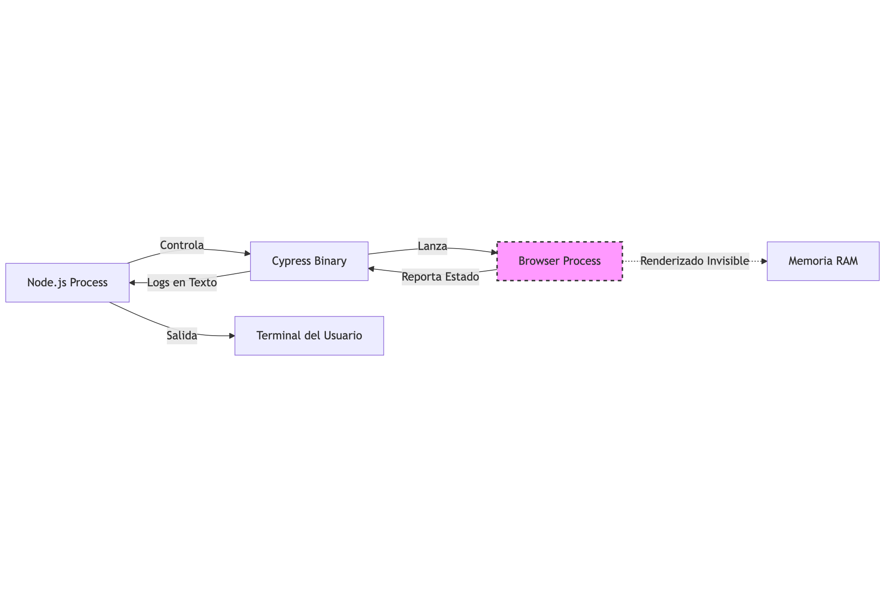
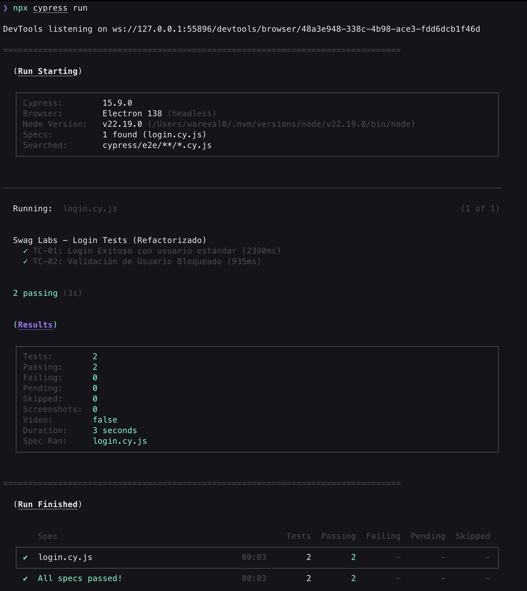
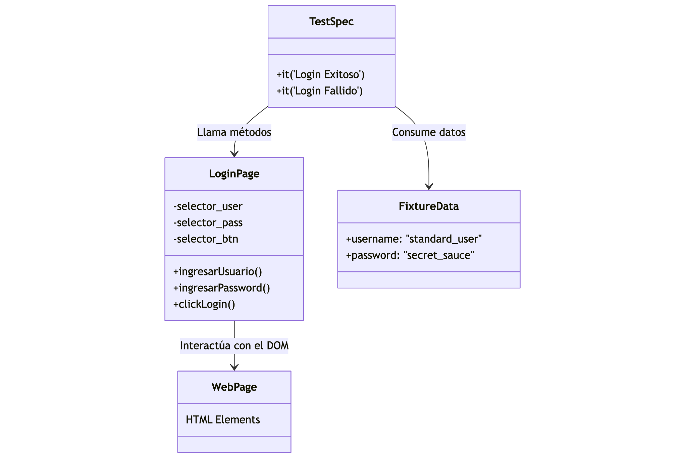
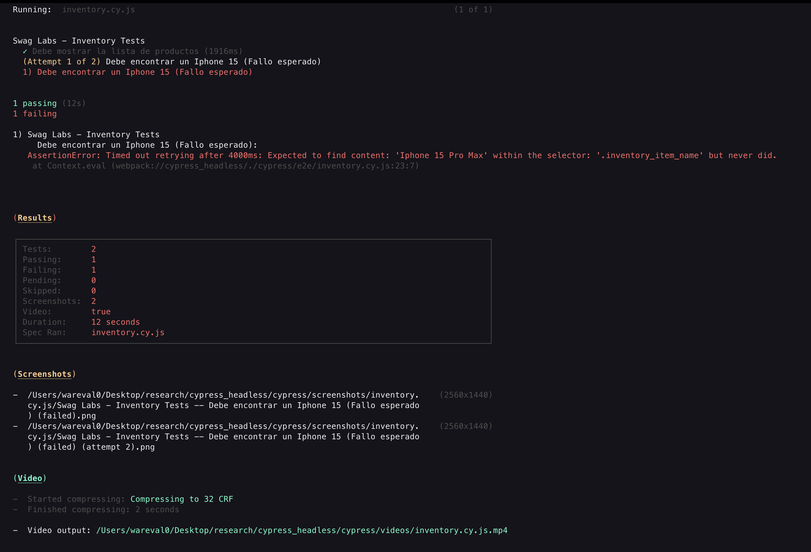
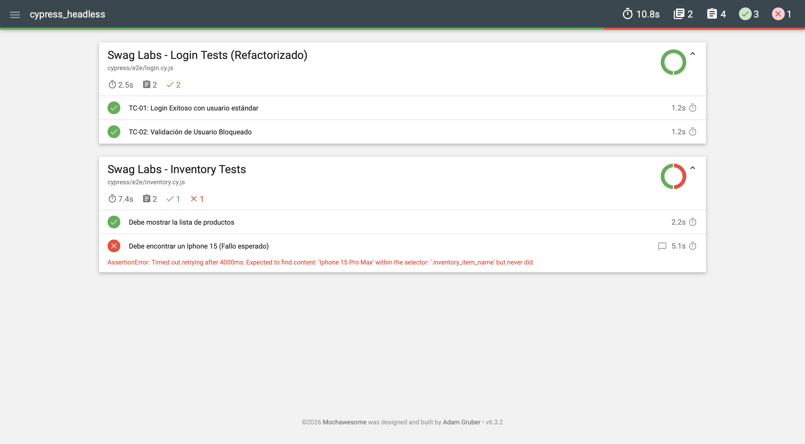

author: Wilmer Arévalo
summary: Cypress Headless
id: cypress_headless
categories: tutorial,taller,pruebas automatizadas,software,cypress,headless,page object,fixtures,retries,reporter
environments: Web
status: Published
feedback link: https://github.com/LensesResearchLab/material-educativo-investigacion/issues

# Headless Testing con Cypress CLI

## Introducción a Cypress CLI

La mayoría aprendemos a automatizar usando el "Test Runner" (esa bonita interfaz gráfica donde ves el navegador moverse). Pero seamos realistas: **los servidores de Integración Continua (CI/CD) no tienen ojos (monitores).**

En esta primera fase, vamos a configurar un entorno Linux desde cero (tal como sería un contenedor de Docker en Jenkins o un Runner de GitHub Actions) y ejecutaremos nuestra primera prueba sin ver absolutamente nada visualmente, confiando plenamente en los logs.

> **Concepto Clave: ¿Qué es Headless Testing?**
Cuando ejecutas Cypress en modo *headless*, el navegador (Chrome, Electron, Firefox) sí se ejecuta, pero no dibuja la interfaz gráfica (UI) en pantalla. Todo ocurre en memoria.
> 



### **Introducción y Prerrequisitos**

En este Codelab, aprenderás a configurar y ejecutar pruebas automatizadas profesionales utilizando Cypress en modo **Headless** (sin interfaz gráfica). Simularemos el flujo de trabajo real de un Ingeniero de Automatización trabajando con servidores de Integración Continua (CI).

**Lo que aprenderás:**

- Configurar Cypress desde cero.
- Implementar el patrón Page Object Model (POM).
- Depurar errores sin ver el navegador (usando Logs y Screenshots).
- Generar reportes HTML ejecutivos.

**Lo que necesitas:**

- [**Node.js**](https://www.google.com/url?sa=E&q=https%3A%2F%2Fnodejs.org%2F) instalado (v16 o superior).
- Un editor de código (recomendamos **VS Code**).
- Una terminal (PowerShell, Bash o Zsh).

### **Inicialización del Proyecto**

1. Crea una carpeta destinada para la realización del taller
2. Abre una terminal en la ubicación de esa carpeta
3. Abre esa carpeta en tu editor de código, por ejemplo, VS Code

En la terminal, corre el siguiente comando:

```bash
npm init -y
npm install cypress --save-dev
```

> *Nota:* Usaremos el flag `--save-dev` porque Cypress es una herramienta de desarrollo/testing, no una dependencia que tu aplicación necesite para funcionar en producción.
> 

### **Configuración de Cypress**

En la raíz del proyecto, crea un archivo llamado `cypress.config.js`. Este será el cerebro de nuestras pruebas.

Copia y pega el siguiente código:

```jsx
const { defineConfig } = require("cypress");

module.exports = defineConfig({
  e2e: {
    // URL base de nuestra aplicación (Swag Labs)
    baseUrl: 'https://www.saucedemo.com',
    // Patrón para encontrar nuestros archivos de prueba
    specPattern: 'cypress/e2e/**/*.cy.js',
    // Deshabilitamos video por defecto (lo activaremos luego)
    video: false,
    chromeWebSecurity: false,
    setupNodeEvents(on, config) {
      // listeners
    },
  },
});
```

Además, crea el archivo `e2e.js` en la carpeta `cypress/support`

Déjalo vacío, solo hace parte del Set Up de Cypress

### **Tu Primer Test (Smoke Test)**

Cypress necesita una estructura de carpetas específica.

1. Crea la carpeta `cypress` en la raíz.
2. Dentro, crea la carpeta `e2e`.
3. Crea un archivo `cypress/e2e/login.cy.js`.

Pega el siguiente código para validar que la página carga:

```jsx
describe('Swag Labs - Smoke Test', () => {
  it('Debe cargar la página de inicio correctamente', () => {
    cy.visit('/'); // Usa la baseUrl configurada
    cy.title().should('eq', 'Swag Labs');
    cy.log('La página cargó correctamente');
  });
});
```

### **Ejecución Headless**

Ahora viene la magia. No usaremos `npx cypress open`. En su lugar, ejecutaremos la prueba directamente en la consola.

Ejecuta en tu terminal:

```bash
npx cypress run
```

**¿Qué debemos observar en la salida?**

1. **Browser:** Nos dirá qué navegador usó (generalmente Electron headless por defecto).
2. **Specs:** Cuántos archivos de prueba encontró.
3. **Tests:** Cuántos tests pasaron (Green) y cuántos fallaron (Red).
4. **Time:** Cuánto tardó la ejecución (vital para métricas de CI).

Deberás ver una tabla en tu terminal con letras verdes indicando `✔ All specs passed!`.

<aside>
Fíjense en la salida de texto. Cypress no solo nos dijo "pasó", nos dio detalles del entorno:

- Cypress Version: Saber la versión es crítico cuando hay breaking changes.
- Browser: Electron XX (Headless).
- Node Version: La versión del runtime.

En un entorno profesional, **estos logs son tu única fuente de verdad**. Si un test falla un viernes a las 6 PM en el servidor de Jenkins, no tendrás un video inmediato, tendrás este texto. Aprender a leerlo es el primer paso para dominar la automatización.

</aside>




*¿Estamos listos para dejar el código "hardcodeado" y empezar a usar buenas prácticas? En la siguiente fase, implementaremos Page Object Model y Fixtures.*

## **Profesionalizando el Código (POM y Fixtures)**

### **De "Scripting" a Ingeniería de Pruebas**

En la Fase 1 escribimos lo que llamamos "Spaghetti Code" o código lineal. Funciona para un test rápido, pero es **inmantenible** a largo plazo.

En esta fase aplicaremos dos patrones fundamentales de la industria:

1. **Fixtures (Data Driven Testing):** Separar los *datos* de la *lógica*. No escribiremos "`secret_sauce`" dentro del código del test.
2. **Page Object Model (POM):** Separar los *selectores HTML* de la *lógica de prueba*. Si el ID del botón de login cambia mañana, solo queremos corregirlo en un archivo, no en 200 tests.

### Arquitectura POM

El objetivo es crear una "Capa de Abstracción" entre el Test y el Navegador.




### **Separación de Datos (Fixtures)**

No queremos usuarios ni contraseñas dentro del código del test.

1. Crea la carpeta `cypress/fixtures`.
2. Crea el archivo `users.json`:

```json
{
  "standard": {
    "username": "standard_user",
    "password": "secret_sauce"
  },
  "locked": {
    "username": "locked_out_user",
    "password": "secret_sauce"
  }
}
```

### **Page Object Model (POM)**

Vamos a crear una clase Javascript que represente la **Página de Login**.

Esta clase tendrá:

1. **Getters:** Propiedades que retornan los elementos web (Selectores).
2. **Actions:** Métodos que realizan acciones de negocio (ej: `login()`).

<aside>
**Tip Senior:**

Nota cómo usamos selectores `[data-test="..."]`. Esta es la mejor práctica en Cypress. Evita usar clases CSS (`.btn-primary`) o IDs dinámicos que los desarrolladores cambian para estilizar la página. El atributo `data-test` es un contrato sólido entre QA y Dev.

</aside>

1. Crea la carpeta `cypress/support/pages`.
2. Crea el archivo `LoginPage.js`:

```jsx
class LoginPage {
  // --- Selectores (Getters) ---
  // Centralizamos los localizadores aquí.
  get usernameInput() { return cy.get('[data-test="username"]'); }
  get passwordInput() { return cy.get('[data-test="password"]'); }
  get loginButton() { return cy.get('[data-test="login-button"]'); }
  get errorMessage() { return cy.get('[data-test="error"]'); }

  // --- Acciones (Métodos de Negocio) ---

  // Método modular para navegar
  visit() {
    cy.visit('/');
  }

  // Método atómico para escribir credenciales
  fillCreds(username, password) {
    this.usernameInput.clear().type(username);
    this.passwordInput.clear().type(password);
  }

  // Método atómico para clickear
  submit() {
    this.loginButton.click();
  }

  // Método Agrupado (Helper): Realiza todo el flujo de login
  login(username, password) {
    this.fillCreds(username, password);
    this.submit();
  }
}

// Exportamos una instancia de la clase para no tener que hacer 'new' en cada test
export const loginPage = new LoginPage();
```

### **Refactorización del Test**

Ahora vamos a reescribir nuestro test de la Fase 1. Observa cómo el código se vuelve mucho más legible, casi como leer inglés simple.

**Cambios clave:**

- Importamos `loginPage`.
- Usamos `beforeEach` para cargar los datos del *fixture* antes de cada test.
- Usamos `cy.fixture(...).as('userData')` para crear un alias y acceder a los datos con `this.userData`.
- Ya no hay `cy.get` en el test, solo llamadas a métodos.

Modifica tu archivo `cypress/e2e/login.cy.js` para usar el patrón nuevo:

```jsx
// Importamos el Page Object
import { loginPage } from '../support/pages/LoginPage';

describe('Swag Labs - Login Tests (Refactorizado)', () => {

  // Hook: Se ejecuta antes de cada test (it)
  beforeEach(() => {
    // Cargamos el JSON y lo guardamos en el alias 'users'
    cy.fixture('users').as('users');
    // Siempre visitamos la página antes de testear
    loginPage.visit();
  });

  it('TC-01: Login Exitoso con usuario estándar', function() {
    // Nota: Usamos 'function()' en lugar de '() =>' para poder acceder a 'this'
    const user = this.users.standard;

    // Acción: Usamos el método de alto nivel del POM
    loginPage.login(user.username, user.password);

    // Aserción: Verificamos que entramos al inventario
    cy.url().should('include', '/inventory.html');
  });

  it('TC-02: Validación de Usuario Bloqueado', function() {
    const user = this.users.locked;

    // Acción
    loginPage.login(user.username, user.password);

    // Aserción: Verificamos el mensaje de error usando el getter del POM
    loginPage.errorMessage
      .should('be.visible')
      .and('contain.text', 'Sorry, this user has been locked out.');
  });
});
```

Ejecuta nuevamente `npx cypress run` y verifica que ambos tests pasen.

Aunque hemos cambiado casi todo el código interno, el resultado externo debe ser el mismo (o mejor, porque agregamos un caso negativo).

Fíjate en la consola. Ahora tenemos **2 tests**. Cypress ejecutará `beforeEach` dos veces (una antes de cada `it`).

### **Análisis de la Fase 2**

Si la salida muestra:

```
✔  All specs passed!
```

Significa que hemos refactorizado exitosamente sin romper la funcionalidad.

**Ventajas logradas:**

1. **Reusabilidad:** Si queremos hacer un test de "Comprar producto", ya tenemos el método `loginPage.login()` listo para usar en el `beforeEach` de ese nuevo archivo.
2. **Mantenibilidad:** Si *Swag Labs* cambia el `id` del campo `password`, solo editamos `LoginPage.js` línea 7.
3. **Datos Limpios:** Si cambiamos la contraseña del entorno de pruebas, solo editamos `users.json`.

*Todo se ve muy verde y bonito, ¿verdad? Pero en la vida real, los tests fallan. En la Fase 3, vamos a provocar un fallo intencional y aprenderemos a depurar cuando no tenemos interfaz gráfica (Headless Debugging).*

## **Depuración a Ciegas (Forensics)**

En esta fase vamos a provocar errores intencionales. Es vital entender que **un test rojo no es un fracaso, es un hallazgo**. En entornos Headless (CI/CD), no tenemos ojos, así que dependemos de "Artefactos": Logs, Screenshots y Videos.

### **Modo Sherlock Holmes: Debugging Headless**

Imagina que recibes una alerta de Jenkins: "El Build falló". Entras y ves logs de texto. No hay navegador abierto. ¿Qué pasó? ¿La página no cargó? ¿Cambió un botón? ¿La API respondió 500?

Cypress tiene herramientas poderosas para esto. Por defecto, cuando corres en CLI (`cypress run`):

1. **Logs de Consola:** Te dice qué aserción falló.
2. **Screenshots:** Toma una foto automática **solo** si el test falla.
3. **Videos:** Graba toda la sesión (si lo activamos).

Vamos a configurar esto y luego romperemos nuestro código a propósito.

### **Reconfiguración: Activando los "Ojos" de Cypress**

Vamos a modificar nuestro `cypress.config.js`. Activaremos la grabación de video y configuraremos una estrategia de **Retries** (Reintentos).

<aside>
**¿Qué son los Retries?**

A veces la red parpadea y un test falla falsamente (*Flaky Test*). Configurar `runMode: 2` le dice a Cypress: *"Si falla, inténtalo una vez más antes de marcarlo como error"*. Esto da estabilidad al Pipeline.

</aside>

Edita tu `cypress.config.js` para habilitar video y capturas de pantalla automáticas al fallar:

```jsx
const { defineConfig } = require("cypress");

module.exports = defineConfig({
  e2e: {
    baseUrl: 'https://www.saucedemo.com',
    specPattern: 'cypress/e2e/**/*.cy.js',
    chromeWebSecurity: false,

    // --- Configuración de Debugging y Estabilidad ---

    // 1. Habilitamos video para ver la repetición de la jugada
    video: true,
    // Comprimimos el video para que no ocupe mucho espacio (0 a 51)
    videoCompression: 32,

    // 2. Screenshots: Por defecto es true al fallar, pero lo explicitamos
    screenshotOnRunFailure: true,

    // 3. Retries: Reintentar pruebas fallidas para evitar 'Flakiness'
    retries: {
      runMode: 1, // En CLI (Headless): reintenta 1 vez extra
      openMode: 0 // En GUI (Local): no reintentar, quiero ver el error ya
    },

    setupNodeEvents(on, config) {
      // Listeners de eventos
    },
  },
});
```

### **Sabotaje: Creando un Test Fallido**

Vamos a crear un nuevo archivo de prueba `inventory.cy.js`. Usaremos nuestro patrón POM, pero introduciremos una **Aserción Falsa**.

Esperaremos que, al entrar al inventario, aparezca un producto que no existe (ej: "Iphone 15").

Crea un nuevo archivo `cypress/e2e/inventory.cy.js` con el error intencional:

```jsx
import { loginPage } from '../support/pages/LoginPage';

describe('Swag Labs - Inventory Tests', () => {

  beforeEach(() => {
    cy.fixture('users').as('users');
    loginPage.visit();
  });

  // Este test pasará
  it('Debe mostrar la lista de productos', function() {
    loginPage.login(this.users.standard.username, this.users.standard.password);
    cy.get('.inventory_list').should('be.visible');
  });

  // Este test FALLARÁ INTENCIONALMENTE
  it('Debe encontrar un Iphone 15 (Fallo esperado)', function() {
    loginPage.login(this.users.standard.username, this.users.standard.password);

    // Intentamos buscar un elemento que no existe
    // Cypress esperará 4 segundos (default timeout) y fallará.
    cy.contains('.inventory_item_name', 'Iphone 15 Pro Max')
      .should('be.visible');
  });

});
```

### **Ejecución y Análisis del Fallo**

Ejecutemos Cypress. Esta vez esperamos ver **texto rojo**.

Ejecuta en la terminal:

```bash
npx cypress run --spec "cypress/e2e/inventory.cy.js"
```

Presten atención al proceso:

1. Verán que el test de inventory tarda más de lo normal. (Está haciendo el retry).
2. Al final, el resumen dirá "`1 of 2 failed`".
3. Cypress nos avisará que guardó screenshots y video.

### **Análisis Forense: Visualizando la Evidencia**

Hay texto rojo en la consola. **No te asustes.**

1. Ve a tu explorador de archivos en VS Code.
2. Busca la carpeta `cypress/screenshots`. Ahí verás una imagen del momento exacto del fallo.
3. Busca la carpeta `cypress/videos`. Ahí verás un `.mp4` con la grabación de la sesión.

> Lección: Estos archivos son los que buscarás en Jenkins o GitHub Actions cuando un *build* se rompa.
> 

### **Reflexión del Mentor (Debriefing)**

Mira la imagen de arriba.

1. Vemos la página de "Products".
2. Vemos la lista de items (Backpack, Bike Light...).
3. **NO** vemos el "Iphone 15 Pro Max".

**Conclusión:**

El test falló correctamente. La aplicación está bien, lo que estaba mal era nuestra expectativa (el test).

El **Video** (archivo `.mp4` en `cypress/videos`) nos mostraría toda la navegación previa: el login, la carga de la página y los 4 segundos de espera buscando el Iphone.

> Importante: El uso de retries (que configuramos en un paso anterior) hizo que el test se ejecutara dos veces antes de rendirse. Esto es vital en la nube, donde a veces una imagen tarda 1 segundo más en cargar y rompe el test innecesariamente.
> 




*Ya sabemos correr tests, estructurarlos profesionalmente y depurarlos cuando explotan. ¿Qué falta? Generar un reporte que podamos entregarle al Jefe o al Cliente. Nadie quiere leer logs de terminal. En la Fase 4, crearemos Dashboards HTML.*

## **Reportes Ejecutivos y Simulación de CI/CD**

Esta fase transforma nuestra terminal de hackers en un Dashboard gerencial.

Al final de esta sección, simularemos cómo descargar "Artefactos" del servidor, tal como lo haría un usuario descargando el reporte de un build de Jenkins.

### **De Logs a Dashboards**

Seamos honestos: si le envías a tu Project Manager o al Cliente una captura de pantalla de tu terminal negra con letras blancas, no entenderán nada.

Para que la automatización aporte valor, necesita **Reportes Legibles**.

Vamos a implementar **`cypress-mochawesome-reporter`**, el estándar actual de la industria para generar reportes HTML autocontenidos (con gráficos, filtros y screenshots incrustados).

### **Instalación del Reporter**

Instalaremos la librería necesaria. Es un "paquete de cero configuración" que simplifica mucho el proceso antiguo de unir archivos JSON.

Ejecuta en tu terminal:

```bash
npm install cypress-mochawesome-reporter --save-dev
```

### **Configuración Final**

Debemos decirle a Cypress que deje de usar el reporter por defecto (spec) y use el nuestro. También configuraremos que los screenshots se incrusten directamente en el HTML.

Vamos a sobreescribir nuestro archivo de configuración por última vez.

Actualiza `cypress.config.js` para incluir el reporter:

```jsx
const { defineConfig } = require("cypress");

module.exports = defineConfig({
  // Definimos el reporter que acabamos de instalar
  reporter: 'cypress-mochawesome-reporter',
  reporterOptions: {
    charts: true,           // Muestra gráficos de torta (Pass/Fail)
    reportPageTitle: 'Reporte de Pruebas SwagLabs',
    embeddedScreenshots: true, // ¡Vital! Mete la foto del error dentro del HTML
    inlineAssets: true,     // Crea un solo archivo HTML (sin carpetas CSS externas)
    saveAllAttempts: false,
  },
  e2e: {
    baseUrl: 'https://www.saucedemo.com',
    specPattern: 'cypress/e2e/**/*.cy.js',
    chromeWebSecurity: false,
    video: false, // Apagamos video para este ejemplo (el reporter usa screenshots)
    screenshotOnRunFailure: true,

    setupNodeEvents(on, config) {
      // Aquí registramos el plugin del reporter
      require('cypress-mochawesome-reporter/plugin')(on);
      return config;
    },
  },
});
```

### **Registro en el Support File**

Cypress necesita cargar el plugin del reporter antes de que inicien los tests. Esto se hace en `cypress/support/e2e.js`.

```jsx
// Importamos los comandos por defecto
import './commands';

// Registramos el reporter para que escuche los fallos
import 'cypress-mochawesome-reporter/register';

// (Opcional) Podemos silenciar logs XHR ruidosos aquí si quisiéramos
```

### **Generación del Reporte**

Vamos a correr **toda** la suite de pruebas.

Recuerda:

1. `login.cy.js`: Debería pasar (2 tests).
2. `inventory.cy.js`: Debería tener 1 test pasado y 1 fallido (el del Iphone 15).

Al finalizar, Cypress generará una carpeta `cypress/reports`.

> Nota: si no tienes el archivo `commands.js` dentro de `cypress/support`, créalo.
Este archivo puede estar vacío inicialmente, o puedes agregar comandos personalizados de Cypress
> 

Ejecuta en la terminal:

```bash
npx cypress run
```

### Ver el resultado

1. Al finalizar, verás una nueva carpeta `cypress/reports`.
2. Entra a `cypress/reports/html` (o directamente dentro de reports dependiendo de la versión).
3. Haz doble clic en `index.html` para abrirlo en tu navegador (Chrome/Edge).

Verás un dashboard con gráficos. Busca el test del "Iphone 15" que falló, ábrelo y notarás que **el screenshot del error está incrustado en el reporte**. ¡Listo para enviarlo al equipo!




### **Cypress CLI Avanzado: Simulación de CI/CD**

Para finalizar el taller, miremos cómo haríamos esto flexible.

En un pipeline, no quieres editar el código para cambiar el usuario o el navegador. Usas **Flags**.

**Escenarios comunes:**

1. **Smoke Testing:** Solo correr pruebas críticas antes de un despliegue.
    - Comando: `npx cypress run --spec "cypress/e2e/login.cy.js"`
2. **Cross-Browser Testing:** Probar si funciona en Firefox.
    - Comando: `npx cypress run --browser firefox`
3. **Inyección de Secretos:** No guardar passwords en fixtures.
    - Podemos pasar variables de entorno desde la terminal.

Ejemplo conceptual (no ejecutable sin setup previo de variables):

```bash
CYPRESS_PASSWORD="my_password" npx cypress run --env user_type=admin
```

### **Conclusión y Cierre del Taller**

¡Felicidades equipo! 

Han pasado de no tener nada a tener un **Framework de Automatización Profesional** que incluye:

1. **Headless Execution:** Pruebas optimizadas para servidores Linux.
2. **Patrones de Diseño:** POM y Fixtures para código escalable.
3. **Resiliencia:** Retries automáticos para redes inestables.
4. **Observabilidad:** Screenshots de errores y Reportes HTML ejecutivos.

**¿Siguientes pasos sugeridos?**

- Integrar este repositorio con GitHub Actions o Jenkins.
- Añadir pruebas de API (`cy.request`).
- Configurar Docker para ejecutar esto en un contenedor aislado.

## Referencias y Recursos Adicionales

Este taller ha sido diseñado para proporcionar una base sólida en la automatización profesional, alineada con las mejores prácticas de la industria actual.

### Créditos

Autor: Wilmer Arévalo

Rol: Profesional en Proyectos de Investigación

Departamento: Centro de Investigación, Facultad de Ingeniería, Universidad de los Andes

Fecha de creación/actualización: Enero de 2026

### Referencias Oficiales

Todo el contenido de este taller está basado en la documentación oficial más reciente:

- **Documentación de Cypress:** [**https://docs.cypress.io**](https://www.google.com/url?sa=E&q=https%3A%2F%2Fdocs.cypress.io)
- **Cypress CLI Guide:** [**Command Line Interface Docs**](https://www.google.com/url?sa=E&q=https%3A%2F%2Fdocs.cypress.io%2Fguides%2Fguides%2Fcommand-line)
- **Reporter Plugin:** [**cypress-mochawesome-reporter (GitHub)**](https://www.google.com/url?sa=E&q=https%3A%2F%2Fgithub.com%2FLironEr%2Fcypress-mochawesome-reporter)

### **Enlaces de Utilidad**

Guarda estos enlaces en tus favoritos, los necesitarán en el día a día como Automatizador de Pruebas de Software:

1. **Selectores:** [**Guía de Best Practices para Selectores**](https://www.google.com/url?sa=E&q=https%3A%2F%2Fdocs.cypress.io%2Fguides%2Freferences%2Fbest-practices%23Selecting-Elements) (Por qué usar `data-test`).
2. **Aserciones:** [**Lista completa de Assertions (Chai/Jquery)**](https://www.google.com/url?sa=E&q=https%3A%2F%2Fdocs.cypress.io%2Fguides%2Freferences%2Fassertions) - Para saber qué poner después del `.should()`.
3. **Swag Labs (SUT):** [**SauceDemo**](https://www.google.com/url?sa=E&q=https%3A%2F%2Fwww.saucedemo.com%2F) - El sitio web que usamos para pruebas.

### **Soporte y Dudas**

Si tienen dudas al implementar esto en sus proyectos reales o encuentran problemas con la configuración:

- **Canal de Slack/Teams:** Puede hacer las preguntas a través de los medios habilitados y los profesores, tutores y monitores podrán ayudar con la aclaración
- **Email de Contacto:** w.arevalo@uniandes.edu.co

<aside>
**Repositorio del Taller**

El código final de este ejercicio está disponible en:

https://github.com/LensesResearchLab/material-educativo-investigacion

</aside>