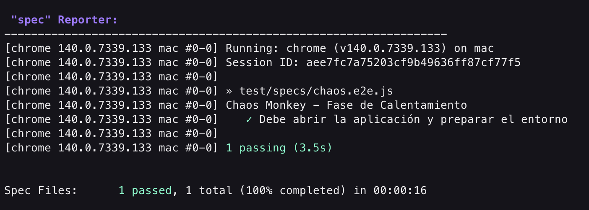
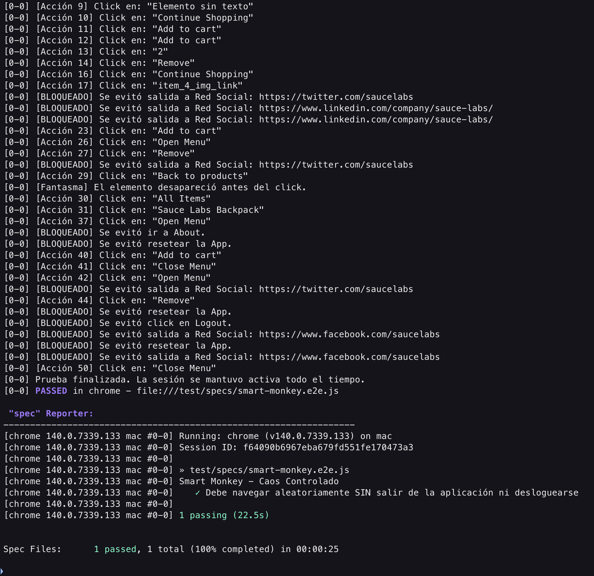
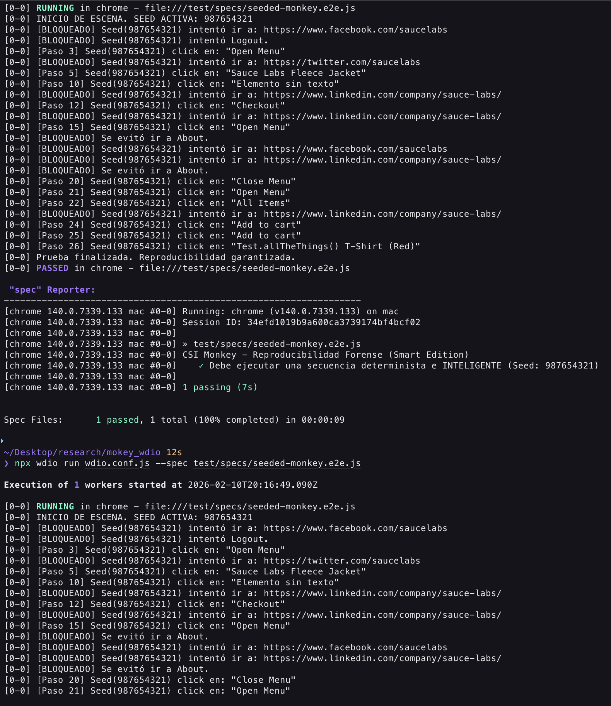

author: Wilmer Arévalo
summary: Chaos Frontend - Monkey Testing con WebdriverIO
id: monkey_wdio
categories: tutorial,taller,pruebas automatizadas,software,monkey,webdriverio
environments: Web
status: Published
feedback link: https://github.com/LensesResearchLab/material-educativo-investigacion/issues

# **Chaos Frontend - Monkey Testing con WebdriverIO**

## **Introducción: La Teoría del Caos**

> "Si le das a un millón de monos máquinas de escribir, eventualmente uno escribirá las obras de Shakespeare. Pero el resto escribirá código que hará colapsar tu servidor."
> 

Hasta ahora, hemos aprendido a ser **Francotiradores**: escribimos pruebas precisas (Cypress) que verifican un camino exacto (`Login -> Click -> Compra`).

Pero, ¿qué pasa si el usuario **no** sigue el camino feliz? ¿Qué pasa si un gato camina sobre el teclado? ¿O si un niño empieza a tocar la pantalla de la tablet frenéticamente?

### **¿Por qué fallan las pruebas tradicionales?**

Como Ingenieros de Automatización, estamos entrenados para pensar de manera **Determinista**. Diseñamos casos de prueba basados en requisitos claros:

- *Paso 1:* El usuario ingresa "user".
- *Paso 2:* El usuario ingresa "pass".
- *Resultado:* Login exitoso.

A esto lo llamamos el **"Happy Path"** (Camino Feliz). Incluso cuando probamos errores (caminos negativos), seguimos un guion predecible.

Sin embargo, el mundo real es **Estocástico** (aleatorio).

- Un usuario hace doble clic en *"Pagar"* porque su internet es lento.
- Un niño golpea la tablet repetidamente.
- Una API responde 200ms más tarde de lo esperado justo cuando el usuario rota la pantalla.

El **Monkey Testing** no busca verificar si la funcionalidad es correcta (¿Suma 2+2?), busca verificar la **Robustez** y **Estabilidad** (¿Si presiono "=" 500 veces, la app explota?).

### ¿Qué es Monkey Testing?

El **Monkey Testing** es una técnica de pruebas de software en la que la aplicación se somete a entradas y eventos aleatorios deliberados para comprobar su comportamiento bajo estrés impredecible.

No buscamos "Fallos Funcionales" (ej: el cálculo está mal), buscamos **"Excepciones No Controladas"**:

1. **Crashes:** La aplicación se cierra inesperadamente.
2. **Freezes:** La interfaz deja de responder (Bloqueo del `UI Thread`).
3. **Memory Leaks:** El consumo de RAM sube hasta que el navegador colapsa.
4. **Glitches Visuales:** Elementos que se superponen o desaparecen.

El objetivo no es verificar funcionalidad, sino **robustez**. Buscamos que la aplicación **no explote** (*Crash*, *Freeze*, *White Screen of Death*) ante lo inesperado.

### Tipos de Monos (Jerarquía de Inteligencia)

1. **Dumb Monkey (Mono Tonto):** No tiene idea de lo que hace. Clickea en coordenadas (x,y) al azar o presiona teclas sin sentido. Es bueno para encontrar fugas de memoria o crashes de bajo nivel.
    - **Comportamiento:** Genera coordenadas (X, Y) aleatorias en la pantalla y hace clic, o envía cadenas de caracteres random al buffer del teclado.
    - **Ventaja:** Es muy rápido y fácil de programar. Excelente para encontrar fugas de memoria y errores de drivers gráficos.
    - **Desventaja:** Pierde mucho tiempo haciendo clic en espacios vacíos (el fondo blanco de la web) o saliendo de la aplicación involuntariamente.
2. **Smart Monkey (Mono Listo):** Conoce la estructura de la UI (DOM). Sabe que hay botones, inputs y enlaces. No clickea en el vacío, sino en elementos reales, pero en orden aleatorio.
    - **Comportamiento:** Sabe que existe un botón `&lt;button&gt;`, un enlace `&lt;a&gt;` o un input `&lt;input&gt;`. No dispara al aire; dispara a elementos interactivos.
    - **Ventaja:** Maximiza la probabilidad de encontrar errores lógicos, ya que interactúa con componentes reales de la UI. Puede configurarse para no salir del dominio (ej: no hacer clic en enlaces externos).
    - **Desventaja:** Requiere más código y mantenimiento.
3. **Brilliant Monkey (Mono Genio):** Tiene conocimiento del dominio. Sabe loguearse, pero luego hace cosas locas. Es el más valioso.
    - **Comportamiento:** Sabe que para comprar, primero debe loguearse. Puede realizar secuencias lógicas (`Login -> Navegar -> Random -> Logout`) pero introduciendo caos en los valores de los datos.
    - **Ventaja:** Encuentra bugs profundos en la lógica de negocio.
    - **Desventaja:** Complejo de implementar. Se acerca más a lo que hoy llamamos *Model-Based Testing* con IA.

### **El Desafío de la Reproducibilidad**

El mayor dolor de cabeza del Monkey Testing es: **"El sistema falló, pero no sé cómo pasó"**.

Si un mono ejecuta 10,000 acciones en 5 minutos y la aplicación crashea en la acción 9,999, ¿cómo le explicamos al desarrollador qué debe arreglar?

> La Regla de Oro: Un buen Monkey Test siempre debe tener Trazabilidad.
> 
1. **Seeds (Semillas):** Usar generadores de números aleatorios pseudo-aleatorios. Si usamos la semilla 12345, la secuencia de eventos será idéntica cada vez que corramos el test.
2. **Logs Agresivos:** Registrar cada acción antes de ejecutarla (ej: `[ACCION 450] Click en botón #submit-btn`).
3. **Video:** Grabar la sesión es obligatorio para entender el contexto visual del fallo.

### ¿Por qué WebdriverIO?

Para este taller usaremos **WebdriverIO** en lugar de Cypress o Selenium puro por razones estratégicas:

1. **Arquitectura Node.js:** WDIO corre en un proceso de *Node.js*, lo que nos permite escribir bucles complejos (for, while) y lógica asíncrona avanzada mucho más fácilmente que en Cypress (que tiene limitaciones para manejar bucles dinámicos dentro de su cadena de comandos).
2. **Protocolo WebDriver:** Nos permite inyectar scripts de *JavaScript* puro (como *Gremlins.js*) directamente en la consola del navegador de manera nativa.
3. **Soporte Multi-Navegador:** Si queremos soltar al mono en Safari, Firefox o Chrome Mobile, WDIO lo hace con un solo cambio de configuración.

**Lo que aprenderás:**

- Configurar WebdriverIO desde cero.
- Implementar Dumb Monkey Testing.
- Implementar Smart Monkey Testing.
- Implementar Gremlins.js.

**Lo que necesitas:**

- [**Node.js**](https://www.google.com/url?sa=E&q=https%3A%2F%2Fnodejs.org%2F) instalado (v16 o superior).
- Un editor de código (recomendamos **VS Code**).
- Una terminal (PowerShell, Bash o Zsh).

**Sobre qué trabajarás:**

- Swag Labs, proyecto de Sauce Labs, disponible en [https://www.saucedemo.com](https://www.saucedemo.com/)

## **Arquitectura del Caos - Configuración del Entorno**

Antes de liberar a nuestros "monos" digitales para que golpeen la interfaz, necesitamos construir una jaula resistente. En términos de ingeniería, esto significa configurar un framework de automatización que nos permita controlar el navegador con precisión quirúrgica, manejar procesos asíncronos y recuperar logs cuando todo colapse.

Para este taller, nuestra herramienta elegida es **WebdriverIO (WDIO)**. A diferencia de otras herramientas que operan dentro del contexto del navegador, WebdriverIO corre en Node.js y se comunica con el navegador a través del protocolo WebDriver (o DevTools). Esta arquitectura es crucial para el Monkey Testing porque nos da un "hilo de ejecución" separado desde donde podemos inyectar caos sin que el script de prueba muera si la página web se congela.

### **Inicialización del Proyecto**

Comenzaremos creando un espacio de trabajo limpio. El Monkey Testing suele generar muchos artefactos (logs, capturas, reportes de error), por lo que es vital mantener una estructura de carpetas ordenada desde el principio.

Abre tu terminal, navega a tu directorio de desarrollo y crea el directorio para el taller. Una vez dentro, iniciaremos un proyecto de *Node.js* estándar.

1. Crea una carpeta destinada para la realización del taller
2. Abre una terminal en la ubicación de esa carpeta
3. Abre esa carpeta en tu editor de código, por ejemplo, VS Code

En la terminal, corre el siguiente comando:

```bash
npm init -y
npm init wdio@latest
```

> *Nota:* Al ejecutarlo, el asistente te guiará a través de una serie de decisiones arquitectónicas. Para los propósitos de este taller, configuraremos un entorno de pruebas **End-to-End (E2E)** local para aplicaciones Web.
> 

> Cuando el asistente pregunte por el framework, seleccionaremos **Mocha**. Esta elección no es arbitraria; Mocha ofrece una sintaxis describe/itmuy similar a Jest o Jasmine, lo que reduce la curva de aprendizaje. Para el compilador en TypeScript, optaremos por **No! (Javascript nativo)** para mantener la simplicidad y evitar la complejidad de configurar TypeScript en este ejercicio introductorio.
> 

> Asegúrate de aceptar la autogeneración de archivos de prueba y el uso de **Page Objects**, ya que, aunque nuestros monos sean caóticos, nuestro código debe seguir siendo limpio.
> 

```bash
✔ A project named "mokey_wdio" was detected at
"/Users/wareval0/Desktop/research/mokey_wdio", correct? Yes
✔ What type of testing would you like to do? E2E Testing - of Web or Mobile
Applications
✔ Where is your automation backend located? On my local machine
✔ Which environment you would like to automate? Web - web applications in the
browser
✔ With which browser should we start? Chrome
✔ Which framework do you want to use? Mocha (https://mochajs.org/)
✔ Do you want to use Typescript to write tests? No
✔ Do you want WebdriverIO to autogenerate some test files? Yes
✔ What should be the location of your spec files?
/Users/wareval0/Desktop/research/mokey_wdio/test/specs/**/*.js
✔ Do you want to use page objects
(https://martinfowler.com/bliki/PageObject.html)? Yes
✔ Where are your page objects located?
/Users/wareval0/Desktop/research/mokey_wdio/test/pageobjects/**/*.js
✔ Which reporter do you want to use? spec
✔ Do you want to add a plugin to your test setup?
✔ Would you like to include Visual Testing to your setup? For more information
see https://webdriver.io/docs/visual-testing! No
✔ Do you want to add a service to your test setup?
✔ Do you want me to run `npm install` Yes
```

### **Anatomía del `wdio.conf.js`**

Una vez finalizada la instalación, verás un archivo llamado `wdio.conf.js` en la raíz. Este es el cerebro de nuestras operaciones.

A diferencia de herramientas "Zero Config", WebdriverIO expone toda su configuración. Esto es intimidante al principio, pero poderoso para el Monkey Testing. Necesitamos modificar una propiedad clave: la `baseUrl`. Esto nos permitirá cambiar el entorno de pruebas (Desarrollo, QA, Producción) sin tocar el código de los monos.

Abre el archivo y localiza la propiedad `baseUrl` (en nuestro caso, en la línea 87). Descomenta, configúrala para apuntar a nuestra aplicación objetivo, **Swag Labs**:

```jsx
exports.config = {
    runner: 'local',
    specs: [
        './test/specs/**/*.js'
    ],
    exclude: [
        // 'path/to/excluded/files'
    ],
    maxInstances: 10,
		capabilities: [{
        browserName: 'chrome',
        'goog:chromeOptions': {
            // Si quieres ver el navegador, comenta la siguiente línea.
            // Para CI/CD, descoméntala para usar modo headless.
            // args: ['--headless', '--disable-gpu']
        }
    }],
    logLevel: 'warn',
    logLevels: {
        webdriver: 'silent',
        webdriverio: 'silent',
        '@wdio/local-runner': 'silent',
        '@wdio/cli': 'silent'
    },
    bail: 0,
    baseUrl: 'https://www.saucedemo.com',
    waitforTimeout: 10000,
    connectionRetryTimeout: 120000,
    connectionRetryCount: 3,
    framework: 'mocha',
    reporters: ['spec'],
    mochaOpts: {
        ui: 'bdd',
        timeout: 60000
    },
}
```

### **La Prueba de Salud (Sanity Check)**

Antes de escribir algoritmos complejos, debemos validar que la comunicación entre *Node.js* y el navegador funciona correctamente. *WebdriverIO* utiliza `async/await`. Cada interacción con el navegador (hacer clic, leer texto, navegar) es una promesa que debe ser resuelta.

Vamos a eliminar los archivos de ejemplo que generó el asistente (en `test/specs/`) y crearemos nuestro primer script de control llamado `chaos.e2e.js`.

Crea el archivo `test/specs/chaos.e2e.js` y añade el siguiente código:

```jsx
describe('Chaos Monkey - Fase de Calentamiento', () => {
    
    it('Debe abrir la aplicación y preparar el entorno', async () => {
        // 1. Preparamos la viewport
        // Maximizar asegura que todos los elementos sean visibles y clickeables
        await browser.maximizeWindow();

        // 2. Navegación
        // Usamos '/' porque ya definimos la baseUrl en el archivo de config
        await browser.url('/');

        // 3. Verificación de Estado
        // Antes de soltar al mono, confirmamos que la app está viva
        const title = await browser.getTitle();
        if (title !== 'Swag Labs') {
             throw new Error('La aplicación no cargó correctamente. Abortando misión.');
        }

        console.log('Conexión establecida: El objetivo "Swag Labs" ha sido localizado.');
        
        // Pausa didáctica para observar el resultado (evitar en producción)
        await browser.pause(2000);
    });

});
```

> Observa el uso de `await browser.url('/')`. En este punto, el script de *Node.js* envía una instrucción HTTP al driver de Chrome, espera a que el navegador cargue la página, y solo entonces continúa a la siguiente línea. Esta sincronización automática es una de las grandes ventajas de WDIO.
> 

### **Ejecución y Validación**

Llegó el momento de la verdad. Ejecuta el framework utilizando el comando CLI de WebdriverIO:

```bash
npx wdio run wdio.conf.js
```

Si la configuración es correcta, verás una ventana de Chrome abrirse, cargar el sitio de Swag Labs y cerrarse poco después. En tu terminal, deberías recibir un reporte limpio.



Si obtienes un error relacionado con la versión de Chrome, no entres en pánico. *WebdriverIO* intenta descargar el driver correspondiente a tu navegador instalado, pero a veces hay desfaces. Generalmente, ejecutar `npm install chromedriver --save-dev` suele alinear las versiones.

<aside>
Con el entorno validado y la "jaula" construida, estamos listos para la siguiente fase: programar la inteligencia artificial primitiva de nuestro primer mono.

</aside>

## El Bucle Infinito - Implementando un Dumb Monkey

Hemos preparado el escenario, y ahora llega el momento de escribir el guion del caos. En esta fase, programaremos lo que técnicamente se conoce como **Fuzz Testing** aplicado a la interfaz de usuario: bombardear la aplicación con datos y eventos aleatorios hasta que algo se rompa.

Nuestro objetivo es crear un agente autónomo (el "Mono") que no siga instrucciones predefinidas, sino que opere bajo principios estocásticos. A diferencia de un usuario humano que tiene una intención clara (comprar una mochila), el Mono Tonto (Dumb Monkey) carece de intención; solo posee capacidad de acción.

### **La Lógica del Caos (Algoritmo Base)**

Para simular este comportamiento en *WebdriverIO*, necesitamos abandonar el paradigma lineal de las pruebas tradicionales. En lugar de una secuencia de pasos, implementaremos un bucle de eventos finito.

La estructura lógica de nuestro script será la siguiente:

1. **Inicialización:** El sistema lleva al mono al "patio de juegos" (la página web).
2. **Identificación de Objetivos:** El script escanea el DOM (Document Object Model) en busca de *todo* lo que parezca interactuable: botones, enlaces, campos de texto y menús desplegables.
3. **Selección Aleatoria:** Utilizando funciones matemáticas básicas, el mono elige una víctima (un elemento) al azar de la lista de objetivos.
4. **Ejecución de Acción:** Dependiendo del tipo de elemento, el mono decide qué hacer (hacer clic o escribir texto basura).
5. **Recuperación de Errores:** Si el elemento desaparece o no es clicable, el mono debe ignorar el error y continuar. **Esto es crucial.** Una prueba tradicional falla si un botón no funciona; un Monkey Test registra el fallo y sigue buscando la siguiente víctima.

<aside>
Una de las potencias de *WebdriverIO* es su manejo de selectores múltiples mediante el comando `$$` (doble signo de dólar). A diferencia de `$` que devuelve el primer elemento que encuentra, `$$` devuelve un array con todos los elementos que coincidan con el criterio.

Para un Dumb Monkey, no nos interesa si el botón es "Login" o "Logout"; solo nos interesa que sea un botón. Por ello, utilizaremos un selector CSS agrupado que capture la mayor cantidad de elementos interactivos posibles: `a`, `button`, `input`, `select`.

</aside>

### **Implementación del Script**

Vamos a crear un nuevo archivo de especificación llamado `test/specs/dumb-monkey.e2e.js`. En este archivo, escribiremos un script que ejecutará 50 acciones aleatorias.

Es importante notar que, para que el mono pueda hacer daño real, primero debemos dejarlo entrar a la tienda. Por lo tanto, iniciaremos la prueba logueándonos programáticamente antes de soltar la aleatoriedad.

Copia y analiza el siguiente código:

```jsx
import { browser, $, $$, expect } from '@wdio/globals';

describe('Dumb Monkey - Ataque Aleatorio', () => {

    it('Debe sobrevivir a 50 interacciones aleatorias', async () => {
        
        // --- 1. PREPARACIÓN ---
        await browser.maximizeWindow();
        await browser.url('/');

        // Login (Selectores estándar)
        await $('#user-name').setValue('standard_user');
        await $('#password').setValue('secret_sauce');
        await $('#login-button').click();

        // Aserción v9 con Regex
        await expect(browser).toHaveUrl(/inventory/);
        console.log('Acceso concedido. Iniciando secuencia de caos...');

        // --- 2. CONFIGURACIÓN DEL CAOS ---
        const MONKEY_LIMIT = 50; 
        const DELAY_MS = 200; // Pausa entre acciones para ver qué pasa

        for (let i = 0; i < MONKEY_LIMIT; i++) {
            
            // Recolectamos víctimas potenciales
            const interactables = await $$('button, a, input, select');

            // Si el mono navega a una página vacía, regresamos al inventario
            if (interactables.length === 0) {
                console.warn('Zona muerta detectada. Reiniciando posición...');
                await browser.url('https://www.saucedemo.com/inventory.html');
                continue;
            }

            // Selección Aleatoria
            const randomIndex = Math.floor(Math.random() * interactables.length);
            const element = interactables[randomIndex];

            // Ejecución Defensiva (El corazón del Monkey Test)
            try {
                // Verificamos visibilidad y habilitación
                const isClickable = await element.isClickable();
                
                if (isClickable) {
                    const tagName = await element.getTagName();

                    if (tagName === 'input') {
                        // Generamos texto aleatorio
                        const randomText = (Math.random() + 1).toString(36).substring(7);
                        // Limpiamos y escribimos
                        await element.setValue(randomText);
                        console.log(`[Acción ${i+1}/${MONKEY_LIMIT}] Escribiendo "${randomText}" en <input>`);
                    } else {
                        // Click
                        await element.click();
                        console.log(`[Acción ${i+1}/${MONKEY_LIMIT}] Click en <${tagName}>`);
                    }
                } else {
                    console.log(`[Skip] Elemento ${randomIndex} no interactuable.`);
                }
            } catch (error) {
                // Los errores "StaleElementReference" son normales aquí (la página cambió mientras el mono pensaba)
                console.log(`[Recuperación] Intento fallido: ${error.message.split('\n')[0]}`);
            }

            // Pausa humana
            await browser.pause(DELAY_MS);
        }

        console.log('Misión cumplida: La aplicación sobrevivió al ataque.');

    }, 300000);
});
```

Al ejecutar este script con `npx wdio run wdio.conf.js --spec test/specs/dumb-monkey.e2e.js`, observarás un comportamiento fascinante y aterrador a la vez.

El check verde `✓` significa que tu script de Node.js terminó sin errores de sintaxis, pero... ¿qué pasó realmente en la aplicación?

Si observas los logs de tu terminal (esos `console.log` que pusimos), notarás patrones interesantes y un problema fundamental del **Dumb Monkey**:

1. **Falta de Memoria:** Es probable que el mono haya hecho clic en "Logout" en la iteración 5. Si eso pasó, las siguientes 45 iteraciones fueron el mono intentando hacer clic en la pantalla de Login sin poder entrar. **Eso es tiempo perdido.**
2. **Fuga de Contexto:** Quizás hizo clic en el enlace de "X" o "Facebook" del footer. Eso abre una pestaña nueva y saca al mono de la aplicación que queremos probar.
3. **Ineficiencia:** El mono "tonto" trata igual a un botón de "Eliminar cuenta" que a un botón de "Ver detalle".

El Dumb Monkey es útil para pruebas de estrés (Stress Testing), pero para encontrar bugs funcionales necesitamos ponerle reglas. Necesitamos un **Smart Monkey**.

<aside>
Ya sabemos cómo crear caos. Ahora vamos a aprender a controlarlo. En la siguiente fase, le enseñaremos al mono a distinguir entre un botón seguro y uno peligroso.

</aside>

## **Evolucionando a "Smart Monkey"**

En esta fase, vamos a refinar nuestro algoritmo. Pasaremos de un ataque aleatorio puro a un **Ataque Estocástico Dirigido**.

### **Concepto: La "Lista Negra" (Blacklisting)**

Un Smart Monkey tiene permiso para tocar todo, **EXCEPTO** ciertas cosas que romperían el flujo de la prueba prematuramente.

Vamos a implementar dos reglas de oro:

1. **Regla de Permanencia:** No hacer clic en elementos que nos saquen del dominio (enlaces externos como X/Facebook).
2. **Regla de Estado:** No hacer clic en el botón de "Logout" ni en el "Reset App State" a menos que sea intencional.

### Creando el Smart Monkey

Vamos a crear un nuevo archivo. Esta vez, antes de interactuar con un elemento, el script leerá sus propiedades (texto, ID, href) y decidirá si es seguro proceder.

Usaremos métodos de *WebdriverIO* como `getAttribute` y `getText` para "ver" antes de "tocar".

Crea el archivo `test/specs/smart-monkey.e2e.js`.

```jsx
import { browser, $, $$, expect } from '@wdio/globals';

describe('Smart Monkey - Caos Controlado', () => {

    // Configuración del experimento
    const MONKEY_LIMIT = 50;
    const DELAY_MS = 100; // Más rápido que el anterior

    it('Debe navegar aleatoriamente SIN salir de la aplicación ni desloguearse', async () => {
        
        // --- SETUP ---
        await browser.maximizeWindow();
        await browser.url('/');
        
        // Login estándar
        await $('#user-name').setValue('standard_user');
        await $('#password').setValue('secret_sauce');
        await $('#login-button').click();
        
        // Aserción inicial
        await expect(browser).toHaveUrl(/inventory/);
        console.log('Smart Monkey activado. Iniciando recorrido inteligente...');

        // --- BUCLE INTELIGENTE ---
        for (let i = 0; i < MONKEY_LIMIT; i++) {
            
            // 1. Recolección: Solo buscamos elementos que suelen ser interactivos
            // Excluimos inputs por ahora para centrarnos en navegación
            const candidates = await $$('button, a');

            if (candidates.length === 0) {
                console.warn('Callejón sin salida. Volviendo al inventario...');
                await browser.url('https://www.saucedemo.com/inventory.html');
                continue;
            }

            // 2. Selección Aleatoria
            const randomIndex = Math.floor(Math.random() * candidates.length);
            const element = candidates[randomIndex];

            // 3. FILTRO DE INTELIGENCIA (La diferencia clave)
            try {
                // Si el elemento no es visible, pasamos al siguiente (ahorramos tiempo)
                if (!await element.isDisplayed()) continue;

                // Obtenemos atributos para analizar riesgo
                const text = await element.getText();
                const href = await element.getAttribute('href');
                const id = await element.getAttribute('id');

                // --- REGLAS DE SEGURIDAD (BLACKLIST) ---
                
                // Regla A: No hacer Logout
                if (text.toLowerCase().includes('logout') || id === 'logout_sidebar_link') {
                    console.log(`[BLOQUEADO] Se evitó click en Logout.`);
                    continue; // Saltamos a la siguiente iteración del for
                }

                // Regla B: No ir a Redes Sociales (Enlaces externos)
                if (href && (href.includes('twitter') || href.includes('facebook') || href.includes('linkedin'))) {
                    console.log(`[BLOQUEADO] Se evitó salida a Red Social: ${href}`);
                    continue;
                }

                // Regla C: No Resetear el estado (opcional)
                if (id === 'reset_sidebar_link') {
                    console.log(`[BLOQUEADO] Se evitó resetear la App.`);
                    continue;
                }

                // 4. EJECUCIÓN SEGURA
                console.log(`[Acción ${i+1}] Click en: "${text || id || 'Elemento sin texto'}"`);
                await element.click();

            } catch (error) {
                // Si el elemento desapareció mientras analizábamos, no pasa nada.
                // Esto es común en apps modernas (React/Vue).
                console.log(`[Fantasma] El elemento desapareció antes del click.`);
            }

            // Pausa breve
            await browser.pause(DELAY_MS);
        }

        console.log('Prueba finalizada. La sesión se mantuvo activa todo el tiempo.');

    }, 300000);
});
```

### Ejecución y Comparativa

Ahora vamos a correr este nuevo script. Presta mucha atención a la terminal. Deberías ver mensajes como `[BLOQUEADO]` indicando que el mono "pensó" antes de actuar.

Ejecuta en tu terminal:

```bash
npx wdio run wdio.conf.js --spec test/specs/smart-monkey.e2e.js
```

El navegador se moverá frenéticamente. Entrará al detalle de un producto, volverá al inventario, abrirá el carrito, cerrará el carrito. Puede que abra el menú lateral, **pero NO debería cerrarse la sesión ni abrir pestañas de X o Facebook**



<aside>
Nota: Si en la terminal aparecen muchos logs informativos, asegúrate de configurar el nivel de logs que queremos en `wdio.conf.js` con `silent` 

</aside>

### Análisis de Estrategia

¿Notaron la diferencia?

- **Dumb Monkey:** Dispara a todo. Es destructivo. Bueno para encontrar *Crashes*.
- **Smart Monkey:** Navega. Es exploratorio. Bueno para encontrar *Dead Links* (enlaces rotos) y errores de lógica al ir y volver muchas veces entre páginas.

En un entorno profesional, este script es el que dejarías corriendo durante la noche (Nightly Build) para ver si la aplicación amanece viva o con un error de memoria (Out of Memory) después de 5,000 interacciones.

<aside>
Hemos programado nuestro propio mono desde cero. Pero, ¿podemos reproducirlo?, ¿si algo falla sabemos qué es y cómo se produjo? En la siguiente sección nos encargaremos de la Reproducibilidad y Evidencia de los tests que hagamos.

</aside>

## **Reproducibilidad y Evidencia**

En la teoría prometimos **Reproducibilidad**, pero en la práctica hemos estado usando `Math.random()`, lo cual es un pecado capital en Monkey Testing profesional. Si encontramos un bug con `Math.random()`, nunca podremos volver a ejecutar *exactamente* la misma secuencia para demostrárselo al desarrollador.

> "Un bug que no se puede reproducir, es un bug que no se va a arreglar".
> 

Hasta ahora, nuestros monos han sido **caóticos e irrepetibles**. Si el mono #43 rompió la base de datos, no tenemos forma de saber qué combinación de clicks lo causó. En esta fase, transformaremos nuestro caos en una **Ciencia Determinista**.

Implementaremos tres pilares de la trazabilidad:

1. **Semillas (Seeds):** Control total del azar.
2. **Logs Persistentes:** Un historial forense de acciones.
3. **Evidencia Visual:** Capturas automáticas del crimen.

### La Teoría del "Random Determinista"

Javascript usa `Math.random()`, que es pseudo-aleatorio pero no nos permite definir una semilla inicial (seed).

Para un Monkey Test profesional, necesitamos una función que, al darle la semilla `12345`, genere **siempre** la misma secuencia de números: `0.45, 0.12, 0.99...`.

De esta forma, si el test falla con la semilla `12345`, podemos pasarle esa semilla al desarrollador y él verá el fallo en su máquina.

Vamos a crear un archivo de utilidades para no ensuciar nuestros tests.

Crea la carpeta `test/utils` y el archivo `test/utils/random.js`.

Copiaremos un algoritmo clásico y ligero llamado **Mulberry32** (un generador de números aleatorios muy rápido y efectivo).

```jsx
/**
 * Generador de números aleatorios con semilla (Seedable PRNG).
 * Algoritmo: Mulberry32.
 * @param {number} a - La semilla (Seed) inicial (ej: 12345)
 * @returns {function} - Una función que reemplaza a Math.random()
 */
export function createSeededRandom(a) {
    return function() {
      var t = a += 0x6D2B79F5;
      t = Math.imul(t ^ t >>> 15, t | 1);
      t ^= t + Math.imul(t ^ t >>> 7, t | 61);
      return ((t ^ t >>> 14) >>> 0) / 4294967296;
    }
}
```

### El "Seeded Monkey" (Mono con Memoria)

Ahora vamos a reescribir nuestro Smart Monkey. Esta vez, no usaremos `Math.random()`. Usaremos nuestra función importada.

El objetivo: Definir una constante `SEED` al inicio. Si cambiamos la Seed, el test cambia. Si mantenemos la Seed, el test es idéntico.

Crea el archivo `test/specs/seeded-monkey.e2e.js`.

```jsx
import { browser, $, $$, expect } from '@wdio/globals';
import { createSeededRandom } from '../utils/random.js';

describe('CSI Monkey - Reproducibilidad Forense (Smart Edition)', () => {

    // LA LLAVE MAESTRA
    // Cambia este número y el comportamiento cambiará, pero será consistente.
    const TEST_SEED = 987654321; 
    
    // Inicializamos el generador determinista
    const rng = createSeededRandom(TEST_SEED);

    it(`Debe ejecutar una secuencia determinista e INTELIGENTE (Seed: ${TEST_SEED})`, async () => {
        
        // 1. SETUP
        await browser.maximizeWindow();
        await browser.url('/');
        await $('#user-name').setValue('standard_user');
        await $('#password').setValue('secret_sauce');
        await $('#login-button').click();

        console.log(`INICIO DE ESCENA. SEED ACTIVA: ${TEST_SEED}`);

        // 2. BUCLE DETERMINISTA
        const ACTIONS = 30;

        for (let i = 0; i < ACTIONS; i++) {
            // Solo buscamos elementos interactivos de navegación
            const candidates = await $$('button, a');
            
            if (candidates.length === 0) {
                await browser.url('https://www.saucedemo.com/inventory.html');
                continue;
            }

            // SELECCIÓN DETERMINISTA
            // Usamos rng() en lugar de Math.random()
            const randomIndex = Math.floor(rng() * candidates.length);
            const element = candidates[randomIndex];

            try {
                // Verificamos si es visible antes de gastar recursos
                if (!await element.isDisplayed()) continue;

                // --- CEREBRO DEL SMART MONKEY (Restaurado) ---
                const text = (await element.getText()) || '';
                const href = (await element.getAttribute('href')) || '';
                const id = (await element.getAttribute('id')) || '';

                // Regla A: No hacer Logout
                if (text.toLowerCase().includes('logout') || id === 'logout_sidebar_link') {
                    console.log(`[BLOQUEADO] Seed(${TEST_SEED}) intentó Logout.`);
                    continue; 
                }

                // Regla B: No ir a Redes Sociales (Enlaces externos)
                if (href.includes('twitter') || href.includes('facebook') || href.includes('linkedin')) {
                    console.log(`[BLOQUEADO] Seed(${TEST_SEED}) intentó ir a: ${href}`);
                    continue;
                }

                // Regla C: No resetear estado
                if (id === 'reset_sidebar_link') {
                    console.log(`[BLOQUEADO] Seed(${TEST_SEED}) intentó resetear la app.`);
                    continue;
                }

                // Regla D: No ir a la página de About
                if (text.toLowerCase().includes('about')) {
                    console.log(`[BLOQUEADO] Se evitó ir a About.`);
                    continue;
                }

                // --- EJECUCIÓN ---
                console.log(`[Paso ${i+1}] Seed(${TEST_SEED}) click en: "${text || 'Elemento sin texto'}"`);
                await element.click();

            } catch (error) {
                console.log(`[Error Controlado] ${error.message.split('\n')[0]}`);
            }
            
            // Pausa para observar
            await browser.pause(100);
        }
        
        console.log('Prueba finalizada. Reproducibilidad garantizada.');
    }, 300000);
});
```

### Capturando la Escena del Crimen (Screenshots Automáticos)

Los logs son buenos, pero una imagen vale más que mil logs.

WebdriverIO tiene un sistema de **Hooks** en el archivo de configuración. Podemos decirle: *"Si un test falla, toma una foto inmediatamente"*.

Vamos a editar el archivo `wdio.conf.js`.

Abre tu `wdio.conf.js`, busca la sección `afterTest` (debes encontrarla comentada al final del archivo) y reemplázala con esto:

```jsx
// ... resto de la configuración ...

    /**
     * Hook que se ejecuta después de cada test.
     * @param {Object} test - Detalles del test
     * @param {Object} context - Contexto
     * @param {Object} result - Resultado ({ passed: boolean, error: string })
     */
    afterTest: async function (test, context, { error, result, duration, passed, retries }) {
        // Solo tomamos foto si el test falló
        if (!passed) {
            const timestamp = new Date().getTime();
            // Creamos un nombre de archivo único con el nombre del test
            const filename = `ERROR_${test.title.replace(/\s+/g, '_')}_${timestamp}.png`;
            
            // Guardamos la captura
            await browser.saveScreenshot(`./screenshots/${filename}`);
            
            console.log(`FOTO DEL CRIMEN GUARDADA: ./screenshots/${filename}`);
        }
    },

 // ...
```

Nota: Asegúrate de crear la carpeta `screenshots` en la raíz de tu proyecto, o WDIO intentará crearla.

### Validación: El Experimento de Repetición

Para demostrar que esto funciona, haz lo siguiente:

1. Ejecuta el `seeded-monkey.e2e.js` una vez. Observa los logs. Verás que el mono elige, por ejemplo, *"Add to cart"* en el paso 1.

```bash
 npx wdio run wdio.conf.js --spec test/specs/seeded-monkey.e2e.js
```

1. Vuelve a ejecutar el mismo test (sin cambiar la `TEST_SEED`).
2. **Resultado:** El mono debe hacer **exactamente lo mismo**, en el mismo orden. Eligirá *"Add to cart"* en el paso 1 nuevamente.

Si cambias la variable `TEST_SEED = 11111`, el comportamiento cambiará radicalmente, pero será consistente para esa nueva semilla.



> Puedes notar que los pasos iniciales en ambas ejecuciones son los mismos: intentó ir a Facebook, intentó logout, abrió el menú, intentó ir a Twitter, etc.
> 

Ahora tienes un **Monkey Test Reproducible**.

Cuando este test falle en el servidor de Integración Continua (*Jenkins/GitHub Actions*), podrás:

1. Ver el log para obtener la `SEED` usada.
2. Ver el Screenshot generado automáticamente en `wdio.conf.js`.
3. Poner esa `SEED` en tu máquina local y ver cómo el bug se reproduce frente a tus ojos.

Esto transforma el Monkey Testing de un juego de azar a una herramienta de ingeniería seria.

<aside>
Ahora que sabemos controlar el tiempo y el azar, estamos listos para liberar a la Horda.¿Y si te dijera que existe un ejército de monos listo para usar? Dejaremos de escribir bucles for manuales e inyectaremos una librería profesional de Chaos Testing: **Gremlins.js**

</aside>

## **La Horda - Integración con Gremlins.js**

Ya dominamos la creación manual de scripts de caos. Ahora vamos a "profesionalizar" el ataque.

En esta fase dejaremos de reinventar la rueda. En lugar de escribir nuestros propios bucles for en *Node.js* (que tienen latencia de red entre tu computadora y el navegador), inyectaremos una librería especializada directamente en el corazón de la página web.

Prepara tu terminal, porque vamos a liberar a la Horda.

Hasta ahora, nuestro mono vivía en ***Node.js*** y enviaba comandos al navegador uno por uno:

1. Node: `"¿Hay un botón?" -> Red -> Browser: "Sí"`.
2. Node: `"Dale click" -> Red -> Browser: "Click"`.

Esto es lento.

**Gremlins.js** es una librería de JavaScript escrita por *Marmelab* que se ejecuta **dentro** del navegador. Al inyectarla, eliminamos la latencia de red. Los gremlins atacan a la velocidad de renderizado del navegador (miles de acciones por minuto).

### **Estrategia de Inyección (CDN)**

Como no somos dueños del código fuente de Swag Labs, no podemos instalar la librería con npm install en su proyecto.

Usaremos un truco de automatización avanzada: **Inyección de Script en Tiempo de Ejecución**.

El plan es:

1. Abrir Swag Labs y loguearnos.
2. Usar `browser.execute()` para crear un elemento `&lt;script&gt;` que apunte al CDN de `Gremlins.js`.
3. Esperar a que la librería cargue.
4. Ejecutar el comando `gremlins.createHorde().unleash()`.

Crea el archivo `test/specs/gremlins-attack.e2e.js`.

Este código es un poco más avanzado porque mezcla código de Node.js (WDIO) con código que se ejecuta dentro del navegador (Browser Context).

```jsx
import { browser, $, expect } from '@wdio/globals';

describe('Gremlins.js - Ataque de Alta Velocidad', () => {

    it('Debe resistir el ataque de una horda de Gremlins', async () => {
        
        // 1. PREPARACIÓN (Login)
        await browser.maximizeWindow();
        await browser.url('/');
        await $('#user-name').setValue('standard_user');
        await $('#password').setValue('secret_sauce');
        await $('#login-button').click();

        // 2. INYECCIÓN DEL SCRIPT (El Caballo de Troya)
        // Ejecutamos JS puro dentro del navegador para cargar la librería desde internet
        console.log('Inyectando Gremlins.js desde CDN...');
        
        await browser.execute(() => {
            const script = document.createElement('script');
            script.src = 'https://unpkg.com/gremlins.js';
            document.body.appendChild(script);
        });

        // 3. ESPERA ACTIVA
        // Esperamos a que la variable global 'gremlins' exista en la ventana del navegador
        await browser.waitUntil(async () => {
            return await browser.execute(() => !!window.gremlins);
        }, {
            timeout: 5000,
            timeoutMsg: 'Los Gremlins no llegaron a tiempo (Error de carga)'
        });

        console.log('Gremlins cargados. ¡Liberando a la horda!');

        // 4. EJECUCIÓN DEL ATAQUE (Async)
        // Usamos executeAsync porque unleash() devuelve una Promesa y queremos esperar a que termine
        await browser.executeAsync((done) => {
            
            // Configuración de la Horda
            window.gremlins.createHorde({
                species: [
                    window.gremlins.species.clicker(), // Hace clicks
                    window.gremlins.species.formFiller(), // Llena inputs
                    window.gremlins.species.scroller() // Hace scroll
                ],
                mogwais: [
                    window.gremlins.mogwais.alert(), // Evita que los alerts bloqueen el test
                    window.gremlins.mogwais.fps() // Monitorea los cuadros por segundo
                ],
                strategies: [
                    // Estrategia de distribución: ataca todo lo que ve
                    window.gremlins.strategies.distribution() 
                ]
            })
            .unleash({
                nb: 100, // Número total de ataques (acciones)
                delay: 10 // Milisegundos entre ataques (¡Muy rápido!)
            })
            .then(() => {
                console.log('Ataque terminado.');
                done(); // Avisamos a WDIO que terminó
            });
        });

        // 5. EVALUACIÓN DE DAÑOS
        // Si llegamos aquí, la app no crasheó totalmente.
        const currentUrl = await browser.getUrl();
        console.log(`El navegador sobrevivió. URL final: ${currentUrl}`);
        
        // Verificamos que no nos hayan sacado de la app
        await expect(browser).toHaveUrl(/inventory/);

    }, 60000);
});
```

### Ejecución y Espectáculo Visual

Prepárate, esto será rápido. A diferencia del mono anterior que hacía "click... pausa... click", los Gremlins atacarán con una furia de 10 milisegundos entre acciones.

```bash
npx wdio run wdio.conf.js --spec test/specs/gremlins-attack.e2e.js
```

**Lo que verás:**

1. El login ocurre normal.
2. De repente, verás **círculos rojos** apareciendo por toda la pantalla. Son los indicadores visuales de Gremlins.js marcando dónde hicieron click.
3. La pantalla subirá y bajará (scroller).
4. Los campos de texto se llenarán de basura.

### **Análisis Forense: ¿Qué pasó?**

Gremlins.js es una herramienta de **Stress Testing de Frontend**.

- **Si la app se pone lenta:** El "Mogwai FPS" lo detectará (visible en la consola del navegador).
- **Si hay errores de consola:** Gremlins los provoca intencionalmente.
- **Eficiencia:** En el tiempo que nuestro "Smart Monkey" hizo 50 acciones, Gremlins puede hacer 1,000.

**¿Cuándo usar cuál?**

- Usa **Smart Monkey (WDIO puro)** cuando necesites lógica de negocio compleja (ej: "no salgas de este flujo") o cuando necesites probar en navegadores donde no puedes inyectar scripts fácilmente.
- Usa **Gremlins.js** cuando quieras "quemar" la interfaz gráfica y buscar fugas de memoria o errores de renderizado puro.

<aside>
Has dominado el arte del caos. Tienes monos tontos, monos listos y hordas de gremlins. ¿Crees que puedes enfrentarte al desafío final? En la siguiente sección, tendrás que demostrar tus habilidades sin mi ayuda paso a paso.

</aside>

### Conclusión y Cierre del taller

¡Felicidades, Ingeniero de Caos! 

Has completado el taller de **Monkey Testing con WebdriverIO**. Has pasado de ejecutar pruebas predecibles a orquestar ataques estocásticos que revelan la verdadera robustez de una aplicación.

### Resumen de lo Aprendido

1. **Dumb Monkey:** Fuerza bruta. Útil para encontrar *crashes* de bajo nivel y errores de renderizado.
2. **Smart Monkey:** Navegación inteligente. Útil para estrés de lógica de negocio y enlaces rotos.
3. **Reproducibilidad:** Logramos reproducir y hacer un análisis de los errores detectados
4. **Gremlins.js:** La herramienta definitiva para saturar el *Event Loop* del navegador y encontrar problemas de rendimiento.
5. **Resiliencia:** Aprendiste a escribir código que no falla cuando encuentra un error, sino que lo reporta y continúa.

### ¿Cuándo usar esto en la vida real?

No ejecutes Monkey Tests en cada *Commit* o *Pull Request*. Son lentos y ruidosos.

- **Mejor Momento:** En las **Nightly Builds** (ejecuciones nocturnas).
- **Estrategia:** Deja al mono corriendo 1 hora cada noche. Si a la mañana siguiente el reporte está rojo, encontraste un bug que ningún humano hubiera detectado manualmente.

## **Desafíos Técnicos**

En esta fase, soltaremos tu mano. Ya conoces las herramientas: bucles, selectores, inyección de scripts y manejo de excepciones. Ahora te toca demostrar que puedes controlar el caos por ti mismo.

Presentamos **"El Guantelete del Caos"**: dos desafíos diseñados para simular requerimientos reales de un equipo de QA Automation en una empresa de tecnología.

> Regla de Oro: Intenta resolver los desafíos por tu cuenta antes de mirar las soluciones. El aprendizaje real ocurre cuando tu código falla y tienes que averiguar por qué.
> 

### **Desafío 1: El Formulario Indestructible**

**Contexto del Negocio:**

El equipo de Backend ha implementado nuevas validaciones en el formulario de Checkout (Nombre, Apellido, Código Postal). Temen que caracteres especiales o textos demasiado largos puedan romper la base de datos o la UI.

**Tu Misión:**

Escribe un script llamado `checkout-chaos.e2e.js`.

El mono debe:

1. Loguearse y agregar un producto al carrito.
2. Ir a la página de Checkout (/`checkout-step-one.html`).
3. Llenar los campos (*First Name, Last Name, Zip*) con datos **completamente aleatorios**:
    - A veces números.
    - A veces símbolos (#$%&).
    - A veces textos vacíos.
4. Intentar hacer clic en "Continue".
5. Repetir este proceso 10 veces sin que el test se detenga por error.

**Pistas Técnicas:**

- Necesitarás identificar los 3 inputs específicos.
- Usa `Math.random()` para decidir qué tipo de dato inyectar en cada iteración.
- Recuerda: Si el formulario rechaza el dato, el mono debe intentarlo de nuevo con otro dato, no detenerse.

### Desafío 2: La Maratón (Prueba de Resistencia)

**Contexto del Negocio:**

Los usuarios reportan que la aplicación se vuelve lenta después de usarla por 10 minutos seguidos. Sospechamos una "Fuga de Memoria" (Memory Leak).

**Tu Misión:**

Configura un **Smart Monkey** que corra ininterrumpidamente durante **3 minutos exactos**.

- No importa cuántas acciones haga (pueden ser 100 o 1000).
- Lo importante es que **NO** se detenga antes de los 3 minutos.

**Pista Técnica:**

- En lugar de un bucle for (`let i=0; i<LIMIT`), ¿qué estructura de control te permite ejecutar código *mientras* no se haya cumplido un tiempo límite? (Piensa en `Date.now()`).
- No olvides configurar el `timeout` de Mocha en el `it`, o tu test morirá a los 60 segundos por defecto.

### Soluciones Sugeridas (**¡No mires hasta intentar!**)

Si te has atascado, aquí tienes cómo resolveríamos el **Desafío 1** usando *WebdriverIO*.

```jsx
import { browser, $, expect } from '@wdio/globals';

describe('Chaos Form - Validación de Entradas', () => {

    it('Debe bombardear el checkout con datos basura', async () => {
        // 1. SETUP RÁPIDO
        await browser.url('/');
        await $('#user-name').setValue('standard_user');
        await $('#password').setValue('secret_sauce');
        await $('#login-button').click();
        
        // Agregamos algo al carrito y vamos al checkout
        await $('.btn_inventory').click(); 
        await $('.shopping_cart_link').click();
        await $('#checkout').click();

        // 2. ATAQUE AL FORMULARIO
        const ITERATIONS = 10;
        
        for (let i = 0; i < ITERATIONS; i++) {
            console.log(`--- Intento ${i + 1} ---`);

            // Generador de Caos de Datos
            const getRandomData = () => {
                const types = [
                    'Juan', // Normal
                    'Ñandú123', // Alfanumérico
                    '!@#$%^&*()', // Símbolos
                    '', // Vacío
                    'TextoExtremadamenteLargoQueNuncaTermina...' // Overflow
                ];
                return types[Math.floor(Math.random() * types.length)];
            };

            // Llenamos los campos con basura
            await $('#first-name').setValue(getRandomData());
            await $('#last-name').setValue(getRandomData());
            await $('#postal-code').setValue(getRandomData());

            // Intentamos enviar
            await $('#continue').click();

            // 3. RECUPERACIÓN
            // Si pasamos (la URL cambió), tenemos que volver para seguir probando
            const url = await browser.getUrl();
            if (url.includes('checkout-step-two')) {
                console.log('El formulario aceptó los datos. Volviendo...');
                await $('#cancel').click(); // Volver al inventario
                await $('.shopping_cart_link').click(); // Volver al carrito
                await $('#checkout').click(); // Volver al form
            } else {
                console.log('El formulario rechazó los datos (¡Bien!). Reintentando...');
                // Simplemente el bucle continúa y sobreescribe los valores
            }
            
            await browser.pause(500);
        }
    }, 60000);
});
```

## Referencias y Recursos Adicionales

Este taller ha sido diseñado para proporcionar una base sólida en la automatización profesional, alineada con las mejores prácticas de la industria actual.

### Créditos

Autor: Wilmer Arévalo

Rol: Profesional en Proyectos de Investigación

Departamento: Centro de Investigación, Facultad de Ingeniería, Universidad de los Andes

Fecha de creación/actualización: Febrero de 2026

### Referencias Oficiales

Todo el contenido de este taller está basado en la documentación oficial más reciente:

- **WebdriverIO Docs:** [**webdriver.io**](https://www.google.com/url?sa=E&q=https%3A%2F%2Fwebdriver.io%2F)
- **Gremlins.js (GitHub):** [**marmelab/gremlins.js**](https://www.google.com/url?sa=E&q=https%3A%2F%2Fgithub.com%2Fmarmelab%2Fgremlins.js)
- **Chaos Engineering Principles:** [**principlesofchaos.org**](https://www.google.com/url?sa=E&q=https%3A%2F%2Fprinciplesofchaos.org%2F)

### **Enlaces de Utilidad**

Guarda estos enlaces en tus favoritos, los necesitarán en el día a día como Automatizador de Pruebas de Software:

1. **Selectores:** [https://webdriver.io/docs/selectors/](https://webdriver.io/docs/selectors/).
2. **Swag Labs (SUT):** [**SauceDemo**](https://www.google.com/url?sa=E&q=https%3A%2F%2Fwww.saucedemo.com%2F) - El sitio web que usamos para pruebas.

### **Soporte y Dudas**

Si tienen dudas al implementar esto en sus proyectos reales o encuentran problemas con la configuración:

- **Canal de Slack/Teams:** Puede hacer las preguntas a través de los medios habilitados y los profesores, tutores y monitores podrán ayudar con la aclaración
- **Email de Contacto:** w.arevalo@uniandes.edu.co

<aside>
Repositorio del Taller

El código final de este ejercicio está disponible en:

https://github.com/LensesResearchLab/material-educativo-investigacion/tree/mokey_wdio

</aside>