author: Wilmer Arévalo
summary: Ingeniería de Rendimiento 360º (Web, Mobile y Backend)
id: profiling_testing
categories: tutorial,taller,pruebas automatizadas,software,mobile,android,studio,devtools,jmeter,carga,stress
environments: Mobile,Web
status: Published
feedback link: https://github.com/LensesResearchLab/material-educativo-investigacion/issues

# **Ingeniería de Rendimiento 360º (Web, Mobile y Backend)**

## **Fundamentos de Ingeniería de Rendimiento**

Hasta ahora, nuestra principal preocupación como Ingenieros de Calidad era responder a la pregunta: **"¿Funciona?"**. A partir de este momento, la pregunta cambia a: **"¿Funciona bajo presión?"**.

Este tutorial está diseñado para establecer el vocabulario y los conceptos matemáticos que diferencian a un Tester Funcional de un Ingeniero de Rendimiento (Performance Engineer).

**"Un sistema que responde correctamente, pero tarda 10 segundos en hacerlo, está funcionalmente roto para el usuario."**

### El Mito del "Funciona rápido en mi máquina"

Todo desarrollador o QA ha dicho esta frase alguna vez. Tienes un MacBook Pro M3 o un PC Gamer de última generación, estás conectado a la red local de la oficina (Latencia < 2ms) y eres el **único** usuario probando la aplicación. Obviamente, todo carga al instante.

Pero el mundo real es un lugar hostil:

- Tus usuarios están en un tren perdiendo cobertura 4G a cada kilómetro.
- Tienen teléfonos Android de gama baja de hace más de 4 años con procesadores lentos y memoria fragmentada.
- No hay un solo usuario; hay 5,000 personas intentando comprar entradas para un concierto en el mismo milisegundo.

La Ingeniería de Rendimiento se encarga de simular este "mundo real" antes de que la aplicación salga a producción.

### Client-Side vs. Server-Side Performance

El rendimiento no es un concepto monolítico. Se divide en dos campos de batalla distintos, y un error común es medir solo uno de ellos.

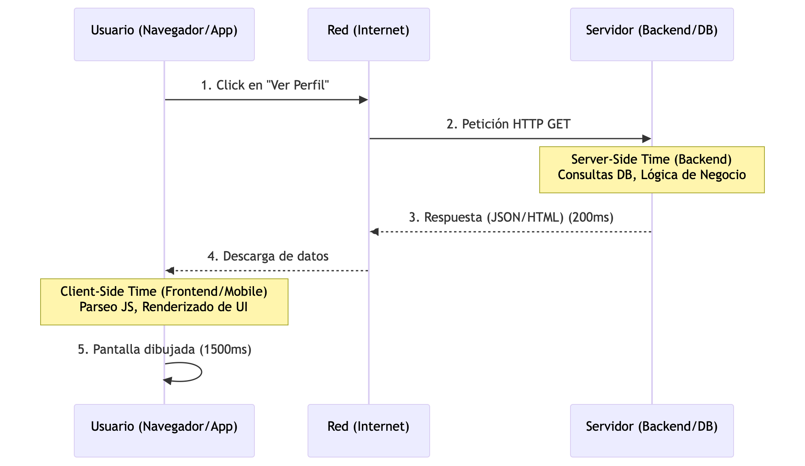

1. **Server-Side (Backend):** Es el tiempo que tarda el servidor en procesar la petición y devolver los datos. Si la base de datos es lenta o el servidor no tiene CPU suficiente, esto falla. (Aquí usaremos **JMeter**).
2. **Client-Side (Frontend/Mobile):** Es el tiempo que tarda el dispositivo del usuario en dibujar los datos en la pantalla. Si el servidor respondió en 20ms, pero la aplicación web descargó 5MB de JavaScript que el procesador del celular tardó 3 segundos en ejecutar, el usuario experimentará una aplicación lenta. (Aquí usaremos **Chrome DevTools y Android Profiler**).

### La Taxonomía de las Pruebas de Rendimiento

No existe una sola "Prueba de Carga". Dependiendo de lo que queramos descubrir, aplicamos diferentes perfiles de tráfico.

1. **Pruebas de Carga (Load Testing):**
    - *Objetivo:* Verificar que el sistema soporta el tráfico **esperado** en el día a día.
    - *Ejemplo:* Simular 500 usuarios navegando simultáneamente durante 1 hora.
2. **Pruebas de Estrés (Stress Testing):**
    - *Objetivo:* Encontrar el **punto de quiebre**. Vamos subiendo la carga hasta que el servidor colapsa (da errores 500 o deja de responder). Sirve para saber cuál es nuestro límite máximo absoluto.
3. **Pruebas de Picos (Spike Testing):**
    - *Objetivo:* Evaluar cómo el sistema maneja aumentos **extremos y repentinos** de tráfico, y si puede recuperarse después.
    - *Ejemplo:* El minuto exacto en que empieza el "Black Friday" o se envían notificaciones Push a 1 millón de usuarios.
4. **Pruebas de Resistencia (Endurance / Soak Testing):**
    - *Objetivo:* Mantener una carga moderada durante un **largo periodo** (12 a 72 horas).
    - *Ejemplo:* Se usa exclusivamente para detectar **Fugas de Memoria (Memory Leaks)** que no se notan en una prueba de 10 minutos, pero que eventualmente tiran el servidor al cabo de dos días.

### El Lenguaje del Rendimiento (Métricas Clave)

Para reportar problemas de rendimiento, no podemos decir "va lento". Necesitamos hablar con precisión matemática.

- **Throughput (Rendimiento/Tasa de transferencia):** ¿Cuántas peticiones por segundo (RPS) o transacciones por segundo (TPS) puede manejar el sistema?
- **Latency (Latencia):** El tiempo que tarda un paquete de datos en viajar desde el cliente al servidor y volver. Es un problema de física y redes, no de código.
- **Response Time (Tiempo de Respuesta):** El tiempo total desde que se envía la petición hasta que se recibe el último byte de respuesta.

**La Trampa del Promedio (Por qué usamos Percentiles)**

Si tienes 10 peticiones que tardan `10ms` y 1 petición que tarda `1000ms`, el **promedio** es `100ms`. Si le dices a tu jefe "El promedio es 100ms", él pensará que todo está bien. ¡Pero el 10% de tus usuarios esperó un segundo entero!

Por eso en QA usamos **Percentiles**:

- **P90 (Percentil 90):** Significa que el 90% de los usuarios experimentan este tiempo de respuesta *o menos*. Es la métrica estándar de la industria.
- **P99 (Percentil 99):** Nos muestra la experiencia del 1% de los usuarios más desafortunados. Aquí es donde se esconden los problemas de red o las pausas del *Garbage Collector*.

**Core Web Vitals (El estándar Frontend)**

Para la parte web, Google estandarizó tres métricas críticas que incluso afectan el SEO (posicionamiento) de tu página:

1. **LCP (Largest Contentful Paint):** Tiempo de carga del elemento más grande en la pantalla (una imagen héroe o un bloque de texto). Mide la **velocidad de carga percibida**.
2. **CLS (Cumulative Layout Shift):** Mide la **estabilidad visual**. ¿El texto salta de repente porque acaba de cargar una imagen publicitaria arriba y desplazó todo hacia abajo?
3. **INP (Interaction to Next Paint):** *(Reemplazó a FID en 2024)*. Mide la **capacidad de respuesta**. Cuando el usuario hace clic en un acordeón o añade al carrito, ¿cuánto tarda la página en mostrar un cambio visual que confirme que el clic funcionó?

Un QA Funcional reporta: "El botón de Login funciona".

Un QA de Rendimiento reporta: "El botón de Login soporta 300 TPS continuos con un P90 de 250ms, pero la métrica INP en frontend degrada la experiencia en dispositivos móviles de gama baja debido a un exceso de ejecución en el Hilo Principal (Main Thread)".

<aside>
Con las bases teóricas y el vocabulario claro, estamos listos para abrir el capó de un navegador web. En la próxima sección, aprenderemos a leer "Cascadas de Red" y a medir los Core Web Vitals usando Chrome DevTools.

</aside>

## **Frontend - Red y Core Web Vitals**

En este módulo, no escribiremos código. Usaremos la herramienta de diagnóstico más potente y subestimada del mundo del desarrollo web: **Chrome Developer Tools (DevTools)**.

Nuestro objetivo es entender cómo viajan los datos desde el servidor hasta el navegador del usuario y cómo esos datos afectan la experiencia visual.

**"El backend puede ser un Ferrari, pero si la carretera (Red) está llena de baches o el peaje (Render-blocking) es lento, el usuario viaja a 10 km/h."**

### Teoría: La Anatomía de la Cascada (The Waterfall)

Cuando escribes una URL y presionas Enter, no descargas "una página web". Descargas un documento HTML que contiene *instrucciones* para descargar docenas (o cientos) de otros archivos: CSS, JavaScript, Imágenes, Fuentes, etc.

El orden y el tiempo que tardan estas descargas se visualiza en un gráfico llamado **Waterfall (Cascada)**. Aprender a leerlo es la habilidad #1 de un Performance Engineer.

Cada petición en la cascada tiene fases críticas:

1. **Queueing (En cola):** El navegador retrasa la petición. Chrome solo permite ~6 conexiones simultáneas por dominio. Si pides 20 imágenes a la vez, 14 se quedan "en cola".
2. **DNS Lookup & TCP/SSL:** Tiempo buscando la IP del servidor y estableciendo la conexión segura (Handshake).
3. **TTFB (Time To First Byte):** **¡Métrica Crítica!** Es el tiempo de espera desde que enviamos la petición hasta que el servidor responde con el *primer byte* de datos. Si el TTFB es alto (ej: > 500ms), el problema **casi siempre es el Backend o la Base de Datos**.
4. **Content Download:** El tiempo que tarda el archivo en descargar. Si es alto, el archivo es muy pesado o la red del usuario es muy lenta.

### Práctica: Análisis de Red en el Mundo Real

Vamos a analizar la carga de un sitio complejo. Usaremos Wikipedia (o cualquier e-commerce pesado que prefieras).

**Paso a Paso:**

1. Abre Google Chrome en una pestaña de incógnito (para evitar que tus extensiones ensucien los datos).
2. Abre DevTools: Presiona `F12` o `Ctrl+Shift+I` (Windows) / `Cmd+Option+I` (Mac).
3. Ve a la pestaña **Network (Red)**.
4. **Configuración vital para QA:**
    - Marca la casilla **"Disable cache"** (Desactivar caché). Si no haces esto, Chrome cargará los archivos desde tu disco duro en 1ms, dándote resultados falsos.
5. Navega a: `https://en.wikipedia.org/wiki/Software_testing`

**Análisis del Investigador:**

- Mira la columna **Waterfall** o **Timing**. Pasa el cursor sobre la primera barra (el documento HTML). Se abrirá un desglose. Observa el valor de **Waiting for server response (TTFB)**.
- En la parte superior, busca el filtro de tipos y selecciona **JS**. ¿Cuántos scripts se descargaron?
- Mira la parte inferior de la pantalla. Verás un resumen estadístico:
    - *Ejemplo:* `85 requests | 1.2 MB transferred | Finish: 2.5 s | DOMContentLoaded: 800 ms | Load: 1.2 s`
    - *Load* es el momento en que todos los recursos principales terminaron de descargar.

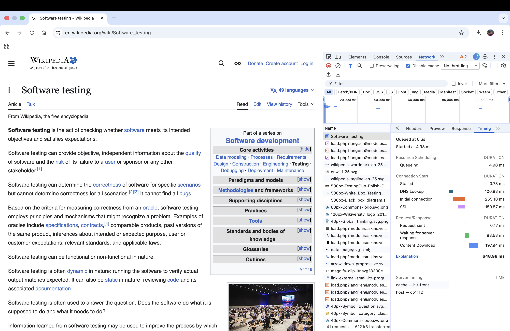

### Práctica: Empatía Digital (Network Throttling)

Probar con fibra óptica de 1 Gbps es un engaño. Vamos a simular cómo vive el usuario promedio en una red móvil inestable.

1. En la misma pestaña **Network**, busca el menú desplegable que dice **"No throttling"** (Sin limitación).
2. Cámbialo a **"Slow 4G"** (o "Fast 3G" dependiendo de tu versión de Chrome).
3. Vuelve a cargar la página de Wikipedia (`F5`).

**¿Qué pasó?**

- El tiempo de Load pasó probablemente de 1.2s a 5s o más.
- Si miras la cascada, la barra de **Content Download** de las imágenes grandes ahora es larguísima.
- *Lección de QA:* Aquí es donde detectas que los desarrolladores están enviando imágenes de 5MB sin comprimir para mostrarlas en un recuadro de 100x100 píxeles.

### Teoría y Práctica: Core Web Vitals (Lighthouse)

Mirar peticiones individuales es útil para depurar, pero para dar un reporte a gerencia necesitamos **Métricas de Experiencia de Usuario**. Google definió los **Core Web Vitals**:

1. **LCP (Largest Contentful Paint):** ¿Cuánto tarda en aparecer lo más importante? (Debe ser < 2.5 segundos).
2. **CLS (Cumulative Layout Shift):** ¿La página "tiembla" o los botones se mueven mientras carga? (Debe ser < 0.1).
3. **INP (Interaction to Next Paint):** Cuando hago clic en un botón, ¿cuánto tarda el navegador en procesar el JS y mostrar un cambio visual? (Debe ser < 200 milisegundos).

**Generando tu Primer Reporte Lighthouse**

Chrome tiene una herramienta de auditoría automatizada integrada.

1. Ve a la pestaña **Lighthouse** en DevTools.
2. Selecciona:
    - **Mode:** Navigation (Default).
    - **Device:** Mobile.
    - **Categories:** Performance (Puedes desmarcar Accessibility, SEO, etc. por ahora).
3. Haz clic en **"Analyze page load"**.

Chrome tomará el control. Achicará la ventana (simulando un Moto G Power), estrangulará la CPU (simulando un procesador móvil lento) y simulará una red 4G. Al terminar, te dará un puntaje del 0 al 100.

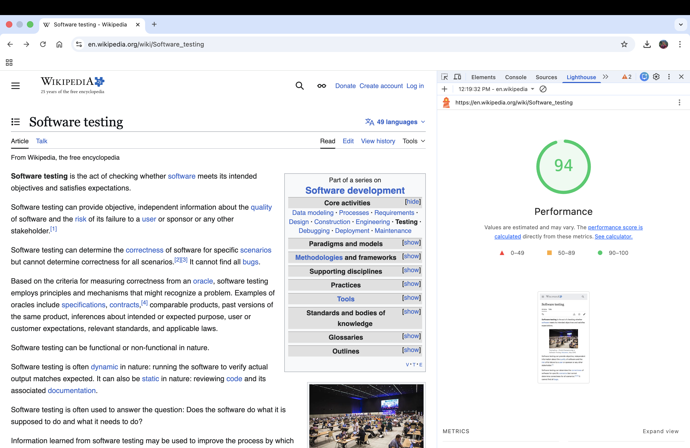

**Interpretación del Reporte QA:**

Baja hasta la sección **"Opportunities" (Oportunidades)** y **"Diagnostics"**. Aquí es donde un SDET brilla. Encontrarás hallazgos como:

- *Eliminate render-blocking resources:* Significa que hay un archivo CSS o JS en el <head> que está obligando al navegador a detener el dibujado de la pantalla hasta que se descargue.
- *Properly size images:* Imágenes gigantes mostradas en espacios pequeños.
- *Reduce unused JavaScript:* Código muerto que está consumiendo ancho de banda y CPU.

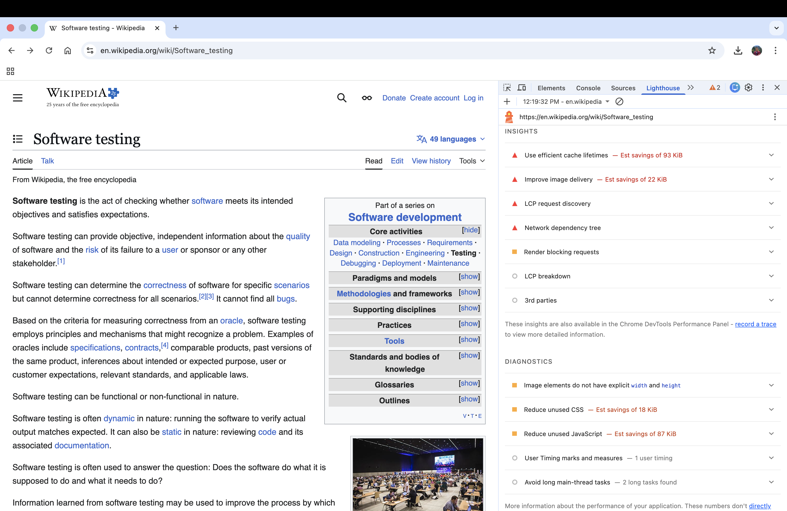

Como Tester Funcional, si haces clic y el menú se abre, el test "Pasa".

Como Tester de Rendimiento, si al hacer clic el menú tarda 400ms en abrirse (INP alto) porque el navegador está ocupado ejecutando un script de analíticas (Google Tag Manager, trackers), el test **Falla**.

Los Core Web Vitals son aserciones de calidad innegociables en 2026.

<aside>
¿Pudiste generar el reporte de Lighthouse y ver la cascada de red en tu navegador?

Si la red ya no tiene secretos para ti, prepárate. En la siguiente sección, vamos a sumergirnos en el interior del navegador: El Motor de JavaScript. Aprenderemos a grabar perfiles de CPU y a cazar fugas de memoria web.

</aside>

## **Frontend - CPU y Memoria**

La red nos dice qué tan rápido llegan los datos, pero ahora vamos a ver qué hace el navegador con ellos.

Aquí dejamos de mirar los cables y abrimos el cerebro del navegador: el **Motor V8** y el **Motor de Renderizado (Blink)**. Si alguna vez has usado una página web que hace que los ventiladores de tu computadora suenen como un avión despegando, el problema está aquí.

**"Si tu código JavaScript tarda 200 milisegundos en ejecutarse, tu pantalla estará congelada durante 200 milisegundos. A eso lo llamamos 'Jank'."**

### Teoría: El Dictador del Navegador (El Hilo Principal)

Los navegadores web modernos tienen una limitación arquitectónica fundamental: **JavaScript es de un solo hilo (Single-Threaded)**.

Este "Hilo Principal" (Main Thread) es el empleado del mes. Lo hace todo:

1. Analiza el HTML.
2. Calcula los estilos CSS.
3. Ejecuta tu código JavaScript.
4. Dibuja los píxeles en la pantalla (Paint).

**La regla de los 60 FPS (Cuadros por segundo):**

Para que una animación o el scroll se vean fluidos, la pantalla debe actualizarse 60 veces por segundo.

Matemática simple: 1000 ms / 60 frames = 16.6 ms por frame.

Si un bloque de tu código JavaScript tarda **50ms** en ejecutarse, el Hilo Principal está bloqueado. No puede dibujar los siguientes 3 cuadros. El usuario hace scroll y la pantalla "tironea". Esos son los temidos **Long Tasks** (Tareas Largas), y son los asesinos directos de la métrica **INP (Interaction to Next Paint)** que vimos en el módulo anterior.

### Práctica: El Profiler de CPU (Pestaña Performance)

Vamos a grabar y diseccionar el trabajo del Hilo Principal.

1. Abre DevTools (F12) y ve a la pestaña **Performance (Rendimiento)**.
2. **Configuración del Laboratorio:** Haz clic en el ícono del engranaje (Capture settings) arriba a la derecha.
    - En **CPU**, selecciona **"4x slowdown"** o **"6x slowdown"**. Esto simula el procesador de un teléfono móvil promedio. Probar con tu CPU i9 o M3 arruinará el experimento.
3. Haz clic en el botón de **Record** (el círculo gris).
4. Interactúa con la página (haz scroll, abre un menú, escribe en un buscador).
5. Haz clic en **Stop**.

**Interpretando el Flame Chart (Gráfico de Llamas)**

Chrome generará un gráfico masivo. No te asustes.

1. **La línea de tiempo superior:** Verás picos rojos. Esos picos indican que los FPS cayeron drásticamente.
2. **La sección "Main":** Este es el Hilo Principal. Verás barras de colores apiladas hacia abajo:
    - **Amarillo (Scripting):** Ejecución de JavaScript. (Llamadas a funciones, parsing de JSON).
    - **Morado (Rendering):** Recálculo de estilos CSS y Layout (posición de los elementos).
    - **Verde (Painting):** Dibujando los píxeles en la pantalla.
3. **Buscando al culpable:** Si ves una barra amarilla muy ancha con un triángulo rojo en la esquina, ¡bingo! Es un **Long Task**. Si haces clic en ella, el panel inferior ("Bottom-Up" o "Call Tree") te dirá exactamente qué función de JavaScript tardó tanto y en qué línea de código está.

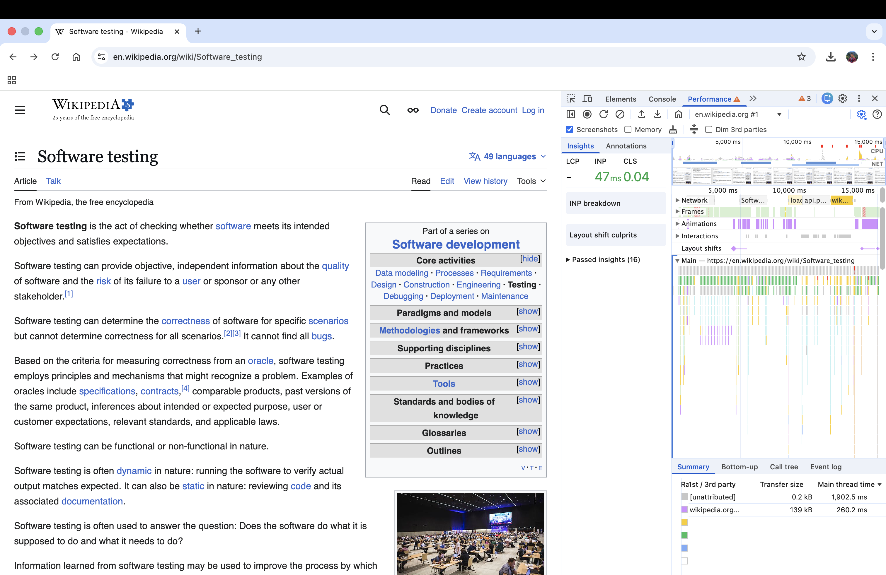

**El Anti-Patrón: Layout Thrashing (Ataque de Diseño)**

En tu análisis morado (Rendering), podrías ver muchas barras delgadas y repetitivas. Esto sucede cuando un desarrollador hace esto en un bucle:

1. Lee el ancho de un elemento (`element.offsetWidth`).
2. Cambia el ancho de otro elemento (`element.style.width = '100px'`).
3. Repite.

Al cambiar el ancho, el navegador invalida el diseño. Al leer el ancho en la siguiente línea, obligas al navegador a detener el JS y recalcular toda la pantalla sincrónicamente. Esto destruye el rendimiento.

### Teoría: Fugas de Memoria en JavaScript (Memory Leaks)

JavaScript es un lenguaje con **Garbage Collector (GC)** o Recolector de Basura. Tú no liberas memoria manualmente (como en C++). El GC escanea la memoria periódicamente y elimina los objetos que ya no están referenciados por la aplicación.

**¿Cómo ocurre una fuga entonces?**

Ocurre cuando mantienes una referencia a un objeto que ya no necesitas, engañando al GC para que no lo borre.

*Causas comunes:*

1. **Event Listeners no eliminados:** Agregas un `window.addEventListener('resize', miFuncion)`, la página o el componente desaparece (ej. en React/Angular), pero nunca llamaste a `removeEventListener`.
2. **Timers olvidados:** Un `setInterval` corriendo en el fondo para un componente destruido.
3. **Detached DOM Trees (Árboles DOM Desprendidos):** El peor de todos. Guardas un nodo HTML en una variable global o en un closure, y luego eliminas ese elemento de la pantalla (`element.remove()`). Aunque ya no se ve, el navegador no puede liberar su memoria porque tu variable de JS lo sigue "sosteniendo".

### Práctica: Cazando Fugas con Heap Snapshots (Pestaña Memory)

Si una pestaña de Chrome consume 100MB al abrir, y tras usarla por 20 minutos consume 1.5GB y crashea, tienes una fuga de memoria. Vamos a cazarla usando la **Técnica de los 3 Snapshots**.

1. Abre la pestaña **Memory** en DevTools.
2. Asegúrate de tener seleccionado **"Heap snapshot"**.
3. **Paso 1 (Línea Base):** Haz clic en el botón "Take snapshot" (Tomar instantánea). Esto toma una "foto" de toda la memoria actual (Snapshot 1).
4. **Paso 2 (Acción):** En tu página web, abre un modal (o navega a otra vista en una SPA) y luego ciérralo.
5. **Paso 3:** Vuelve a hacer clic en "Take snapshot" (Snapshot 2).
6. **Paso 4 (Confirmación):** Repite la acción (abrir y cerrar el modal) y toma un tercer snapshot (Snapshot 3).

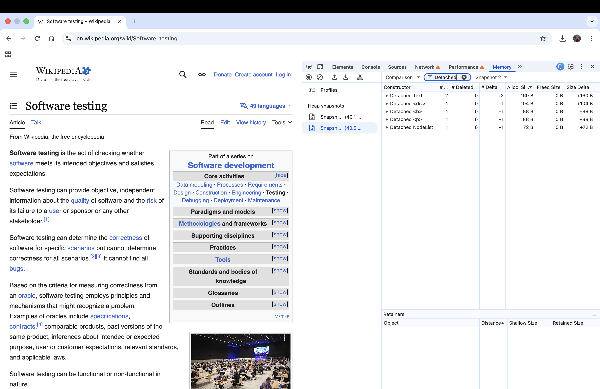

**Analizando la Sangría de Memoria**

Ahora selecciona el **Snapshot 3**.

- En la parte superior (arriba de la tabla), cambia el filtro de "Summary" (Resumen) a **"Comparison" (Comparación)**.
- Compáralo con el **Snapshot 1**.
- En la barra de búsqueda de clases (Class filter), escribe **Detached** o **HTML**.

**El Diagnóstico del SDET:**

Si ves filas que dicen `Detached HTMLDivElement` y en la columna de "Delta" (Diferencia) dice +5, significa que al abrir y cerrar tu modal dejaste 5 elementos `<div>` atrapados en la memoria RAM que el Garbage Collector no pudo limpiar.

Si haces clic en uno de esos elementos, la ventana inferior **"Retainers" (Retenedores)** te mostrará exactamente qué variable o archivo de JavaScript está impidiendo que ese elemento sea borrado (generalmente, un *closure* o un array global).

Las fugas de memoria son asesinos silenciosos. No rompen tus pruebas E2E en Cypress porque tus tests duran 30 segundos y el navegador se cierra.

Un usuario real deja la pestaña abierta todo el día. Como Ingenieros de Rendimiento, usar la pestaña *Memory* nos permite encontrar bugs que arruinarían la experiencia en producción después de horas de uso.

<aside>
¿Lograste grabar un perfil de CPU y ver el famoso Main Thread?

Si el Frontend Web ya no tiene secretos para ti, es momento de cambiar de ecosistema. En la siguiente sección abandonaremos el navegador web y conectaremos nuestro teléfono Android para ver qué consume la batería de una App Nativa.

</aside>

## **Mobile - Android Studio Profiler**

¡Cambio de ecosistema! Dejamos atrás el navegador web y nos adentramos en el mundo nativo.

En esta sección vamos a abrir el capó de una aplicación Android. Si en la web un mal rendimiento significa una pantalla lenta, en móvil significa **batería drenada, sobrecalentamiento y el temido mensaje "La aplicación no responde" (ANR)**.

Para esta sección, utilizaremos la `TallerLoginApp` que construimos en el taller de Firebase, y la conectaremos al escáner médico más avanzado de Google: **El Android Studio Profiler**.

**"En el desarrollo móvil, la CPU y la Red no son recursos infinitos; son la batería del usuario consumiéndose en tiempo real."**

### Teoría: El Hilo de UI y el Fantasma del ANR

Al igual que los navegadores, Android tiene un **Main Thread** (Hilo Principal), también conocido como el **UI Thread** (Hilo de Interfaz de Usuario).

Su trabajo es dibujar la pantalla 60 o 120 veces por segundo (en los teléfonos modernos). Si ejecutas una operación matemática compleja, una consulta a base de datos (Room/SQLite) o una llamada de red en este hilo, la pantalla se congela.

- **Jank (Tirones):** Si bloqueas el hilo por más de 16 milisegundos, el usuario nota que la animación "salta" o se traba.
- **ANR (Application Not Responding):** Si bloqueas el hilo por **5 segundos**, el sistema operativo Android pierde la paciencia y le muestra al usuario un cuadro de diálogo preguntando si desea cerrar (matar) la aplicación. Para un Ingeniero de Rendimiento, un ANR es un fallo crítico de Nivel 1.

### Práctica: Setup y Conexión al Profiler

Vamos a conectar nuestra aplicación al monitor de signos vitales.

1. Abre **Android Studio** (versión Koala, Ladybug o superior) y carga tu proyecto `TallerLoginApp`.
2. Conecta tu dispositivo físico por USB (recomendado para métricas reales) o inicia el Emulador.
3. **Ejecuta la app** haciendo clic en el botón normal de "Run" (el triángulo verde).
4. En la barra inferior de Android Studio, busca la pestaña **"Profiler"** (o ve a *View > Tool Windows > Profiler*).
5. Selecciona tu dispositivo y el paquete de tu app (`com.example.tallerloginapp`).

Inmediatamente, verás un listado de Tasks para hacer profiling

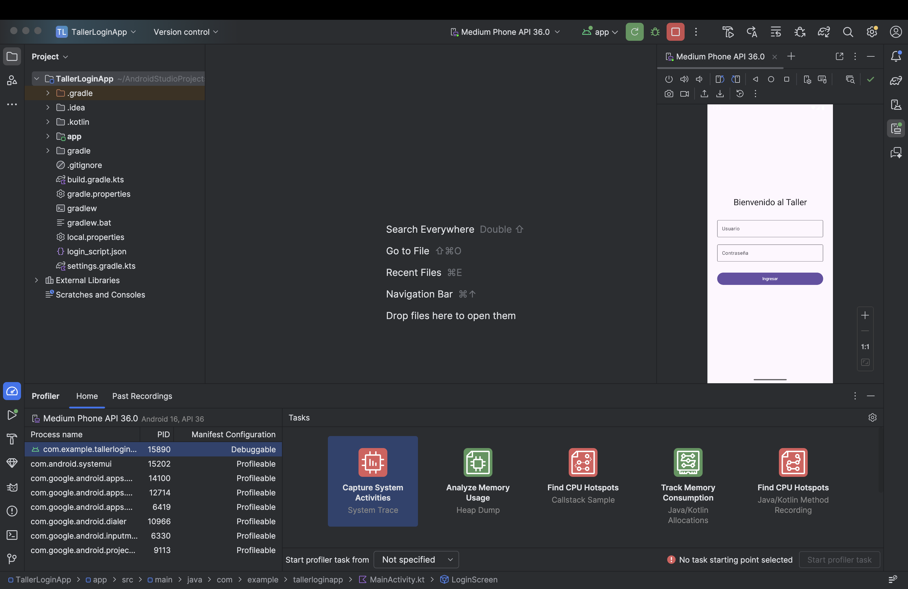

### El CPU Profiler: Cazando el Código Lento

Vamos a investigar qué hace exactamente el procesador cuando el usuario interactúa con la app.

1. En la línea de tiempo del Profiler, haz clic en la card que dice **Find CPU Hotspots**. Esto abrirá el inspector detallado.
2. En la parte inferior seleccionas “Start profiler task from” **Process Star (Restart process)**, e inicias la tarea de profiling.
3. En tu aplicación (en el teléfono o emulador), haz clic en el botón de "Ingresar" un par de veces.
4. Haz clic en **Stop**.

Android Studio procesará los datos y te mostrará un panel complejo.

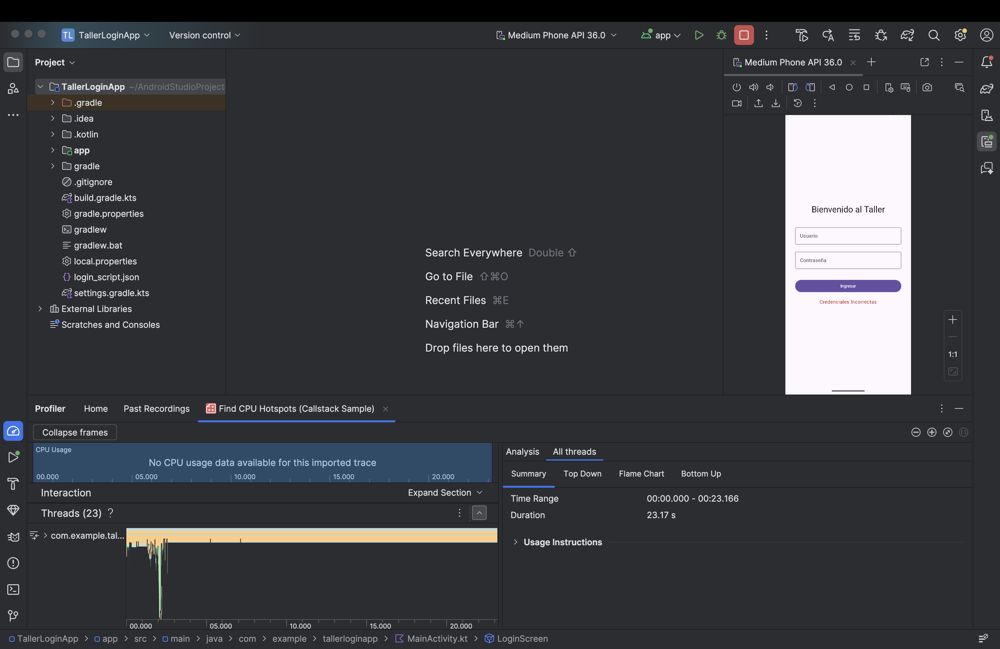

**Interpretando el Flame Chart (Gráfico de Llamas Nativo)**

El análisis móvil es ligeramente distinto al web. Verás varias pestañas: *Call Chart*, *Flame Chart*, *Top Down* y *Bottom Up*.

Ve a la pestaña **Flame Chart**.

- **El Eje X (Horizontal):** No representa tiempo cronológico, sino el tiempo total agregado que tomó una función. Si una barra es muy ancha, consumió mucha CPU.
- **El Eje Y (Vertical):** Representa la pila de llamadas (Call Stack). Quién llamó a quién. onClick llamó a validarCredenciales, que llamó a encriptarPassword.
- **El Color:** En Android Studio, los métodos del sistema (Android SDK) suelen ser naranjas/rojos, los métodos de librerías de terceros (ej. Retrofit/OkHttp) son azules, y **TUS métodos (tu código Kotlin)** son de color verde.

**El Diagnóstico del SDET:**

Busca barras **verdes muy anchas** en el `main` thread. Si ves que el método `validarCredenciales()` es una barra gigante, acabas de encontrar el cuello de botella. En una app real, podrías descubrir que un desarrollador está parseando un JSON de 5MB en el Hilo de UI en lugar de usar una Corrutina de Kotlin (`Dispatchers.IO`) en segundo plano.

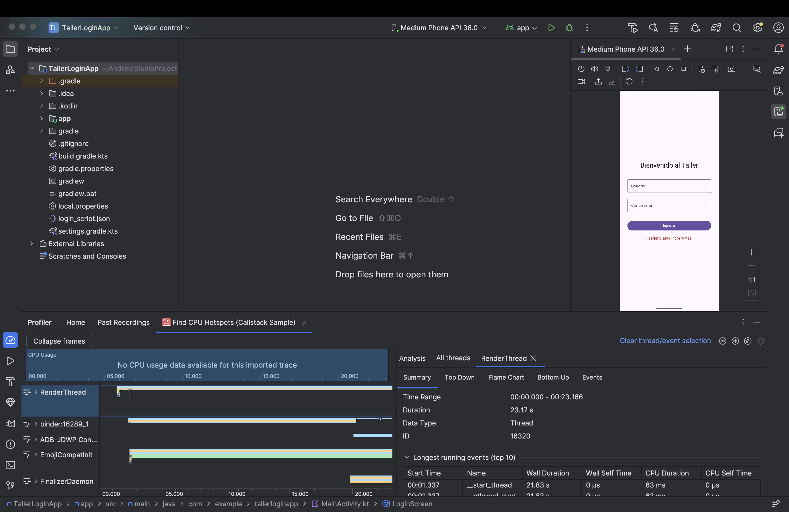

### El Network Inspector (Intercepción de Red)

A diferencia de la web, donde basta con presionar `F12` para ver las peticiones de red, en las apps móviles el tráfico está oculto e intercederlo externamente requiere proxys complejos (como Charles o Wireshark). Sin embargo, el Profiler de Android nos da visión de rayos X interna.

1. Regresa a la vista principal del Profiler (haz clic en el botón de retroceso < arriba a la izquierda).
2. Haz clic en la card de **Network**.

*(Nota didáctica: Nuestra* `TallerLoginApp` *no hace peticiones a internet reales aún. Imagina que agregamos una llamada a una API usando Retrofit/OkHttp).*

**Qué buscar en el Network Profiler:**

Si tu aplicación estuviera haciendo peticiones a un servidor backend, verías gráficos de barras en tiempo real.

1. **Connection View:** Haz clic y arrastra sobre la línea de tiempo para seleccionar un rango. En el panel inferior verás una lista de todas las peticiones HTTP/HTTPS.
2. **Request/Response Details:** Si haces clic en una petición, podrás ver:
    - **Headers:** Para verificar si estamos enviando los tokens de autenticación correctos.
    - **Payload/Body:** Para ver el tamaño de las imágenes o el JSON que estamos descargando.
    - **Timing:** El tiempo de DNS, conexión y transferencia (TTFB en móvil).

**El Diagnóstico del SDET:**

Un error muy común en móvil es el **"Over-fetching"** (Traer datos de más).

Ejemplo: Vas a la vista de "Perfil" y el Network Profiler muestra que la app descargó un JSON de 2MB. Revisas el *Response* y ves que el backend envió el historial completo de compras de los últimos 10 años del usuario, cuando la pantalla solo necesita mostrar el "Nombre" y la "Foto".

Ese es un hallazgo de rendimiento crítico. Está consumiendo el plan de datos del usuario, agotando la batería para parsear el JSON y volviendo la app lenta.

Las pruebas E2E con Appium o Espresso pueden pasar con éxito (en verde) incluso si la app descarga 10MB innecesarios o si la CPU llega al 100%.

Usar el Profiler nos convierte en **Ingenieros de Confiabilidad (Reliability Engineers)**. Aseguramos que la aplicación sea "ciudadana ejemplar" en el dispositivo del usuario.

<aside>
¿Localizaste el Flame Chart y viste cómo se pintaban los métodos de tu aplicación?

En la siguiente sección, subiremos la dificultad. Vamos a sabotear nuestra propia aplicación introduciendo una **Fuga de Memoria (Memory Leak)** y usaremos el *Memory Profiler* para capturarla en el acto antes de que el sistema operativo mate nuestra app por falta de RAM (OOM).

</aside>

## **Mobile - Fugas de Memoria (Heap Dumps)**

En esta sección, nos enfrentaremos al asesino silencioso más temido por los desarrolladores móviles: **La Fuga de Memoria (Memory Leak)**.

A diferencia de un error de sintaxis que hace que la app se cierre inmediatamente, una fuga de memoria es insidiosa. La app funciona perfectamente al principio, pero a medida que el usuario navega, la aplicación consume más y más RAM (memoria de acceso aleatorio) hasta que el sistema operativo Android dice: *"Esta aplicación está asfixiando al teléfono"* y la asesina sin piedad, lanzando un `OutOfMemoryError` (OOM).

**"Una aplicación que no libera lo que ya no usa, está destinada a ser eliminada por el sistema."**

### Teoría: El Ciclo de Vida y el Recolector de Basura (GC)

En Android (Kotlin/Java), no liberamos memoria manualmente (como en C o C++). Tenemos un **Garbage Collector (GC)**.

**¿Cómo funciona el GC?**

El GC busca objetos en la memoria (Heap) que ya no tienen ninguna "referencia fuerte" (nadie los está usando ni apuntando a ellos) y los destruye para liberar espacio.

**¿Cómo engañamos al GC (Memory Leak)?**

Las fugas ocurren cuando mantenemos una referencia a un objeto pesado (como un `Activity`, un `Context` o un `Bitmap` de una imagen de 4K) mucho tiempo después de que el usuario ya cerró esa pantalla. Como nuestra variable sigue "sosteniendo" la pantalla, el GC no puede borrarla.

*Resultado:* El usuario abre la pantalla de Login 10 veces, y en lugar de tener 1 pantalla en memoria, tenemos 10 pantallas fantasma consumiendo RAM.

### Práctica: El Sabotaje (Inyectando un Leak Intencional)

Para cazar un monstruo, primero debemos crearlo. Vamos a modificar nuestra `TallerLoginApp` para que filtre memoria de forma agresiva.

Abre tu proyecto en Android Studio y ve a `MainActivity.kt`.

**Paso 1: Crear un Objeto Estático Peligroso**

En Kotlin, el equivalente a un `static` de Java es un `companion object`. Estos objetos viven durante **toda la vida útil de la aplicación**, no de la pantalla.

Modifica tu `MainActivity` agregando este bloque dentro de la clase, pero fuera del `onCreate`:

```kotlin
class MainActivity : ComponentActivity() {

    // EL SABOTAJE: Una lista estática que vivirá para siempre en la RAM
    companion object {
        val memoryLeakList = mutableListOf<ComponentActivity>()
    }

    override fun onCreate(savedInstanceState: Bundle?) {
        super.onCreate(savedInstanceState)
        
        // CULPABLE: Cada vez que se crea esta pantalla (ej. al rotar el teléfono), 
        // nos guardamos a nosotros mismos en la lista estática.
        // Nunca nos borramos de la lista al destruir la pantalla (onDestroy).
        memoryLeakList.add(this)

        setContent {
            // ... (tu código Compose de LoginScreen) ...
        }
    }
}
```

**Paso 2: Generar el Leak en Vivo**

1. **Ejecuta la App** en el emulador (o dispositivo físico).
2. Abre el **Profiler** de Android Studio y conéctalo a tu app.
3. Haz clic en la card de **Analyze Memory Usage (Heap Dump)**, atado al proceso actual. Verás un gráfico azul subiendo y bajando (es normal, el GC está trabajando).
4. **La Acción Destructiva:** En tu emulador, **gira la pantalla** repetidamente (Horizontal -> Vertical -> Horizontal).
    - *Nota:* En Android, girar la pantalla destruye el `Activity` actual y crea uno nuevo.
    - Como nosotros estamos guardando cada nuevo `Activity` en nuestra `memoryLeakList` estática, cada vez que giras, agregamos una pantalla entera (con todos sus botones y textos) a la memoria permanente.

### Análisis Forense: Capturando el Heap Dump

Observa el gráfico de memoria azul. Si giraste la pantalla 20 veces, notarás que la línea base del gráfico está escalando como una escalera y nunca baja, incluso si dejas el teléfono quieto.

¡Tenemos una fuga confirmada! Vamos a averiguar exactamente qué línea de código es la culpable.

**Paso 3: Forzar el GC y Tomar la Foto**

1. En la parte superior del Memory Profiler, busca el ícono de un **Cubo de Basura** (Force Garbage Collection). Haz clic en él varias veces.
    - *Objetivo:* Le decimos a Android: "Limpia todo lo que puedas limpiar AHORA". Si la memoria no baja después de esto, el leak es real.
2. Haz clic en el botón de **"Capture Heap Dump"** (Capturar volcado del montón) o selecciona esa opción en el menú de grabación y presiona **Record**.

**Paso 4: Leyendo el Heap Dump**

Android Studio congelará la app por unos segundos, descargará toda la memoria RAM del teléfono y abrirá un panel complejo con miles de clases.

1. En la esquina superior derecha del panel inferior, asegúrate de que esté seleccionado **"Arrange by class"** (Organizar por clase).
2. Marca la casilla mágica: **"Show activity/fragment leaks"** (Mostrar fugas de `Activity/Fragment`) o busca el filtro de advertencias (un triángulo amarillo ⚠️).

Android Studio es lo suficientemente inteligente para decirte: *"Oye, encontré 15 instancias de* `MainActivity` *en la memoria, pero solo debería haber 1 o 0. Esto es una fuga"*.

1. Haz clic en `MainActivity` en la lista.
2. En el panel de la derecha (**Instance Details**), verás las copias "fantasma" de tu pantalla. Selecciona una.
3. En el panel inferior derecho (**References** o **Paths to GC Roots**), verás *quién* está sosteniendo a esa pantalla para que no sea borrada.

**¡BINGO!** El Profiler te acaba de decir exactamente qué variable (`memoryLeakList`) en qué clase (`Companion object`) está causando que el teléfono se quede sin memoria.

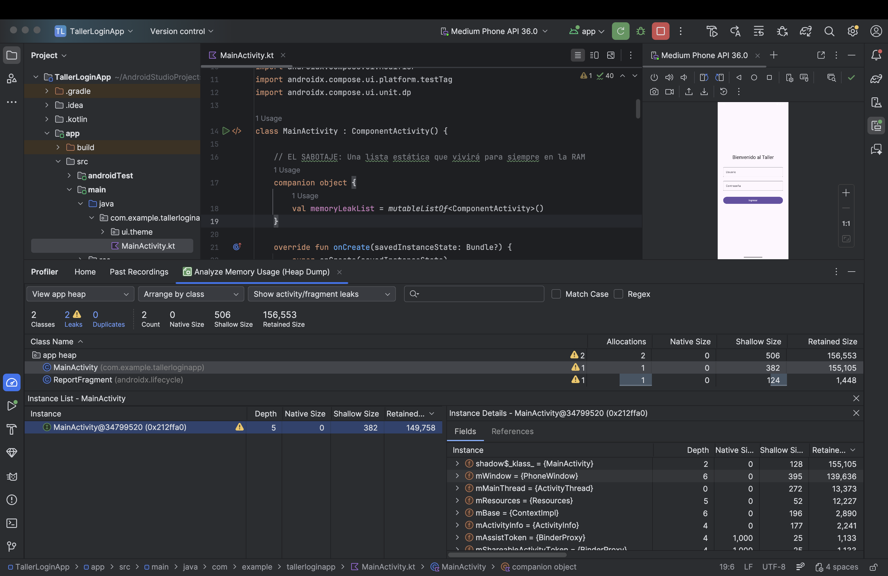

### Herramientas de Industria: LeakCanary (Bonus)

Leer Heap Dumps manualmente es como leer Matrix. Requiere mucha práctica.

En el mundo real del QA Automation, usamos una librería llamada **LeakCanary** desarrollada por Square.

- **¿Qué hace?** Se instala en la versión de Debug de la app. Si LeakCanary detecta que una pantalla fue destruida pero sigue en memoria 5 segundos después, captura el Heap Dump automáticamente, lo analiza en segundo plano y le muestra una notificación al desarrollador en el teléfono con el árbol exacto del problema (como lo hicimos nosotros, pero 100% automático).
- *Nota de Arquitectura:* Nunca instales LeakCanary en la versión de Producción, solo en los entornos de QA/Dev.

Un Tester manual reporta: "La app se pone lenta y se cierra después de usarla 30 minutos". El desarrollador intentará reproducirlo y probablemente no lo logre, marcando el bug como "No reproducible".

Un Ingeniero SDET usa el Memory Profiler, toma un Heap Dump, y adjunta la captura de pantalla del "Path to GC Root" en el ticket de Jira, señalando la variable estática exacta que el desarrollador olvidó limpiar. **Esa es la diferencia entre reportar un síntoma y diagnosticar una enfermedad.**

<aside>
¿Lograste hacer subir la memoria girando la pantalla y viste las múltiples instancias de MainActivity en el Heap Dump?

Con esto concluimos la fase Client-Side (Frontend y Mobile). Has aprendido a auditar navegadores y aplicaciones nativas.

Es hora de cambiar de liga. En la próxima sección, nos enfrentaremos al monstruo detrás de escena: El Servidor (Backend). Aprenderemos a someter APIs a presión militar usando Apache JMeter.

</aside>

## **Backend - Diseño de Pruebas de Carga**

¡Cambiamos de frente de batalla! Hemos auditado el Frontend (Web) y el Client-Side (Mobile). Pero, ¿qué pasa cuando la aplicación de un usuario funciona perfectamente, pero hay **10,000 usuarios más** haciendo exactamente lo mismo al mismo tiempo?

Aquí nos convertiremos en directores de orquesta de tráfico web. Dejaremos de simular a un usuario con un cronómetro, y empezaremos a simular a un ejército entero usando **Apache JMeter**.

**"Un servidor web es como un restaurante. Si entra un cliente, la comida sale en 5 minutos. Si entran 500 clientes de golpe, la cocina se incendia."**

### Teoría: ¿Qué es JMeter y qué NO es?

Apache JMeter es el estándar de la industria open-source para pruebas de carga. Está escrito 100% en Java.

**La Regla de Oro del SDET:** *JMeter NO es un navegador.*

A diferencia de Playwright o Cypress, JMeter no descarga imágenes (a menos que se lo pidas explícitamente), no renderiza CSS y, lo más importante, **NO ejecuta JavaScript**.

JMeter opera a nivel de protocolo (HTTP/HTTPS, TCP, JDBC, etc.). Envía bytes y recibe bytes. Por lo tanto, sirve exclusivamente para medir el rendimiento del **Servidor/Backend**, no la experiencia visual del usuario.

### Práctica: Setup y Tuning (El Secreto de los Profesionales)

Para usar JMeter, necesitas tener instalado el JDK de Java (versión 11 o superior, idealmente 17 o 21).

1. **Descarga:** Ve a la página oficial de Apache JMeter y descarga los binarios de la versión más reciente (5.6+). Descomprime la carpeta.
2. **El Ajuste de Memoria (Tuning):**
    
    Por defecto, JMeter viene configurado para usar solo 1GB de memoria RAM. Si intentas simular miles de usuarios con esa configuración, JMeter crasheará con un `OutOfMemoryError` antes que tu servidor.
    
    - Ve a la carpeta bin de JMeter.
    - lanzaremos una terminal desde esta ubicación, y ejecutaremos el programa pasando como argumento el nuevo límite de memoria. Para Windows, la extensión es `.bat` y para Mac es `.sh`.
    
    ```bash
    # Para Mac
    JVM_ARGS="-Xms1g -Xmx4g" ./jmeter.sh
    ```
    

### Arquitectura de un Test Plan (Plan de Pruebas)

En JMeter, todo sigue una jerarquía de árbol. Vamos a construir un script para atacar una API pública de pruebas: dummyjson.com.

**Paso 1: El Batallón (Thread Group)**

El *Thread Group* define cuántos usuarios vamos a simular y cómo van a entrar al sistema.

1. Haz clic derecho en **Test Plan** > **Add** > **Threads (Users)** > **Thread Group**.
2. Configura los parámetros clave:
    - **Number of Threads (users):** `10` (Vamos a simular 10 usuarios concurrentes).
    - **Ramp-up period (seconds):** `5` (JMeter tardará 5 segundos en meter a los 10 usuarios. Es decir, entrarán 2 usuarios por segundo. Esto evita un ataque DDOS instantáneo).
    - **Loop Count:** `2` (Cada usuario hará el flujo 2 veces. Total de peticiones: 10 x 2 = 20).

**Paso 2: El Soldado (HTTP Request Sampler)**

El *Sampler* es la acción que hace el usuario (la petición web).

1. Haz clic derecho en tu **Thread Group** > **Add** > **Sampler** > **HTTP Request**.
2. Llama a este paso: `GET Products`.
3. Configúralo así:
    - **Protocol:** `https`
    - **Server Name or IP:** `dummyjson.com`
    - **HTTP Request Method:** `GET`
    - **Path:** `/products`

**Paso 3: La Pausa Humana (Timers y Think Time)**

Un error de novatos es crear peticiones en bucle sin pausas. Las computadoras pueden hacer 1000 requests por segundo, los humanos no. Los humanos leen la pantalla antes de hacer clic. A esto se le llama **Think Time**. Si no pones pausas, estás haciendo un ataque de Denegación de Servicio (DDOS), no una prueba de carga realista.

1. Haz clic derecho en **GET Products** > **Add** > **Timer** > **Constant Timer** (o *Gaussian Random Timer* para mayor realismo).
2. Configura el **Thread Delay:** `2000` (milisegundos).
    - *Efecto:* Cada usuario esperará 2 segundos exactos antes de ejecutar la petición (o entre peticiones si hubiera más de una).

**Paso 4: El Control de Calidad (Assertions)**

Si tu servidor está colapsando, podría empezar a devolver mensajes de error rápidamente. Un error 500 (Internal Server Error) devuelto en 10ms es un fallo, no un éxito de rendimiento. JMeter, por defecto, marca en verde todo lo que sea `2xx` o `3xx`. Debemos ser más estrictos.

1. Haz clic derecho en **GET Products** > **Add** > **Assertions** > **Response Assertion**.
2. Configúralo:
    - **Field to Test:** `Response Code`
    - **Pattern Matching Rules:** `Equals`
    - **Patterns to Test:** Clic en "Add" y escribe 200.
3. *Opcional pero recomendado:* Agrega otra aserción de tipo `JSON Assertion` para verificar que el nodo `$.products` exista en la respuesta. Así validamos que la API no solo no falló, sino que trajo la data correcta bajo presión.

**Paso 5: Los Monitores (Listeners)**

Los Listeners nos permiten ver los resultados de la prueba.

1. Haz clic derecho en **Thread Group** > **Add** > **Listener** > **View Results Tree** (Ver Árbol de Resultados).
2. Haz clic derecho en **Thread Group** > **Add** > **Listener** > **Summary Report** (Reporte Resumido).

> **Nota:** Los Listeners consumen **mucha** memoria RAM porque guardan la respuesta de cada petición. **SOLO** deben usarse en modo GUI para depurar el script con 1 o 2 usuarios. ¡NUNCA los dejes activos cuando corras una prueba real de miles de usuarios!
> 

### Ejecución (Prueba de Humo Local)

Guarda tu Test Plan (ej: `API_LoadTest.jmx`).

1. Haz clic en el botón verde de **Play** en la barra superior.
2. Ve al Listener **View Results Tree**.
3. Verás aparecer 20 peticiones (10 usuarios x 2 loops). Todas deberían estar en verde.
4. Si haces clic en una de ellas, podrás inspeccionar el **Request** (lo que enviaste) y el **Response data** (el JSON gigante de productos que devolvió el servidor).
5. Ve al **Summary Report**. Aquí verás la magia de la estadística: Mínimo, Máximo, Promedio y Throughput (Peticiones por segundo).

Diseñar un Test Plan es un ejercicio de modelado matemático. Si tu sistema real tiene usuarios que navegan un 80% del tiempo y compran un 20%, tu script de JMeter debe reflejar esa misma proporción usando Controladores Lógicos (If Controllers, Throughput Controllers).

Una prueba de carga con el perfil de tráfico equivocado te dará resultados inútiles y falsas sensaciones de seguridad.

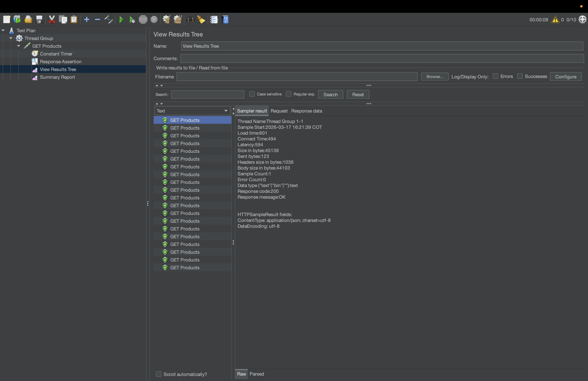

<aside>
¿Lograste configurar tu Thread Group y ver los resultados en verde en el Árbol de Resultados?

Si tu script funciona perfectamente en la interfaz gráfica, prepárate. En la siguiente sección, vamos a abandonar la interfaz visual, inyectaremos datos dinámicos desde archivos CSV y aprenderemos a generar Dashboards HTML ejecutivos desde la consola, como lo hacen los profesionales en entornos CI/CD.

</aside>

## **Backend - JMeter Avanzado**

¡Subimos de nivel! Nuestro script de la sección anterior funciona, pero tiene dos problemas graves que lo descalifican como una prueba de rendimiento profesional:

1. **Es predecible:** Cien usuarios pidiendo exactamente la misma URL (/products) causarán que el servidor guarde la respuesta en la memoria caché. Estaremos probando la memoria caché del servidor, no su capacidad real de procesamiento ni la Base de Datos.
2. **Es local y gráfico:** Si intentas lanzar 5,000 usuarios desde la interfaz gráfica (GUI) de JMeter, tu computadora explotará antes que el servidor.

Ahora vamos a convertir nuestro script en un arma de asedio dinámica y aprenderemos a ejecutarla como un verdadero DevOps.

**"Nunca pruebes la caché de un servidor pensando que estás probando su base de datos."**

### Teoría y Práctica: Data Driven Testing (CSV Data Set Config)

Para estresar un servidor de verdad, cada usuario virtual (Thread) debe hacer algo diferente. Vamos a simular un escenario de Login masivo donde cada usuario usa credenciales distintas.

**Paso 1: El Archivo de Datos**

Crea un archivo de texto simple llamado `usuarios.csv` en la misma carpeta donde guardaste tu script `.jmx`.

Añade datos falsos separados por comas (sin espacios extra):

```
emilys,emilyspass
michaelw,michaelwpass
sophiab,sophiabpass
```

*(Nota: dummyjson.com tiene estos usuarios de prueba preconfigurados en su API).*

**Paso 2: Inyectar el CSV en JMeter**

1. Abre tu `API_LoadTest.jmx` en la GUI de JMeter.
2. Haz clic derecho en tu **Thread Group** > **Add** > **Config Element** > **CSV Data Set Config**.
3. Arrastra este elemento para que quede arriba del todo (es buena práctica que las configuraciones sean lo primero que lea el Thread Group).
4. Configúralo:
    - **Filename:** `usuarios.csv` (Si está en la misma carpeta, basta con el nombre).
    - **Variable Names (comma-delimited):** `USER,PASS` (Esto creará dos variables en JMeter).
    - **Ignore first line:** `False` (Porque no le pusimos cabeceras a nuestro CSV).
    - **Recycle on EOF:** `True` (Si hay más Threads que filas en el CSV, volverá a empezar desde la primera línea).

**Paso 3: Usar las Variables (El POST Request)**

1. Haz clic derecho en el Thread Group > **Add** > **Sampler** > **HTTP Request**.
2. Nómbralo `POST Login`.
3. Configúralo:
    - **Method:** `POST`
    - **Path:** `/auth/login`
4. En la pestaña **Body Data** (abajo), escribe el JSON inyectando las variables de JMeter usando la sintaxis `${VARIABLE}`:

```json
{
  "username": "${USER}",
  "password": "${PASS}"
}
```

1. **IMPORTANTE:** Para hacer un POST con JSON, necesitas un Header. Haz clic derecho en `POST Login` > **Add** > **Config Element** > **HTTP Header Manager**. Añade una fila:
    - Name: `Content-Type`
    - Value: `application/json`

*Si ejecutas esto ahora (con 3 usuarios), cada petición POST enviará credenciales diferentes. ¡Has vencido a la caché del servidor!*

### **El Pecado Capital de JMeter**

Abre JMeter, mira la parte superior de la pantalla. Verás un texto que probablemente nunca leíste:

> *"Don't use GUI mode for load testing !, only for Test creation and Test debugging."*
> 

**¿Por qué?**

La interfaz gráfica de JMeter está escrita en Java Swing. Dibujar botones, actualizar tablas y renderizar el "View Results Tree" consume **gigabytes de memoria RAM**.

Si lanzas 1,000 usuarios desde la GUI, JMeter sufrirá un `OutOfMemoryError`. La prueba se detendrá, y tú creerás que el servidor falló, cuando en realidad **tu herramienta de pruebas fue la que colapsó**.

### Ejecución Profesional: Non-GUI Mode (CLI)

Para pruebas reales, JMeter se ejecuta desde la terminal negra y fría. Esto libera el 99% de la RAM para usarla exclusivamente en generar tráfico de red.

1. Asegúrate de **deshabilitar (Disable) o eliminar** todos los *Listeners* (View Results Tree, Summary Report) de tu script. Guárdalo (`API_LoadTest.jmx`).
2. Abre tu terminal y navega hasta la carpeta donde está tu script.
3. Ejecuta el **Comando Maestro de JMeter**:

```bash
jmeter -n -t API_LoadTest.jmx -l resultados.jtl -e -o ./Dashboard_HTML
```

**Anatomía del Comando Maestro:**

`-n` (Non-GUI): Le dice a JMeter que no abra la interfaz gráfica.

`-t API_LoadTest.jmx`: Especifica el *Test Plan* a ejecutar.

`-l resultados.jtl`: JMeter guardará cada petición, su latencia y su código de respuesta en un archivo CSV ligero (.jtl).

`-e`: Le indica a JMeter que genere un reporte final cuando acabe.

`-o ./Dashboard_HTML`: La carpeta (DEBE estar vacía o no existir) donde volcará el reporte ejecutivo.

Verás en tu consola un resumen cada cierto tiempo informando cuántos usuarios están activos y si hay errores.

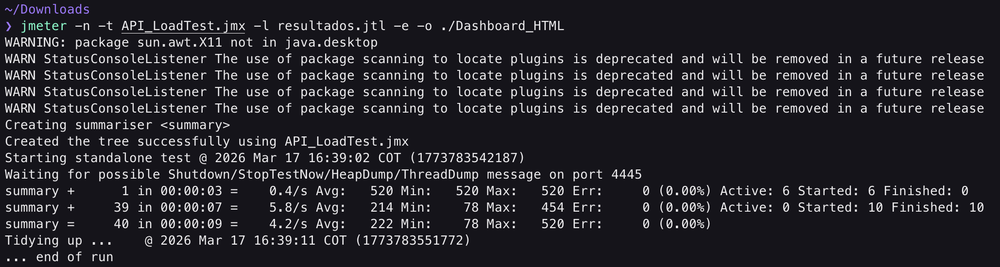

### El Reporte Ejecutivo (HTML Dashboard)

Nadie en la gerencia (CTOs, Product Managers) va a leer un archivo de texto `.jtl`. Ellos necesitan gráficos.

Cuando termine tu prueba por terminal, ve a tu explorador de archivos.

1. Abre la nueva carpeta `Dashboard_HTML`.
2. Haz doble clic en el archivo `index.html`. Se abrirá en tu navegador un dashboard interactivo de nivel profesional.

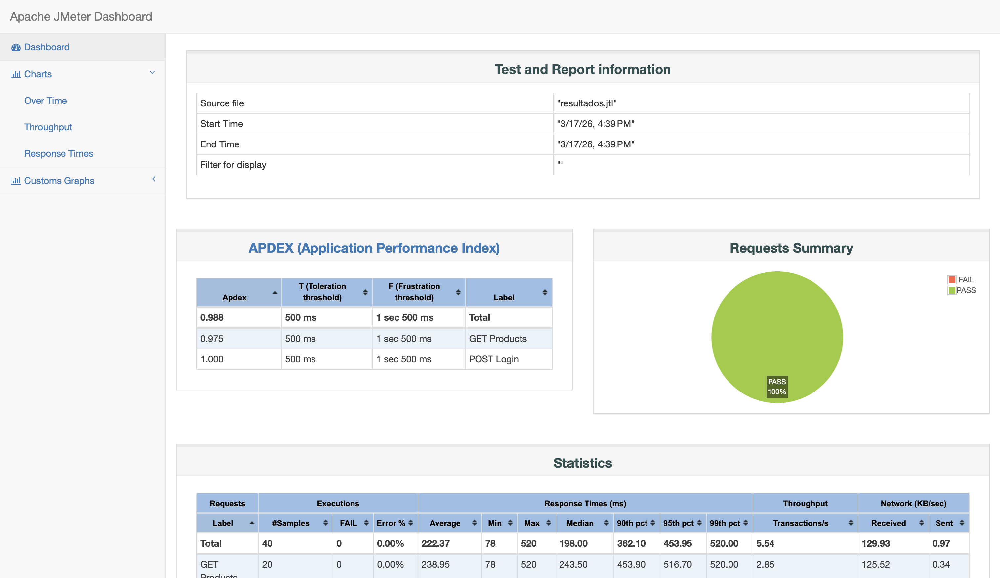

**Métricas Críticas para Explicar a tu Jefe:**

En el Dashboard, navega por el menú de la izquierda para analizar:

1. **APDEX (Application Performance Index):** Un estándar internacional de 0 a 1 que mide la satisfacción del usuario. `1.0` es excelente (todos los requests fueron rápidos). `< 0.5` es inaceptable.
2. **Response Times Over Time (Gráfico de Líneas):** Te muestra si el sistema se fue degradando con el tiempo. *Diagnóstico SDET:* Si la línea del tiempo de respuesta sube constantemente a medida que avanza la prueba, probablemente el servidor tiene un cuello de botella en la Base de Datos o un Memory Leak.
3. **Active Threads Over Time:** Te muestra cuántos usuarios estaban conectados en cada segundo. Sirve para correlacionar los picos de usuarios con los picos de lentitud.
4. **Response Time Percentiles:** Verás las famosas líneas de P90, P95 y P99 que discutimos en el Módulo 0.

Un Tester Junior dice: "JMeter me arrojó 5,000 errores".

Un SDET analiza el Dashboard y reporta: "El servidor soportó hasta 250 Threads concurrentes manteniendo un Apdex de 0.9. Sin embargo, al cruzar la barrera de los 300 Threads, la latencia de la base de datos se disparó, el P99 llegó a 4.5 segundos y los requests subsecuentes fallaron por Timeouts. El cuello de botella es la conexión al pool de base de datos."

<aside>
¿Lograste generar el Dashboard HTML? Si es así, tienes en tus manos la herramienta de diagnóstico de backend más utilizada del mundo empresarial.

¡Con esto cerramos las lecciones teóricas y guiadas! Frontend, Mobile y Backend dominados.

En la próxima sección, nos enfrentaremos a 3 desafíos prácticos (uno por cada área) donde tendrás que demostrar tus habilidades sin instrucciones paso a paso. ¿Listo para el reto final?

</aside>

## **Desafíos Prácticos**

Hemos pasado a través de las redes del navegador, la memoria de los teléfonos y los hilos de ejecución de los servidores. Tienes las herramientas, conoces la teoría y sabes leer los gráficos. 

En esta sección, te enfrentarás a tres escenarios de crisis sacados directamente del día a día de un Ingeniero de Rendimiento (Performance SDET) en una empresa tecnológica top.

**Regla de Oro:** Intenta resolver los desafíos utilizando las herramientas aprendidas antes de mirar las pistas o soluciones. En el mundo real, no hay un tutorial paso a paso para un servidor caído a las 3:00 AM.

### Desafío 1: El Sabotaje de Marketing (Frontend Web)

**Contexto del Negocio:**

El equipo de Marketing acaba de lanzar una nueva *Landing Page* promocional. En sus potentes MacBooks en la oficina, la página carga al instante. Sin embargo, los usuarios que entran desde sus teléfonos móviles en la calle se están yendo porque la página se queda en blanco por varios segundos.

**Tu Misión:**

1. Abre cualquier página web moderna de noticias o e-commerce pesado (ej. `cnn.com`, `amazon.com` o una web de prueba que elijas).
2. Abre **Chrome DevTools**.
3. **Descubre el Cuello de Botella:** Debes simular las condiciones de los usuarios móviles y encontrar el archivo exacto (una imagen gigante, un script de terceros, un video) que está arruinando la métrica **LCP (Largest Contentful Paint)**.

**Restricciones y Pistas:**

- Debes usar **Network Throttling** (Slow 4G).
- Debes desactivar la caché.
- *Pista:* Ordena la pestaña Network por la columna "Time" o "Size". También puedes ejecutar un reporte de Lighthouse y buscar en la sección "Diagnostics" cuál es el elemento LCP.

### Desafío 2: El Asesino Silencioso (Mobile Android)

**Contexto del Negocio:**

Nuestra aplicación de Android tiene una calificación de 2.5 estrellas en la Google Play Store. Los comentarios dicen: *"La app funciona bien, pero después de usarla un rato viendo productos, el teléfono se calienta y la app se cierra sola sin dar error"*. El equipo de desarrollo no puede reproducirlo haciendo un flujo rápido.

**Tu Misión:**

Simular un uso prolongado y demostrar matemáticamente que existe una Fuga de Memoria (Memory Leak).

1. Abre el **Android Studio Profiler** y conéctalo a cualquier app de prueba (puedes usar la `TallerLoginApp` con el leak que inyectamos en una sección anterior).
2. Genera estrés de memoria (rota la pantalla 15 veces o navega frenéticamente).
3. **Captura el culpable:** Toma un Heap Dump y encuentra la clase que no está siendo recolectada por el Garbage Collector (GC).

**Restricciones y Pistas:**

- Antes de tomar el Heap Dump, debes forzar al GC (el ícono del bote de basura) al menos 3 veces. Si la memoria no baja, tienes tu evidencia.
- *Pista:* En el Heap Dump, filtra por `Activity` o marca la casilla "Show Activity/Fragment Leaks". Debes encontrar el "Path to GC Root" para demostrar qué variable retiene la pantalla.

### Desafío 3: El Punto de Quiebre (Backend Stress Testing)

**Contexto del Negocio:**

Se acerca el "Black Friday" 2026. El CTO te llama y te hace una pregunta directa: *"¿Cuántos usuarios simultáneos puede soportar nuestra API de productos antes de que la experiencia sea inaceptable (P90 mayor a 2 segundos) o el servidor colapse?"*

**Tu Misión:**

Diseñar y ejecutar una **Prueba de Estrés (Stress Test)** progresiva en JMeter.

1. Utiliza la API pública de pruebas `dummyjson.com/products` (o cualquier otra API REST pública permitida).
2. Crea un Test Plan que no inyecte todos los usuarios de golpe, sino que vaya subiendo la carga progresivamente.
3. Ejecuta la prueba en **Modo Consola (CLI)**, no en la interfaz gráfica.
4. Genera el **Dashboard HTML**.

**Restricciones y Pistas:**

- Para encontrar el punto de quiebre, en lugar de un `Thread Group` normal, investiga cómo usar un Stepping Thread Group (con plugins) o simplemente configura el `Ramp-up period` para que los usuarios entren gradualmente a lo largo de 3 minutos.
- *Pista de Comando:* `jmeter -n -t stress_test.jmx -l resultados.jtl -e -o ./ReporteFinal`
- En el reporte, revisa el gráfico **"Response Times Over Time"**. Busca el momento exacto (minuto y segundo) en que la línea de latencia se dispara verticalmente. Ese es tu punto de quiebre.

### **Soluciones**

**Ver Diagnóstico: Desafío 1 (Frontend Web)**

Al usar "Slow 4G" en la pestaña Network, el gráfico de Cascada (Waterfall) revelará líneas verdes o azules muy largas.

Si encuentras un archivo `.js` de 2MB bloqueando el renderizado (Render-blocking), tu diagnóstico como SDET es: "El script de analíticas X está bloqueando el Hilo Principal por 3.5 segundos en redes móviles. Solución propuesta: Añadir los atributos `defer` o `async` a la etiqueta script, o reducir el tamaño del bundle".

**Ver Diagnóstico: Desafío 2 (Mobile Leak)**

En el Heap Dump, al filtrar por la Actividad principal, verás que la columna "Count" dice 15 en lugar de 1.

Al hacer clic en la instancia, el panel "References" mostrará que una variable estática (como un `Companion Object` en Kotlin o un Singleton) tiene una referencia fuerte (Strong Reference) al `Context` de la Actividad.

Diagnóstico SDET: "Evidencia de Memory Leak adjunta. La variable X está reteniendo el Contexto. Se sugiere usar un `WeakReference` o limpiar la lista en el método `onDestroy()`".

**Ver Diagnóstico: Desafío 3 (Backend Quiebre)**

En el Dashboard HTML generado, navegas a `Charts > Response Times > Response Times Over Time`.

Verás que durante el primer minuto (con 50 usuarios) el tiempo de respuesta era plano (~200ms). En el minuto 2:15, cuando los usuarios concurrentes llegaron a 150, la línea subió bruscamente a 3000ms y el APDEX cayó a 0.4.

Diagnóstico SDET: "El punto de quiebre de la API actual es de 145 usuarios concurrentes. A partir de 150 usuarios, el P90 supera nuestro SLA de 2 segundos. Se requiere escalar los pods del servidor o agregar una capa de caché (Redis)".

## Referencias y Recursos Adicionales

Este taller ha sido diseñado para proporcionar una base sólida en la automatización profesional, alineada con las mejores prácticas de la industria actual.

### Créditos

Autor: Wilmer Arévalo

Rol: Profesional en Proyectos de Investigación

Departamento: Centro de Investigación, Facultad de Ingeniería, Universidad de los Andes

Fecha de creación/actualización: Marzo de 2026

### Referencias Oficiales

Todo el contenido de este taller está basado en la documentación oficial más reciente:

- [**ADB Cheatsheet:** **adbshell.com**](https://developer.chrome.com/docs/devtools)
- [**https://developer.android.com/studio/profile**](https://developer.android.com/studio/profile)
- [**https://jmeter.apache.org**](https://jmeter.apache.org/)

### **Soporte y Dudas**

Si tienen dudas al implementar esto en sus proyectos reales o encuentran problemas con la configuración:

- **Canal de Slack/Teams:** Puede hacer las preguntas a través de los medios habilitados y los profesores, tutores y monitores podrán ayudar con la aclaración
- **Email de Contacto:** w.arevalo@uniandes.edu.co

<aside>
Repositorio del Taller

El código final de este ejercicio está disponible en: https://github.com/LensesResearchLab/material-educativo-investigacion/tree/profiling_testing

</aside>