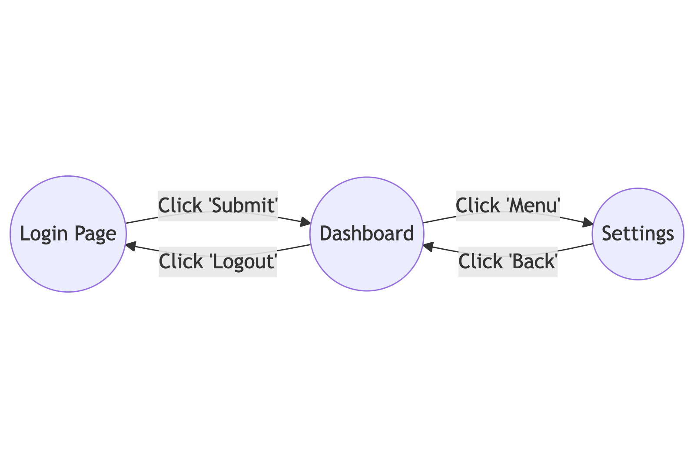
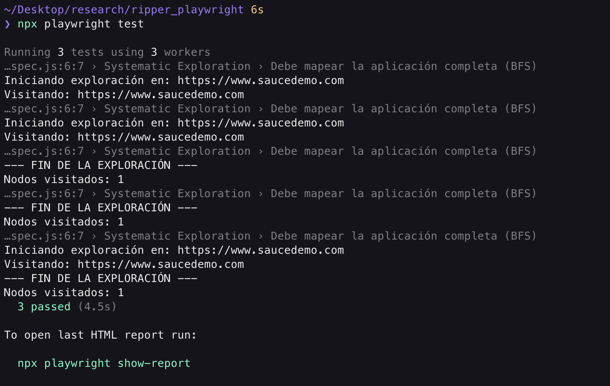
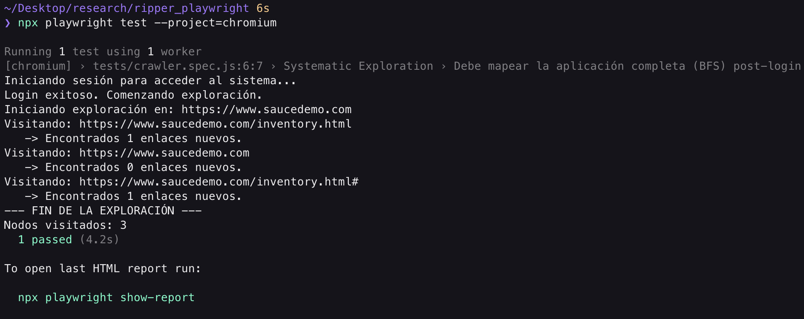
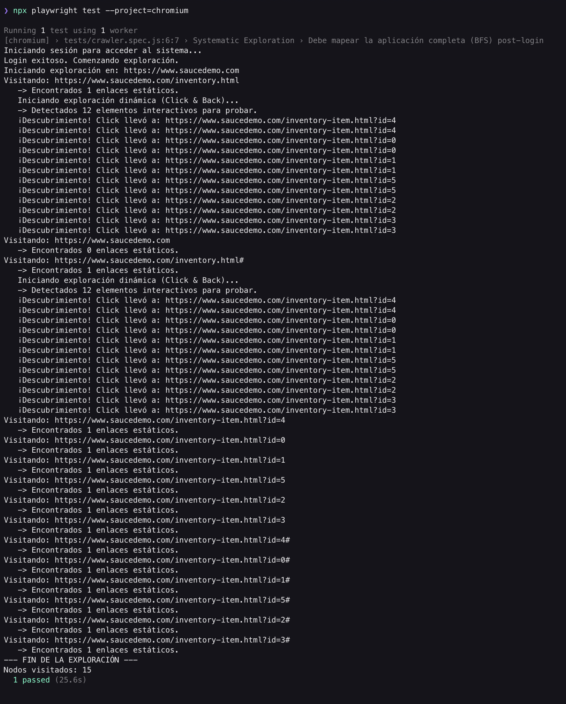
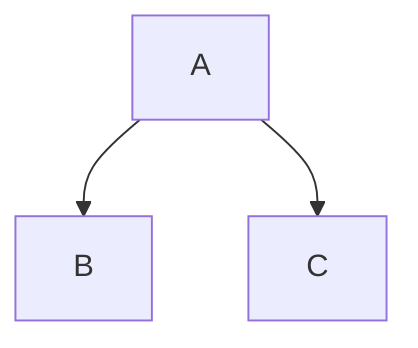
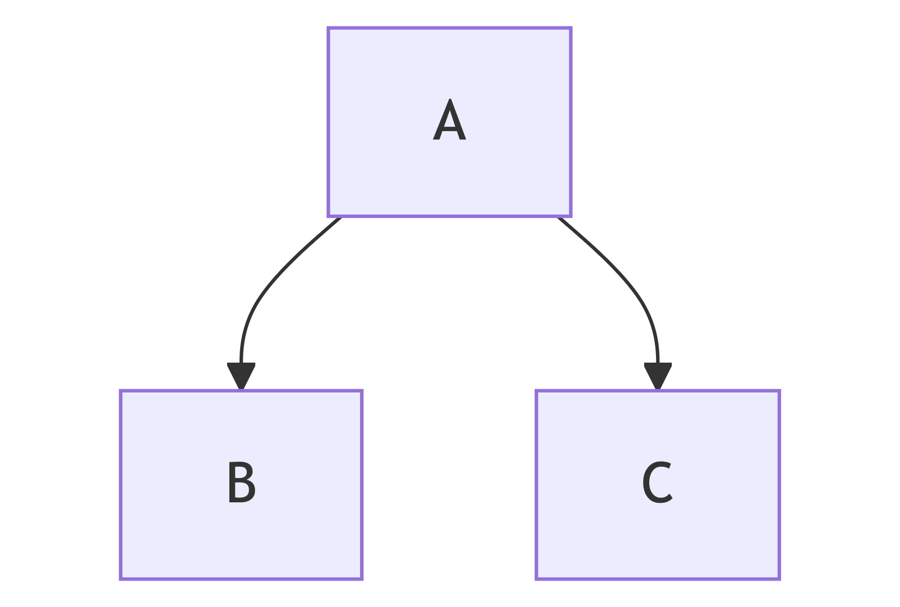
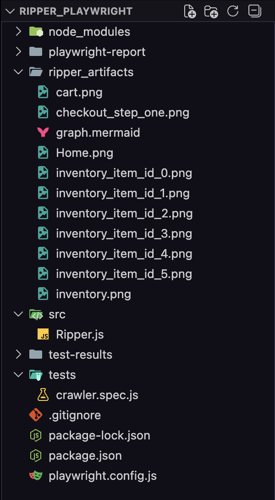

author: Wilmer Arévalo
summary: GUI Ripping con Playwright
id: ripper_playwright
categories: tutorial,taller,pruebas automatizadas,software,ripper,GUI Ripping,playwright
environments: Web
status: Published
feedback link: https://github.com/LensesResearchLab/material-educativo-investigacion/issues

# **GUI Ripping con Playwright**

## **Fundamentos de GUI Ripping**

"El Monkey Testing golpea la puerta con un martillo para ver si se rompe. El GUI Ripping abre todas las puertas, dibuja un mapa de la casa y verifica si alguna habitación tiene goteras."

### **La Evolución de la Automatización**

Para entender por qué necesitamos **GUI Ripping**, miremos nuestro viaje hasta ahora:

1. **E2E Scripting (Cypress):** Somos **Francotiradores**. Conocemos el objetivo exacto (`Login -> Checkout`) y escribimos un guion preciso. Si el diseño cambia, el script falla.
    - *Limitación:* Solo probamos lo que ya sabemos que existe.
2. **Monkey Testing (WebdriverIO):** Somos **Caos**. Bombardeamos la aplicación con eventos aleatorios buscando robustez.
    - *Limitación:* Es probabilístico. Puede que pasen 1,000 años y el mono nunca haga la combinación exacta de clicks para entrar al menú de *"Configuración Avanzada"*.
3. **GUI Ripping (Playwright):** Somos **Cartógrafos**. El objetivo es la **Exploración Sistemática**. Queremos visitar el 100% de los estados de la aplicación de manera determinista, sin escribir un test para cada pantalla.

| Fase   | Tipo de exploración | Naturaleza               |
| ------ | ------------------- | ------------------------ |
| E2E    | Scripted            | Determinística           |
| Monkey | Random              | Estocástica              |
| Ripper | Systematic          | Exhaustiva / Model-based |

### **¿Qué es GUI Ripping?**

El término *"Ripping"* (del inglés *to rip*, arrancar o extraer) se refiere a la técnica de **Ingeniería Inversa** de la interfaz gráfica.

Un **Ripper** es un robot de software que navega automáticamente por la aplicación gráfica (GUI), "arrancando" información sobre sus ventanas, botones y campos de texto para construir un **Modelo (Grafo)** del comportamiento del sistema.

**El ciclo de vida de un Ripper:**

1. **Introspección:** Mira la pantalla actual y detecta todos los elementos interactivos (botones, enlaces, inputs).
2. **Ejecución:** Elige uno de esos elementos y lo activa (click).
3. **Observación:** Analiza si la pantalla cambió (Nuevo Estado) o si ocurrió un error.
4. **Modelado:** Registra el hallazgo en un mapa y repite el proceso.

### **Teoría de Grafos para QA (States & Transitions)**

Para construir un Ripper, debemos pensar en la aplicación como un **Grafo Dirigido** (`G=(V,E)`).

### Nodos (V - Vértices) = Estados

Un **Estado** no es solo la URL. Dos usuarios pueden estar en `/dashboard`, pero uno ve un mensaje de error y el otro una tabla de datos. Son estados visuales distintos.

- **Identificación (Fingerprinting):** El Ripper necesita saber: *"¿Ya estuve aquí?"*. Para esto, generamos una "huella digital" del estado, usualmente un **Hash del DOM** (estructura HTML) o de la URL + Título.

### Aristas (E - Bordes) = Transiciones

Una **Transición** es el evento que nos mueve de un estado A a un estado B.

- Ejemplo: Un click en el botón "Login" es la arista que conecta el nodo *Página de Login* con el nodo *Dashboard*.



### **Algoritmos de Exploración: ¿Cómo no perderse?**

Si soltamos al robot en una aplicación grande, ¿cómo aseguramos que visite todo sin quedarse atrapado en un bucle infinito (ej: `Calendario Siguiente -> Siguiente -> Siguiente...`)?

Existen dos estrategias clásicas:

1. **DFS (Depth-First Search - Búsqueda en Profundidad)**

El robot elige un camino y lo sigue hasta el final (o hasta un límite de profundidad) antes de retroceder.

- *Comportamiento:* `Login -> Producto 1 -> Detalle -> Comprar -> Checkout -> Pagar...` (y luego vuelve para ver el `Producto 2`).
- *Riesgo:* Puede quedarse atrapado en flujos muy largos y nunca ver la página principal completa.
1. **BFS (Breadth-First Search - Búsqueda en Anchura) *Nuestra Elección***

El robot explora todos los vecinos inmediatos antes de profundizar.

- *Comportamiento:* Estando en el `Dashboard`, hace click en TODOS los botones del menú uno por uno, registrando a dónde llevan, antes de entrar a navegar dentro de esas sub-páginas.
- *Ventaja:* Descubre rápidamente la estructura general de la aplicación ("El esqueleto"). Es más seguro para evitar "agujeros negros" de navegación.

### **El Oráculo (¿Cómo sabemos si falló?)**

En un test E2E manual, tú escribes `expect(título).toBe('Éxito')`.

En un Ripper, el robot no sabe qué es "correcto" y qué no. Necesitamos **Oráculos Genéricos**:

1. **Crash Oracle:** ¿Apareció la pantalla blanca de la muerte?
2. **HTTP Oracle:** ¿Alguna petición de red devolvió 404 (Not Found) o 500 (Server Error)?
3. **Console Oracle:** ¿Hay errores de JavaScript rojos en la consola del navegador?
4. **Dead End Oracle:** ¿Llegué a un estado del que no puedo salir (trampa)?

### **¿Por qué Playwright?**

Para este taller usaremos **Playwright** por razones técnicas específicas que superan a Selenium/Cypress para esta tarea:

1. **Velocidad de Ejecución:** Playwright usa el protocolo DevTools directamente (WebSockets), lo que permite escanear el DOM milisegundos más rápido que WebDriver. En un Ripper que hace 10,000 clicks, esto ahorra horas.
2. **Auto-Waiting & Locators:** Playwright espera automáticamente a que los elementos sean "estables" antes de hacer click. Esto reduce la fragilidad (*flakiness*) cuando el Ripper navega muy rápido.
3. **Manejo de Contextos:** Podemos abrir múltiples pestañas o contextos de navegador en paralelo muy fácilmente.
4. **Network Interception:** Tiene una API nativa muy potente para escuchar el tráfico de red y detectar los errores 404/500 (nuestro Oráculo) sin librerías extra.

El objetivo de este taller no es reemplazar tus pruebas funcionales. Un Ripper no sabrá si el cálculo de impuestos es correcto.

El objetivo es Cobertura Topológica: Asegurar que no existan "enlaces rotos" ni "pantallas de error" ocultas en tu aplicación antes de liberar una versión.

<aside>
¿Listos para construir nuestro propio explorador autónomo? Pasemos a la Configuración del Entorno.

</aside>

## **Configuración y Arquitectura del Ripper**

A diferencia de los talleres anteriores donde escribíamos scripts sueltos, aquí vamos a **construir una herramienta**. Un Ripper es una pieza de software compleja que necesita gestionar memoria (qué ya visité), cola de tareas (qué me falta visitar) y reporte de errores. Por ello, la arquitectura de nuestro código será fundamental.

En este módulo, no solo instalaremos Playwright. Vamos a diseñar la **Clase Maestra** que gobernará la exploración. Pasaremos de escribir "tests lineales" a escribir un "algoritmo de grafos".

### **Inicialización del Proyecto (Playwright)**

Comenzaremos con un proyecto limpio. *Playwright* tiene un inicializador excelente que configura TypeScript/JavaScript y descarga los navegadores necesarios.

1. Crea una carpeta dedicada para este taller.
2. Abre la terminal en esa carpeta.
3. Ejecuta el comando de inicialización:

```bash
npm init playwright@latest
```

### Configuración recomendada para el asistente:

```bash
Getting started with writing end-to-end tests with Playwright:
Initializing project in '.'
✔ Do you want to use TypeScript or JavaScript? · JavaScript
✔ Where to put your end-to-end tests? · tests
✔ Add a GitHub Actions workflow? (Y/n) · false
✔ Install Playwright browsers (can be done manually via 'npx playwright install')? (Y/n) · true
```

Una vez termine, limpia el proyecto: borra el archivo `tests/example.spec.js`.

### **Configuración del Motor (`playwright.config.js`)**

Un Ripper se comporta muy diferente a una prueba unitaria. Puede tardar minutos u horas explorando. Necesitamos ajustar el archivo de configuración para evitar que *Playwright* "mate" al proceso por tardar demasiado (*Timeouts*).

Abre `playwright.config.js` y ajusta lo siguiente:

```jsx
import { defineConfig, devices } from '@playwright/test';

export default defineConfig({
  testDir: './tests',
  
  // 2. PARALELISMO:
  // Importante: Un Ripper suele ser secuencial (Fully Parallel = false)
  // porque comparte estado (la cola de URLs).
  fullyParallel: false, 
  
  forbidOnly: !!process.env.CI,
  retries: process.env.CI ? 2 : 0,
  workers: process.env.CI ? 1 : undefined,
  reporter: 'html',
  use: {
    // URL Base de Swag Labs
    baseURL: 'https://www.saucedemo.com',

    // 3. ARTEFACTOS DE DEPURACIÓN:
    // Queremos ver el Trace solo si el Ripper falla o encuentra un error.
    trace: 'retain-on-failure',
    screenshot: 'only-on-failure',
    video: 'retain-on-failure',
  },
  projects: [
    {
      name: 'chromium',
      use: { ...devices['Desktop Chrome'] },
    },
    {
      name: 'firefox',
      use: { ...devices['Desktop Firefox'] },
    },
    {
      name: 'webkit',
      use: { ...devices['Desktop Safari'] },
    },
  ],
});
```

### **Arquitectura de Software: La Clase `Ripper`**

Aquí es donde nos separamos de un tutorial básico. No vamos a escribir un script plano. Vamos a crear una **Clase** que encapsule la lógica del grafo.

**Concepto: El Vector de Estado**

El *Ripper* necesita memoria.

1. **`visited` (Set):** Un conjunto de URLs o Hashes que ya visitamos para no entrar en bucles infinitos.
2. **`queue` (Array):** Una lista FIFO (First-In, First-Out) de estados pendientes por explorar.
3. **`graph` (Map):** La estructura de datos donde guardaremos el mapa resultante (`Nodo A -> Nodo B`).

Crea una carpeta `src` en la raíz y dentro un archivo `Ripper.js`.

```jsx
/**
 * El Cartógrafo Digital.
 * Responsable de navegar, catalogar y reportar el estado de la aplicación.
 */
export class Ripper {
  constructor(page, baseUrl) {
    this.page = page; // La instancia del navegador de Playwright
    this.baseUrl = baseUrl;

    // MEMORIA DEL ROBOT
    // Usamos un Set para búsquedas O(1) súper rápidas
    this.visitedUrls = new Set();

    // LA COLA DE TAREAS (Frontier)
    // Aquí guardamos las URLs que descubrimos pero aún no visitamos
    this.queue = [];

    // EL MAPA RESULTANTE (Grafo)
    // Estructura: { 'url_origen': ['url_destino_1', 'url_destino_2'] }
    this.adjacencyList = new Map();
  }

  /**
   * Método principal que inicia la exploración BFS
   */
  async start() {
    console.log(`Iniciando exploración en: ${this.baseUrl}`);

    // 1. Semilla inicial
    this.queue.push(this.baseUrl);

    // 2. Bucle de Exploración (El corazón del Ripper)
    while (this.queue.length > 0) {
      // Extraemos el siguiente nodo (BFS)
      const currentUrl = this.queue.shift();

      // Si ya lo visitamos, lo saltamos (Poda del grafo)
      if (this.visitedUrls.has(currentUrl)) continue;

      // Exploramos el nodo
      await this.visitAndExtract(currentUrl);
    }

    this.report();
  }

  /**
   * Visita una URL y extrae nuevos enlaces (Transiciones)
   * @param {string} url 
   */
  async visitAndExtract(url) {
    // Marcamos como visitado ANTES de ir para evitar condiciones de carrera
    this.visitedUrls.add(url);

    try {
      console.log(`Visitando: ${url}`);
      await this.page.goto(url, { waitUntil: "domcontentloaded" });

      // AQUÍ OCURRIRÁ LA MAGIA EN EL SIGUIENTE MÓDULO
      // 1. Detectar errores (404, consola)
      // 2. Extraer enlaces
      // 3. Agregarlos a la cola

    } catch (error) {
      console.error(`Error visitando ${url}: ${error.message}`);
    }
  }

  report() {
    console.log("--- FIN DE LA EXPLORACIÓN ---");
    console.log(`Nodos visitados: ${this.visitedUrls.size}`);
  }
}
```

### **El Punto de Entrada (El Test Runner)**

Ahora necesitamos conectar nuestra Clase con el ejecutor de pruebas de *Playwright*. Aunque es un *"Crawler"*, lo ejecutaremos como un test para aprovechar los reportes HTML y los Traces.

Crea un archivo `tests/crawler.spec.js`:

```jsx
import { test } from '@playwright/test';
import { Ripper } from '../src/Ripper';

test.describe('Systematic Exploration', () => {

  test('Debe mapear la aplicación completa (BFS)', async ({ page, baseURL }) => {
    // Aumentamos el timeout del test específicamente
    test.setTimeout(120000); 

    // Instanciamos nuestro bot explorador
    const ripper = new Ripper(page, baseURL);

    // ¡Liberamos al Kraken!
    await ripper.start();
  });

});
```

### **Validación de Arquitectura**

Vamos a verificar que el esqueleto funciona.

Ejecuta el test en tu terminal. Debería visitar la URL base, imprimir el log y terminar.

```bash
npx playwright test
```

Deberías ver en la consola:



Hemos creado un "Single Page Crawler". Visita la URL inicial, la marca como visitada y termina porque no hemos implementado la lógica para **extraer** nuevos enlaces (`visitAndExtract` está vacío de lógica de extracción).

La estructura `while (queue.length > 0)` es la base de un algoritmo **BFS (Breadth-First Search)**. En el siguiente módulo, llenaremos esa función para que el robot tenga "ojos" y pueda ver a dónde ir después.

<aside>
Vamos a hacer que nuestro motor tenga “ojos”, vamos a implementar nuestro Motor de Exploración

</aside>

## **El Motor de Exploración - Extracción y Normalización**

Ahora que el robot "camina" (visita la URL inicial), necesitamos darle "ojos" para que vea a dónde ir después.

El mayor desafío de un Ripper no es hacer click, es **interpretar los enlaces**.

- Un enlace puede ser absoluto: `https://google.com` (No queremos ir ahí, salimos del alcance).
- Un enlace puede ser relativo: `/inventory.html`.
- Un enlace puede ser una acción JS: `javascript:void(0)`.

En este módulo implementaremos la lógica de **Extracción** (`Extract`) del algoritmo.

### **Teoría: Greedy Link Extraction**

Usaremos una estrategia voraz (Greedy). Escanearemos el DOM buscando todo lo que parezca un enlace (`&lt;a href="..."&gt;`) y lo añadiremos a la cola de procesamiento.

**Reglas del Cartógrafo:**

1. **Normalización:** Convertir todo enlace relativo (`/cart.html`) a absoluto (`https://saucedemo.com/cart.html`) para poder compararlos correctamente en el Set de `visitedUrls`.
2. **Filtrado de Dominio:** Si el enlace nos lleva fuera de saucedemo.com, lo ignoramos. No queremos mapear todo Internet.
3. **Filtrado de Recursos:** Ignorar enlaces a imágenes (`.jpg`), PDFs (`.pdf`) o correos (`mailto:`).

### **Actualizando la Clase `Ripper`**

Vamos a "vitaminizar" nuestra clase. Agregaremos métodos auxiliares para extraer enlaces y normalizarlos.

Modifica `src/Ripper.js` con el siguiente código mejorado.

**Paso 1: Mejorar `visitAndExtract`**

Ahora, en lugar de solo visitar, vamos a "minar" la página en busca de oro (URLs).

```jsx
export class Ripper {
  ...
  
  async visitAndExtract(url) {
    this.visitedUrls.add(url);
    
    try {
      console.log(`Visitando: ${url}`);
      await this.page.goto(url, { waitUntil: 'networkidle' }); // Esperamos a que la red se calme

      // 1. EXTRAER ENLACES (Mining)
      const newLinks = await this.extractLinks();
      
      // 2. PROCESAR ENLACES
      console.log(`   -> Encontrados ${newLinks.length} enlaces nuevos.`);
      
      for (const link of newLinks) {
        // Solo agregamos a la cola si NO lo hemos visitado y NO está ya en la cola
        if (!this.visitedUrls.has(link) && !this.queue.includes(link)) {
          this.queue.push(link);
          
          // Guardamos la relación en el grafo (Padre -> Hijo)
          if (!this.adjacencyList.has(url)) {
            this.adjacencyList.set(url, []);
          }
          this.adjacencyList.get(url).push(link);
        }
      }

    } catch (error) {
      console.error(`Error procesando ${url}: ${error.message}`);
    }
  }

  ...
}
```

**Paso 2: Crear el método `extractLinks`**

Este es el "ojo" del robot. Usaremos `page.evaluate` para ejecutar código directamente en el contexto del navegador (Browser Context), lo cual es muchísimo más rápido que pedir los elementos uno por uno a través del protocolo de *Playwright*.

Agrega este método dentro de la clase `Ripper`:

```jsx
/**
   * Extrae todos los href válidos de la página actual.
   * Ejecuta JS dentro del navegador para máxima velocidad.
   */
  async extractLinks() {
    return await this.page.evaluate((baseUrl) => {
      // 1. Buscamos todos los tags <a> con atributo href
      const anchors = Array.from(document.querySelectorAll('a[href]'));
      
      return anchors
        .map(a => a.href) // Obtenemos la URL absoluta directamente del navegador
        .filter(href => {
          // --- FILTROS DE SEGURIDAD ---
          
          // 1. Debe pertenecer al mismo dominio (Scope)
          if (!href.startsWith(baseUrl)) return false;
          
          // 2. Ignorar anclas vacías o javascript
          if (href.includes('javascript:') || href === baseUrl + '#' || href === baseUrl + '/') return false;
          
          // 3. Ignorar archivos estáticos (opcional)
          if (href.endsWith('.pdf') || href.endsWith('.png')) return false;

          return true;
        })
        // Eliminamos duplicados en la misma página (Set dentro de Array)
        .filter((value, index, self) => self.indexOf(value) === index);
        
    }, this.baseUrl);
  }
```

### **El Problema del Login (La Barrera)**

Si ejecutamos el *Ripper* ahora mismo sobre *Swag Labs*, pasará algo aburrido:

1. Visitará el *Login*.
2. No encontrará enlaces (`&lt;a&lg;`), porque el botón de login es un `&lt;input type="submit"&gt;` o un botón que ejecuta un form, y *Swag Labs* no tiene enlaces de navegación en la portada (salvo quizás redes sociales que filtramos).
3. El *Ripper* terminará.

Para que el *Ripper* sea útil, **debe estar autenticado**.

Vamos a agregar un método de login manual a la clase, para llamarlo antes de empezar a ripear.

Agrega este método a `src/Ripper.js`:

```jsx
/**
   * Método auxiliar para romper la barrera de entrada.
   * Un Ripper necesita credenciales para explorar zonas privadas.
   */
  async login() {
    console.log('Iniciando sesión para acceder al sistema...');
    await this.page.goto(this.baseUrl);
    
    // Selectores específicos de Swag Labs
    await this.page.fill('[data-test="username"]', 'standard_user');
    await this.page.fill('[data-test="password"]', 'secret_sauce');
    await this.page.click('[data-test="login-button"]');
    
    // Esperamos a ver el inventario
    await this.page.waitForURL('**/inventory.html');
    console.log('Login exitoso. Comenzando exploración.');
    
    // Reiniciamos la cola con la nueva URL post-login
    this.queue = [this.page.url()];
    this.visitedUrls.clear(); // Limpiamos para empezar el mapa desde dentro
  }
```

### **Actualizando el Test Runner**

Finalmente, actualizamos `tests/crawler.spec.js` para usar el login.

```jsx
import { test } from '@playwright/test';
import { Ripper } from '../src/Ripper';

test.describe('Systematic Exploration', () => {

  test('Debe mapear la aplicación completa (BFS) post-login', async ({ page, baseURL }) => {
    // Aumentamos el timeout del test específicamente
    test.setTimeout(120000); 

    // Instanciamos nuestro bot explorador
    const ripper = new Ripper(page, baseURL);

    // 1. Rompemos la seguridad
    await ripper.login();

    // 2. Liberamos al Kraken en zona segura
    await ripper.start();
  });

});
```

### **Ejecución y Análisis del Grafo**

Ejecuta:

> Nota: para facilidad del tutorial, solo ejecutaremos la prueba en un solo navegador
> 

```bash
npx playwright test --project=chromium
```

**Lo que deberías ver:**



Fíjate que el robot visita los enlaces, pero... ¿cómo vuelve?

En BFS, el robot abre la URL. Si la página de detalle de producto tiene un botón *"Back to products"*, lo detectará como un enlace y lo agregará a la cola.

Pero si el botón *"Add to cart"* no es un `&lt;a&gt;` (es un `&lt;button&gt;`), nuestro método `extractLinks` actual lo ignora.

**Limitación actual:** Nuestro *Ripper* solo sigue enlaces de hipertexto (`href`). En aplicaciones modernas (SPA), muchos botones (`&lt;button&gt;`) cambian el estado.

En el siguiente módulo, haremos al *Ripper* más agresivo para que interactúe también con botones.

<aside>
¿Estás listo para transformar nuestro robot de un "Lector de Enlaces" (Static Analyzer) a un "Explorador Activo" (Dynamic Analyzer)?

</aside>

## **Heurística y Profundidad - Exploración Activa**

En este módulo, enseñaremos al Ripper a lidiar con la incertidumbre. Si un enlace no dice a dónde va (`href="#"`), el robot debe tener la curiosidad de **hacer clic para averiguarlo**.

### **Teoría: Análisis Estático vs Dinámico**

1. **Análisis Estático (Lo que teníamos):** Mirar el HTML (`&lt;a href="/cart"&gt;`) y anotar la dirección. Es rápido y seguro, pero falla en Apps modernas.
2. **Análisis Dinámico (Lo que haremos):** Interactuar con el elemento.
    - Hacer Clic.
    - Observar si la URL cambió.
    - Si cambió, anotar la nueva URL.
    - **Retroceder (Backtrack)** para seguir probando los otros botones de la página original.

### **La Estrategia "Click & Back"**

Modificaremos la clase `Ripper` para que, cuando visite una página, ejecute una rutina de descubrimiento:

1. Identificar elementos "misteriosos" (enlaces con `#` o sin `href`).
2. Para cada elemento:
    - Guardar la URL actual.
    - Hacer Clic.
    - Esperar un momento.
    - ¿Cambió la URL?
        - **SÍ:** ¡Nuevo estado descubierto! Agrégalo a la cola queue.
        - **NO:** Fue un clic inútil (o un modal que no cambia URL).
    - Regresar a la página original (`page.goBack()` o volver a navegar) para probar el siguiente botón.

**Código: Implementando la Exploración Activa**

Vamos a modificar `src/Ripper.js`. Esta es una cirugía mayor en el método `visitAndExtract`.

**Paso 1: Nuevo método `exploreDynamicLinks`**

Agrega este método a tu clase `Ripper`. Este método busca elementos interactivos que NO son enlaces claros y los prueba.

```jsx
/**
   * Intenta descubrir estados ocultos haciendo clic en elementos ambiguos.
   * Estrategia: Click -> Check URL -> Backtrack
   */
  async exploreDynamicLinks(currentUrl) {
    console.log('   Iniciando exploración dinámica (Click & Back)...');
    
    // 1. Identificar candidatos (Heurística: Títulos de productos en SwagLabs)
    // En una app real, usaríamos selectores más genéricos como 'a[href="#"], button'
    // Para el taller, somos específicos para evitar caos.
    const selector = `
      .inventory_item_name, 
      .inventory_item_img a,
      .shopping_cart_link,
      [data-test="back-to-products"],
      [data-test="checkout"],
      [data-test="continue"],
      [data-test="finish"]
    `;

    const candidates = await this.page.$$(selector);
    
    console.log(`   -> Detectados ${candidates.length} elementos interactivos para probar.`);

    // Iteramos por los candidatos (Usamos un for clásico para manejar async)
    for (let i = 0; i < candidates.length; i++) {
      try {
        // Recargamos los candidatos porque al volver atrás el DOM se destruye
        // (El problema de "Stale Element" clásico de Selenium/Playwright)
        const freshCandidates = await this.page.$$('.inventory_item_name, .inventory_item_img a');
        const element = freshCandidates[i];

        if (!element) continue;

        // ACCIÓN: CLIC
        await element.click();
        
        // ESPERA: Damos tiempo a que la app reaccione (SPA transition)
        await this.page.waitForTimeout(800);

        // CHEQUEO: ¿Dónde estoy?
        const newUrl = this.page.url();

        if (newUrl !== currentUrl) {
          // ¡EUREKA! Encontramos un nuevo estado
          console.log(`   ¡Descubrimiento! Click llevó a: ${newUrl}`);
          
          if (!this.visitedUrls.has(newUrl) && !this.queue.includes(newUrl)) {
            this.queue.push(newUrl);
             // Guardamos la relación en el grafo
             if (!this.adjacencyList.has(currentUrl)) {
                this.adjacencyList.set(currentUrl, []);
              }
              this.adjacencyList.get(currentUrl).push(newUrl);
          }

          // RETROCESO (Backtrack): Vital para seguir probando el resto de botones
          await this.page.goBack();
          await this.page.waitForLoadState('domcontentloaded');
        } 
      } catch (err) {
        console.log(`   Fallo explorando elemento ${i}: ${err.message}`);
        // Intentamos recuperar la posición
        if (this.page.url() !== currentUrl) {
            await this.page.goto(currentUrl);
        }
      }
    }
  }
```

**Paso 2: Conectar el nuevo método**

Modifica `visitAndExtract` para llamar a esta nueva función después de extraer los enlaces estáticos.

```jsx
async visitAndExtract(url) {
    this.visitedUrls.add(url);
    
    try {
      console.log(`Visitando: ${url}`);
      await this.page.goto(url, { waitUntil: 'networkidle' });

      // FASE 1: Extracción Estática (Lo que ya teníamos)
      const staticLinks = await this.extractLinks();
      this.processLinks(url, staticLinks); // (Refactorizamos esto en un helper abajo)

      // FASE 2: Exploración Dinámica (NUEVO)
      // Solo lo hacemos si estamos en el inventario, carrito y pasos de checkout para no tardar años probando todo
      const isExplorable = 
        url.includes('inventory.html') || 
        url.includes('cart.html') || 
        url.includes('checkout-step-one.html') ||
        url.includes('checkout-step-two.html');

      if (isExplorable) {
        await this.exploreDynamicLinks(url);
      }

    } catch (error) {
      console.error(`Error procesando ${url}: ${error.message}`);
    }
  }

  // Helper para no repetir código
  processLinks(sourceUrl, links) {
    console.log(`   -> Encontrados ${links.length} enlaces estáticos.`);
    for (const link of links) {
      if (!this.visitedUrls.has(link) && !this.queue.includes(link)) {
        this.queue.push(link);
        if (!this.adjacencyList.has(sourceUrl)) {
           this.adjacencyList.set(sourceUrl, []);
        }
        this.adjacencyList.get(sourceUrl).push(link);
      }
    }
  }
```

### **Profundidad (Depth Limit)**

Un *Crawler* sin límites es peligroso. Podría encontrar un calendario y darle a "Siguiente Mes" infinitamente.
Vamos a agregar un límite de profundidad simple.

Modifica el constructor y el bucle `while`:

```jsx
constructor(page, baseUrl) {
    ...
    this.maxNodes = 15; // Límite de seguridad para el taller
  }

  async start() {
    console.log(`Iniciando exploración en: ${this.baseUrl}`);
    this.queue.push(this.baseUrl);

    // Agregamos condición de parada de seguridad
    while (this.queue.length > 0 && this.visitedUrls.size < this.maxNodes) {
      const currentUrl = this.queue.shift();
      if (this.visitedUrls.has(currentUrl)) continue;
      await this.visitAndExtract(currentUrl);
    }
    
    this.report();
  }
```

### **Ejecución Final del Módulo**

Ejecuta el test nuevamente:

```bash
npx playwright test --project=chromium
```

**Lo que deberías ver ahora:**

1. Visita `/inventory.html`.
2. Log: `Iniciando exploración dinámica`.
3. El navegador hará clic en el primer producto -> La URL cambia`rá a /inventory-item.html?id=4` -> Log: ¡Descubrimiento!.
4. El navegador volverá atrás.
5. Repetirá con el siguiente producto.
6. Al terminar el bucle dinámico, la `queue` tendrá nuevas URLs.
7. El *Ripper* procederá a visitar esas nuevas URLs una por una.



¡Ahora sí tenemos un *Ripper* real! Estamos descubriendo rutas que no estaban escritas explícitamente en el HTML inicial.

La estrategia de *"Click & Back"* es costosa en tiempo. Por eso los Rippers profesionales corren en paralelo o usan heurísticas muy avanzadas para decidir dónde hacer clic.

En este taller, hemos priorizado la **didáctica** sobre la **optimización**, para que veas claramente cómo el robot "piensa" y "prueba".

## **Generación de Artefactos**

Ya tenemos un robot que navega, explora y descubre rutas ocultas. Pero un explorador que no dibuja un mapa no sirve de mucho.

En este módulo convertiremos los datos abstractos (logs de consola) en **Artefactos Tangibles**:

1. **Diagramas Visuales:** Un grafo real que muestre la topología de la aplicación.
2. **Evidencia Visual:** Capturas de pantalla de cada estado único descubierto.

Hasta ahora, nuestro Ripper imprime texto. En este módulo, aprenderemos a generar código **Mermaid.js**. Mermaid es una sintaxis similar a Markdown que permite generar diagramas de flujo automáticamente.

**Objetivo:** Al finalizar la ejecución, el *Ripper* generará un archivo de texto que, al pegarlo en un visor (como [**Mermaid Live Editor**](https://www.google.com/url?sa=E&q=https%3A%2F%2Fmermaid.live%2F)), dibujará el mapa completo de *Swag Labs*.

### **Teoría: Visualización de Grafos**

Nuestro `adjacencyList` es matemáticamente un grafo.

- **Formato Interno:** `Map { 'A' => ['B', 'C'] }`
- **Formato Mermaid:**





El reto técnico aquí es **Sanitizar los Nodos**. Las URLs son largas y contienen caracteres que rompen los diagramas (`:`, `/`, `?`). Necesitamos una función que convierta `https://www.saucedemo.com/inventory.html?id=4` en algo legible como `Inventory_Item_4`.

### **Implementación: El Generador de Reportes**

Vamos a modificar nuestra clase Ripper en src/Ripper.js.

**Paso 1: Importar `fs` (File System)**

Necesitamos escribir archivos en el disco duro. Al inicio de `src/Ripper.js`, agrega:

```jsx
import fs from 'fs';
import path from 'path';
```

**Paso 2: Método `sanitizeNode`**

Agrega este método auxiliar a la clase. Su trabajo es limpiar las URLs para que sean identificadores de nodo válidos.

```jsx
/**
   * Convierte una URL larga en un ID corto para el gráfico.
   * Ej: ".../inventory.html" -> "Inventory"
   */
  sanitizeNode(url) {
    try {
      const urlObj = new URL(url);
      let name = urlObj.pathname.replace('/', '').replace('.html', '');
      
      // Si es la raíz, llámala Home
      if (name === '' || name === '/') name = 'Home';
      
      // Si tiene query params, agrégalos (ej: ?id=4)
      if (urlObj.search) {
        name += `_${urlObj.searchParams.toString()}`;
      }
      
      // Limpieza final de caracteres raros
      return name.replace(/[^a-zA-Z0-9_]/g, '_');
    } catch (e) {
      return 'Unknown_Node';
    }
  }
```

**Paso 3: Captura de Pantalla (Snapshot)**

Modifica el método `visitAndExtract`. Queremos una foto cada vez que visitamos un nodo **nuevo**.

```jsx
// Dentro de visitAndExtract(url), justo después del page.goto:
  
  async visitAndExtract(url) {
    this.visitedUrls.add(url);
    try {
      console.log(`Visitando: ${url}`);
      await this.page.goto(url, { waitUntil: 'networkidle' });

      // --- NUEVO: FOTOGRAFÍA DEL ESTADO ---
      const nodeId = this.sanitizeNode(url);
      const screenshotPath = path.join(process.cwd(), 'ripper_artifacts', `${nodeId}.png`);
      
      // Creamos la carpeta si no existe
      if (!fs.existsSync('ripper_artifacts')) {
        fs.mkdirSync('ripper_artifacts');
      }

      await this.page.screenshot({ path: screenshotPath, fullPage: true });
      ...
```

**Paso 4: Generar el Grafo**

Reemplaza el método `report()` actual con esta versión avanzada que escribe el archivo Mermaid.

```jsx
report() {
    console.log('--- GENERANDO ARTEFACTOS ---');
    
    // 1. Cabecera del archivo Mermaid
    let mermaidContent = 'graph TD;\n';
    
    // 2. Iteramos sobre la lista de adyacencia
    // Formato: NodoOrigen --> NodoDestino
    this.adjacencyList.forEach((destinations, source) => {
      const sourceId = this.sanitizeNode(source);
      
      destinations.forEach(dest => {
        const destId = this.sanitizeNode(dest);
        // Evitamos auto-bucles visuales si no son necesarios
        if (sourceId !== destId) {
          mermaidContent += `  ${sourceId} --> ${destId};\n`;
        }
      });
    });

    // 3. Escribir al disco
    const outputPath = path.join(process.cwd(), 'ripper_artifacts', 'graph.mermaid');
    fs.writeFileSync(outputPath, mermaidContent);
    
    console.log(`Grafo generado en: ${outputPath}`);
    console.log(`Screenshots guardados en: /ripper_artifacts`);
    console.log(`Total Nodos: ${this.visitedUrls.size}`);
  }
```

### **Ejecución y Visualización**

Ejecuta el *Ripper* nuevamente:

```bash
npx playwright test --project=chromium
```

**Resultado:**

1. Verás una nueva carpeta `ripper_artifacts` en tu proyecto.
2. Dentro, verás imágenes como `inventory.png`, `cart.png`, i`nventory_item_4.png`. ¡Tu robot ha documentado visualmente la app!
3. Verás un archivo `graph.mermaid`.

**El Ejercicio de Visualización**

1. Abre el archivo `ripper_artifacts/graph.mermaid` con un editor de texto (VS Code).
2. Copia todo el contenido.
3. Ve a [**Mermaid Live Editor**](https://www.google.com/url?sa=E&q=https%3A%2F%2Fmermaid.live%2F).
4. Pega el código en el panel izquierdo.

**Lo que verás:**

Un diagrama de flujo generado automáticamente que muestra cómo se conectan las páginas de *Swag Labs*. Verás claramente que `Inventory` es el nodo central que conecta con múltiples `Inventory_Item`.



## **El Oráculo - Detección de Anomalías**

Un mapa es útil, pero un mapa que señala dónde hay "minas" es vital.

En este módulo final de implementación, convertiremos al *Ripper* en una herramienta de QA. No solo visitará, sino que **escuchará**.

### Listeners Pasivos

En lugar de escribir aserciones explícitas (`expect(x).toBe(y)`), usaremos **Listeners** de *Playwright*. Estos son "oídos" que se quedan activos durante toda la sesión.

1. **Response Listener:** Cada vez que el navegador recibe una respuesta de red, verificamos si el status code es 404 (Not Found) o 500 (Server Error).
2. **Console Listener:** Cada vez que la página imprime un `console.error`, lo capturamos.

### Implementación: Cazando Errores

Vamos a modificar el `constructor` de la clase `Ripper` para activar estos oídos desde el principio.

**Paso 1: Agregar almacenamiento de errores**

En `src/Ripper.js`:

```jsx
constructor(page, baseUrl) {
    // ... propiedades anteriores ...
    this.errors = []; // Aquí guardaremos los hallazgos
    
    // ACTIVAR EL ORÁCULO
    this.setupOracle();
  }
```

**Paso 2: Crear el método `setupOracle`**

Este método configura los eventos de *Playwright*.

```jsx
setupOracle() {
    // 1. Oído de Red (Network Listener)
    this.page.on('response', response => {
      const status = response.status();
      const url = response.url();
      
      // Filtramos ruido (Google Analytics, etc.) y nos enfocamos en errores reales
      if (status >= 400 && url.includes(this.baseUrl)) {
        const errorMsg = `HTTP ${status} en ${url}`;
        console.error(errorMsg);
        this.errors.push({ type: 'HTTP', msg: errorMsg, location: this.page.url() });
      }
    });

    // 2. Oído de Consola (Console Listener)
    this.page.on('console', msg => {
      if (msg.type() === 'error') {
        const errorMsg = `CONSOLE ERROR: ${msg.text()}`;
        console.error(errorMsg);
        this.errors.push({ type: 'JS', msg: errorMsg, location: this.page.url() });
      }
    });
    
    // 3. Oído de Crashes (Page Crash)
    this.page.on('pageerror', exception => {
      const errorMsg = `UNCAUGHT EXCEPTION: ${exception.message}`;
      console.error(errorMsg);
      this.errors.push({ type: 'CRASH', msg: errorMsg, location: this.page.url() });
    });
  }
```

**Paso 3: Reportar los Errores**

Actualiza el método `report()` para incluir una sección de "Salud del Sistema".

```jsx
report() {
    // ... generación de grafo anterior ...
    
    console.log('\n--- REPORTE DE SALUD ---');
    if (this.errors.length === 0) {
      console.log('Sistema Saludable: No se detectaron anomalías.');
    } else {
      console.log(`SE ENCONTRARON ${this.errors.length} ANOMALÍAS:`);
      this.errors.forEach(err => {
        console.log(`   [${err.type}] en ${err.location} -> ${err.msg}`);
      });
      
      // Opcional: Escribir reporte de errores a disco
      const errorPath = path.join(process.cwd(), 'ripper_artifacts', 'errors.json');
      fs.writeFileSync(errorPath, JSON.stringify(this.errors, null, 2));
    }
  }
```

### Visualización de Resultados

Ejecutamos nuevamente, pero esta vez viendo qué es lo que hace nuestro *Ripper* con la flag `--headed`

```bash
npx playwright test --project=chromium --headed
```

Has construido una herramienta profesional de **Exploración Sistemática**.

- Tiene memoria (Grafos).
- Tiene ojos (Screenshots).
- Tiene oídos (Detección de errores).
- Tiene voz (Reportes Mermaid).

<aside>
Ahora, es momento de poner a prueba tus habilidades sin la guía paso a paso. Pasemos a los Desafíos Prácticos.

</aside>

## Desafíos Prácticos

Hasta ahora, has seguido las instrucciones para construir un *Ripper* funcional. Pero el mundo real del software es sucio, complejo y está lleno de casos borde.

En este módulo, te enfrentarás a dos problemas comunes que todo ingeniero de automatización encuentra al construir herramientas de exploración. No te daré el código paso a paso, pero sí las pistas estratégicas para resolverlo.

**Regla del Desafío:** Intenta implementar las soluciones modificando tu clase *Ripper* actual. Si te atascas, consulta las "Soluciones Sugeridas" al final.

### Desafío 1: La Barrera del Formulario (Checkout)

**El Problema:**

Si ejecutas tu *Ripper* actual, notarás que llega a la página de *Checkout* (`checkout-step-one.html`), intenta hacer clic en el botón *"Continue"*, recibe un error de validación ("Error: First Name is required") y se detiene ahí.

Nunca descubre la página de `checkout-step-two.html` ni la de `checkout-complete.html`.

**Tu Misión:**

Enseñar al *Ripper* a **llenar formularios automáticamente** cuando detecta inputs vacíos, para poder avanzar a las siguientes pantallas.

**Requerimientos:**

1. Detectar si la página actual tiene campos de texto obligatorios (`input[type="text"]`).
2. Llenarlos con datos falsos (puedes usar "test" o una librería como `faker`).
3. Hacer esto *antes* de intentar extraer enlaces dinámicos (clics en botones).

**Pista Técnica:**

- Crea un método `handleForms()` dentro de la clase `Ripper`.
- Llama a este método al principio de `visitAndExtract`.
- Usa `page.$$('input[data-test]')` para encontrar campos específicos de *Swag Labs* de manera robusta.

### Solución Sugerida (¡Solo para emergencias!)

Agrega este método a tu clase `Ripper` y llámalo dentro de `visitAndExtract` antes de la exploración dinámica. Además, cuando explores una página también debes hacerlo, así que lo necesitas dentro del bucle de `exploreDynamicLinks`.

```jsx
/**
   * Heurística para superar bloqueos de formularios.
   * Si ve inputs vacíos, los llena para intentar avanzar.
   */
  async handleForms() {
    // Buscamos inputs de texto visibles
    const inputs = await this.page.$$('input[type="text"]');
    
    if (inputs.length > 0) {
      console.log(`   Detectado formulario con ${inputs.length} campos. Rellenando...`);
      
      for (const input of inputs) {
        // Llenamos con datos genéricos
        await input.fill('autobot_data');
      }
      
      // Caso especial: Zip Code (a veces valida números)
      const zip = await this.page.$('[data-test="postalCode"]');
      if (zip) await zip.fill('12345');
    }
  }
```

**Integración:**

```jsx
async visitAndExtract(url) {
     ...
     await this.page.goto(url, { waitUntil: 'networkidle' });
     
     // 1. INTENTAR LLENAR FORMULARIOS (NUEVO)
     await this.handleForms();

     // 2. EXTRAER ENLACES...
     ...
}

async exploreDynamicLinks(currentUrl) {
    ...
    for (let i = 0; i < candidates.length; i++) {
      try {
        // 1. RE-LLENADO DEFENSIVO
        // Antes de interactuar con cualquier botón, nos aseguramos 
        // de que el formulario (si existe) esté lleno.
        await this.handleForms(); 
        ...
  }
```

## Referencias y Recursos Adicionales

Este taller ha sido diseñado para proporcionar una base sólida en la automatización profesional, alineada con las mejores prácticas de la industria actual.

### Créditos

Autor: Wilmer Arévalo

Rol: Profesional en Proyectos de Investigación

Departamento: Centro de Investigación, Facultad de Ingeniería, Universidad de los Andes

Fecha de creación/actualización: Febrero de 2026

### Referencias Oficiales

Todo el contenido de este taller está basado en la documentación oficial más reciente:

- **Paper Académico Fundacional:** *"GUI Ripping: Reverse Engineering of Graphical User Interfaces for Testing"* (Atif Memon et al.). Es la base teórica de lo que hicimos hoy.
- **Playwright Docs:** [**https://playwright.dev**](https://www.google.com/url?sa=E&q=https%3A%2F%2Fplaywright.dev) - Especialmente la sección de *Network Interception* y *Selectors*.
- **Model-Based Testing (MBT):** Investiga herramientas como *GraphWalker*, que llevan esto al siguiente nivel generando tests a partir de grafos.

### **Enlaces de Utilidad**

Guarda estos enlaces en tus favoritos, los necesitarán en el día a día como Automatizador de Pruebas de Software:

1. **Selectores:** [https://webdriver.io/docs/selectors/.](https://playwright.dev/docs/writing-tests)
2. **Swag Labs (SUT):** [**SauceDemo**](https://www.google.com/url?sa=E&q=https%3A%2F%2Fwww.saucedemo.com%2F) - El sitio web que usamos para pruebas.

### **Soporte y Dudas**

Si tienen dudas al implementar esto en sus proyectos reales o encuentran problemas con la configuración:

- **Canal de Slack/Teams:** Puede hacer las preguntas a través de los medios habilitados y los profesores, tutores y monitores podrán ayudar con la aclaración
- **Email de Contacto:** w.arevalo@uniandes.edu.co

<aside>
Repositorio del Taller

El código final de este ejercicio está disponible en: https://github.com/LensesResearchLab/material-educativo-investigacion/tree/ripper_playwright

</aside>