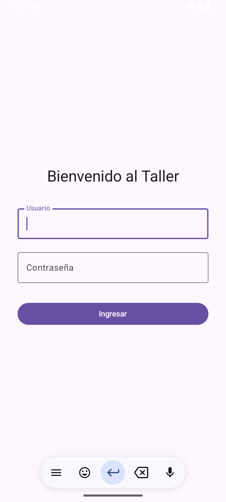
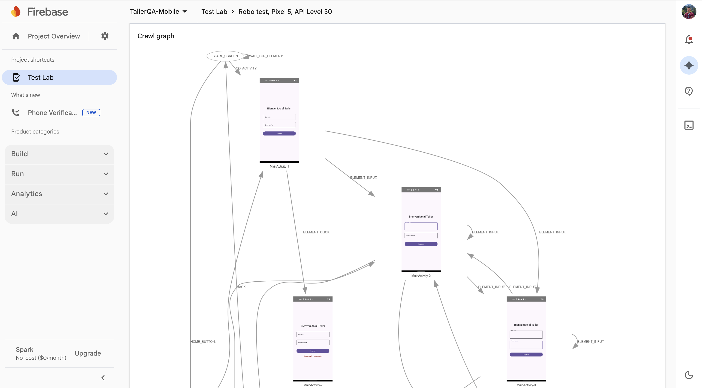
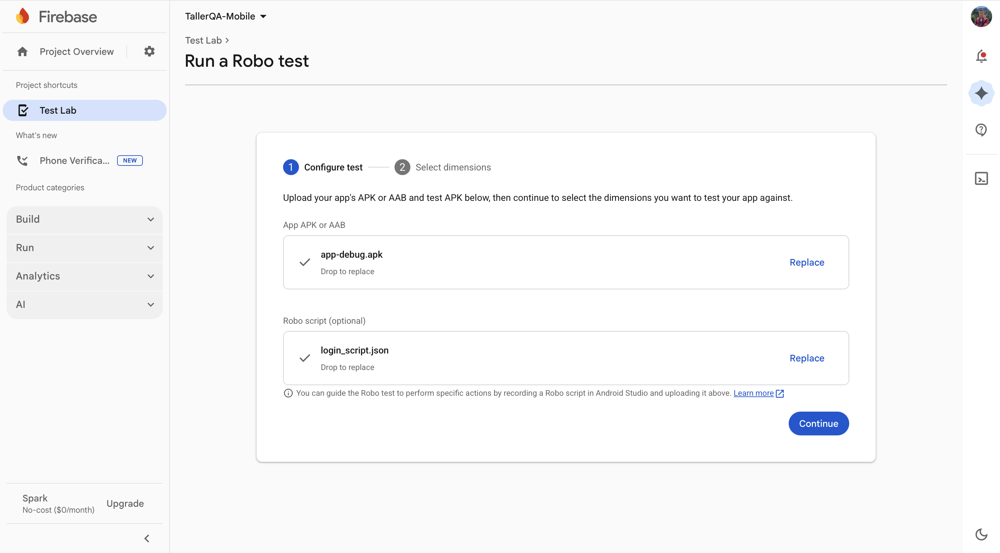
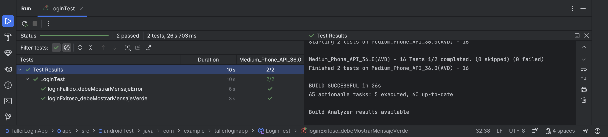
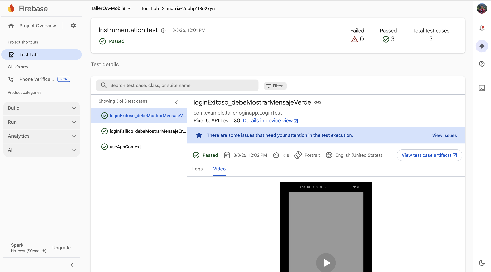
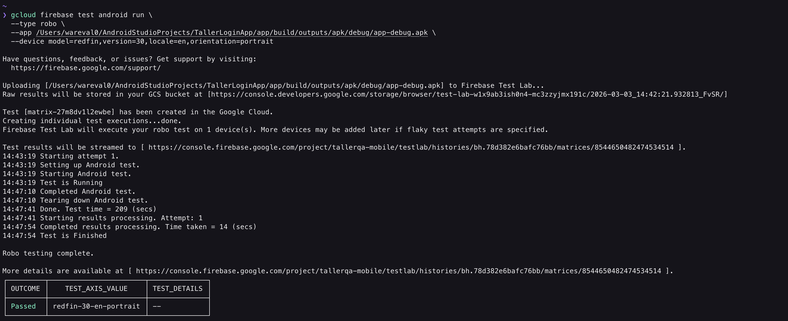

author: Wilmer Arévalo
summary: Android Cloud Testing con Firebase Test Lab y ADB
id: testlab_adb_mobile
categories: tutorial,taller,pruebas automatizadas,software,mobile,adb,ftl,test lab,android,studio
environments: Mobile
status: Published
feedback link: https://github.com/LensesResearchLab/material-educativo-investigacion/issues

# **Android Cloud Testing con Firebase Test Lab y ADB**

## **Fragmentación y la Nube**

Pasar de la web a mobile es un salto obligatorio para un Engineer SDET (Software Development Engineer in Test) completo.

El ecosistema móvil tiene un desafío que la web no tiene (o tiene menos): **La Fragmentación**. En web probamos Chrome y tal vez Safari. En Android, tenemos que probar Samsung, Pixel, Xiaomi, Motorola, Android 11, 12, 13, 14, 15... pantallas plegables, tablets, etc.

Aquí entra **Firebase Test Lab (FTL)**: Una granja de dispositivos en la nube de Google.

**"En la web, si funciona en Chrome, funciona para el 80% del mundo. En Android, si funciona en tu Pixel, solo has probado el 1% del ecosistema."**

### **El Enemigo Silencioso: La Fragmentación**

Antes de escribir una sola línea de código, debemos entender por qué las pruebas móviles son inherentemente más difíciles que las web.

En el desarrollo web, el navegador abstrae el hardware. En móvil, el software corre directamente sobre el hardware ("bare metal" o a través de la JVM/ART), y ese hardware varía infinitamente.

**Las 3 Dimensiones del Caos en Android:**

1. **Versiones del SO:** Tienes usuarios en Android 10 (API 29) hasta Android 15 (API 35). Las APIs cambian, los permisos cambian y las optimizaciones de batería cambian.
2. **Personalización del Fabricante (OEMs):** Un Samsung (OneUI) no se comporta igual que un Xiaomi (HyperOS) o un Pixel (Android Stock). Los fabricantes matan procesos en segundo plano de forma agresiva o cambian los estilos de los componentes nativos.
3. **Factor de Forma:** Pantallas pequeñas, tablets, teléfonos plegables (Foldables), densidad de píxeles (DPI). Un botón que se ve bien en un Pixel 8 puede desaparecer en un Galaxy Fold abierto.

### **La Solución: Granjas de Dispositivos (Device Farms)**

¿Cómo aseguramos la calidad ante tal variedad?

1. **Opción A (Local):** Comprar 20 teléfonos físicos. *Problema:* Costoso, difícil de mantener cargados, se vuelven obsoletos rápido.
2. **Opción B (Emuladores):** Usar el Android Emulator en tu PC. *Problema:* No replican fielmente el hardware (sensores, red real, quirks del fabricante).
3. **Opción C (Nube):** Usar una granja de dispositivos como **Firebase Test Lab**.

**¿Qué es Firebase Test Lab (FTL)?**

Es una infraestructura basada en la nube proporcionada por Google que te permite probar tu aplicación en una amplia gama de dispositivos (físicos y virtuales) alojados en sus centros de datos.

**Ventajas Clave:**

- **Acceso a Físicos:** Pruebas en dispositivos reales sin comprarlos.
- **Logs Unificados:** Video de la prueba, Logcat (logs del sistema), capturas de pantalla y rendimiento, todo en un reporte web.
- **Paralelismo:** Ejecutar la misma prueba en 10 teléfonos distintos al mismo tiempo.

### **Tipos de Pruebas en FTL**

Firebase Test Lab soporta principalmente tres estrategias de testing automatizado:

1. **Robo Tests (El Crawler Inteligente)**
- **¿Qué es?** Un robot automatizado que analiza la estructura de tu UI y la explora sistemáticamente (similar a nuestro Ripper del tutorial anterior, pero hecho por Google).
- **Ventaja:** **Cero Código.** No necesitas escribir tests. Simplemente subes el APK y el robot busca crashes (bloqueos).
- **Limitación:** No entiende la lógica de negocio. Si para entrar necesitas un usuario específico, el robot fallará a menos que le des un "Robo Script" (guion).
1. **Instrumentation Tests (Pruebas Instrumentadas)**
- **¿Qué es?** Pruebas escritas por ti (QA/Dev) usando frameworks como **Espresso** o **Compose Test Rules**.
- **Ventaja:** Validan flujos de negocio específicos (Login, Compra, Logout).
- **Contexto Compose:** En este taller usaremos **Compose Test Rules**. A diferencia de XML donde buscábamos por `R.id.boton`, en Compose buscaremos por **Semántica** (`hasText("Entrar")`, `hasTestTag("login_button")`).
1. **Game Loops**
- **¿Qué es?** Específico para motores de videojuegos (Unity, Unreal). El test recorre el juego simulando inputs. *(No cubriremos esto en el taller).*

### **Arquitectura de Pruebas: Local vs. Nube**

Durante este taller, trabajaremos en dos entornos:

1. **Entorno Local (Tu PC):**
    - Usaremos **Android Studio** para desarrollar y compilar.
    - Usaremos **ADB (Android Debug Bridge)** para comunicarnos con el emulador o dispositivo conectado por USB. Es la "navaja suiza" del QA Mobile.
2. **Entorno Nube (Firebase):**
    - Usaremos la **Consola de Firebase** (Web) para subidas manuales.
    - Usaremos **gcloud CLI** (Terminal) para orquestar pruebas desde una línea de comandos, simulando un pipeline de CI/CD (Jenkins/GitHub Actions).

El objetivo de usar Firebase Test Lab no es solo encontrar bugs, es **reducir el riesgo de lanzamiento**.

Si tu app crashea al abrirse en el teléfono más vendido de tu mercado (ej: Samsung A54), perderás miles de usuarios el día 1. FTL es tu seguro contra ese escenario.

<aside>
¿Listos para ensuciarnos las manos? En la siguiente sección, nos convertiremos en desarrolladores Android por unos minutos para construir nuestra aplicación víctima (SUT) con Jetpack Compose.

</aside>

## **Construcción del SUT con Jetpack Compose**

En este módulo, nos pondremos el sombrero de desarrolladores Android. Vamos a construir una aplicación minimalista pero funcional usando **Jetpack Compose**, el kit de herramientas moderno nativo de Google para construir interfaces de usuario (UI).

A diferencia del viejo sistema de Views (XML), Compose es **declarativo** (como React o Flutter). Esto cambia la forma en que los elementos se identifican para las pruebas automatizadas.

**"Para un QA, el código fuente no debe ser una caja negra. Entender cómo se construye la UI es la mitad de la batalla de la automatización."**

### **Configuración del Proyecto (Android Studio)**

Vamos a crear el proyecto desde cero. Asegúrate de tener Android Studio instalado (versión Koala, Ladybug o superior).

1. Abre Android Studio y selecciona **New Project**.
2. En la lista de plantillas, elige **"Empty Activity"** (Asegúrate de que el icono tenga el logo de Compose, el triángulo verde/azul). *Nota: No elijas "Empty Views Activity".*
3. Configura el proyecto:
    - **Name:** `TallerLoginApp`
    - **Package name:** `com.example.tallerloginapp` (Esto es importante, es el ID único de la app).
    - **Build Configuration Language:** Kotlin DSL (Recommended).
4. Haz clic en **Finish** y espera a que Gradle sincronice (esto puede tardar unos minutos descargando dependencias).

### **Implementación de la UI (LoginScreen)**

En Compose, no hay archivos XML para la UI. Todo es código Kotlin.

Abre el archivo `MainActivity.kt`. Vamos a borrar el código de ejemplo y pegar nuestra lógica de Login.

**Concepto Clave: Modifier.testTag**

En el sistema antiguo, usábamos `android:id="@+id/login_btn"`.

En Compose, aunque podemos buscar por texto (`hasText("Login")`), esto es mala práctica porque el texto cambia con el idioma.

La mejor práctica es usar **Test Tags**. Son etiquetas invisibles para el usuario, pero visibles para los frameworks de prueba (Appium, Espresso, Maestro).

Copia y pega este código en tu `MainActivity.kt`:

```kotlin
package com.example.tallerloginapp

import android.os.Bundle
import androidx.activity.ComponentActivity
import androidx.activity.compose.setContent
import androidx.compose.foundation.layout.*
import androidx.compose.material3.*
import androidx.compose.runtime.*
import androidx.compose.ui.Alignment
import androidx.compose.ui.Modifier
import androidx.compose.ui.platform.testTag
import androidx.compose.ui.unit.dp

class MainActivity : ComponentActivity() {
    override fun onCreate(savedInstanceState: Bundle?) {
        super.onCreate(savedInstanceState)
        setContent {
            MaterialTheme {
                Surface(modifier = Modifier.fillMaxSize()) {
                    LoginScreen()
                }
            }
        }
    }
}

@Composable
fun LoginScreen() {
    // ESTADO: Variables reactivas que guardan lo que escribe el usuario
    var username by remember { mutableStateOf("") }
    var password by remember { mutableStateOf("") }
    var message by remember { mutableStateOf("") }

    Column(
        modifier = Modifier
            .fillMaxSize()
            .padding(32.dp),
        verticalArrangement = Arrangement.Center,
        horizontalAlignment = Alignment.CenterHorizontally
    ) {
        Text(text = "Bienvenido al Taller", style = MaterialTheme.typography.headlineMedium)

        Spacer(modifier = Modifier.height(32.dp))

        // INPUT USUARIO
        OutlinedTextField(
            value = username,
            onValueChange = { username = it },
            label = { Text("Usuario") },
            modifier = Modifier
                .fillMaxWidth()
                .testTag("username_input") // <--- ID para Automation
        )

        Spacer(modifier = Modifier.height(16.dp))

        // INPUT PASSWORD
        OutlinedTextField(
            value = password,
            onValueChange = { password = it },
            label = { Text("Contraseña") },
            modifier = Modifier
                .fillMaxWidth()
                .testTag("password_input") // <--- ID para Automation
        )

        Spacer(modifier = Modifier.height(32.dp))

        // BOTÓN LOGIN
        Button(
            onClick = {
                // LÓGICA DE NEGOCIO SIMPLIFICADA
                if (username == "admin" && password == "1234") {
                    message = "Login Exitoso"
                } else {
                    message = "Credenciales Incorrectas"
                }
            },
            modifier = Modifier
                .fillMaxWidth()
                .testTag("login_button") // <--- ID para Automation
        ) {
            Text("Ingresar")
        }

        Spacer(modifier = Modifier.height(16.dp))

        // MENSAJE DE RESULTADO (Aserción Visual)
        if (message.isNotEmpty()) {
            Text(
                text = message,
                color = if (message == "Login Exitoso") MaterialTheme.colorScheme.primary else MaterialTheme.colorScheme.error,
                modifier = Modifier.testTag("result_message") // <--- ID para comprobar el resultado
            )
        }
    }
}
```

Si Android Studio marca `testTag` en rojo, pon el cursor encima y presiona Alt + Enter para importar. Probablemente necesites agregar la importación manual: `import androidx.compose.ui.platform.testTag`.

### **Generación de los Artefactos (APKs)**

Para probar en la nube (Firebase), no subimos el código fuente, subimos el binario compilado: el **APK**(Android Package).

Existen dos tipos de APKs que nos interesan:

1. **App APK (app-debug.apk):** La aplicación en sí.
2. **Test APK (app-debug-androidTest.apk):** Contiene nuestros scripts de prueba (Espresso/Compose Rules). Aunque aún no hemos escrito tests, generaremos este APK para tener el flujo listo.

**Cómo compilar desde la Terminal (Integración Continua Style)**

Android Studio tiene una pestaña "Terminal" en la parte inferior. Ábrela y ejecuta:

En Windows:

```powershell
.\gradlew assembleDebug assembleAndroidTest
```

En Mac/Linux:

```bash
./gradlew assembleDebug assembleAndroidTest
```

*Nota:* La primera vez descargará medio internet (Gradle Wrapper). Ten paciencia.

### **Ubicación de los Artefactos**

Una vez que veas el mensaje `BUILD SUCCESSFUL`, tus archivos estarán listos. Es vital que sepas dónde están, porque los necesitarás para subirlos a Firebase.

Navega en tu explorador de archivos a la carpeta del proyecto:

- **App APK:** `TallerLoginApp/app/build/outputs/apk/debug/app-debug.apk`
- **Test APK:** `TallerLoginApp/app/build/outputs/apk/androidTest/debug/app-debug-androidTest.apk`

Acabamos de crear una aplicación "Test-Friendly".

Muchos desarrolladores olvidan poner los `testTag` o `contentDescription`, haciendo que la vida del QA sea un infierno de XPaths frágiles.

**Regla de Oro:** Si el componente es interactivo o contiene información clave, debe tener un `testTag`.

<aside>
¿Lograste compilar la app y encontrar los archivos `.apk`? Si es así, estamos listos para dejar el código y empezar a jugar con herramientas de hacker en la sección 2: ADB.

</aside>

## **Dominando ADB (Android Debug Bridge)**

Ya tenemos el artefacto (APK). Ahora, antes de subirlo a la nube, debemos aprender a manipularlo **localmente** sin tocar la pantalla del emulador.

Para un Ingeniero de Automatización Móvil, el ratón es secundario. La verdadera potencia reside en la terminal.

En este módulo, dominaremos **ADB (Android Debug Bridge)**. Es la herramienta que usan Appium, Maestro y Firebase Test Lab "bajo el capó" para orquestar todo.

**"Si no puedes hacerlo por línea de comandos, no puedes automatizarlo."**

### **Teoría: Arquitectura Cliente-Servidor**

ADB no es solo un comando; es un sistema de tres partes:

1. **Cliente:** Tu terminal (donde escribes los comandos).
2. **Servidor:** Un proceso en tu PC que gestiona la comunicación.
3. **Daemon (adbd):** Un proceso que corre *dentro* del teléfono/emulador y ejecuta las órdenes.

Cuando ejecutas un test en Firebase Test Lab, Google no tiene a una persona tocando la pantalla. Tienen servidores enviando comandos ADB a miles de dispositivos conectados por USB.

### **Verificación del Entorno**

ADB viene incluido en el **Android SDK Platform-Tools**.

1. Abre tu terminal (PowerShell, Bash, Zsh).
2. Escribe: `adb version`.
- **Caso A:** Si ves `Android Debug Bridge version x.x.x`, estás listo.
- **Caso B:** Si ves `command not found`, necesitas agregar la carpeta `platform-tools` a tu variable de entorno PATH.
    - *Ruta típica Mac/Linux:* `~/Library/Android/sdk/platform-tools`
    - *Ruta típica Windows:* `C:\Users\TU_USUARIO\AppData\Local\Android\Sdk\platform-tools`

### **Práctica: Control Remoto Total**

Vamos a realizar el ciclo de vida de una prueba manual, pero usando solo la terminal. Asegúrate de tener un emulador abierto o un dispositivo físico conectado (con Depuración USB activa).

**Paso 1: Reconocimiento (devices)**

Verifica quién está conectado.

```bash
adb devices
```

*Salida esperada:*

```bash
List of devices attached
emulator-5554   device
0A3X1J2K        device
```

Si dice `unauthorized`, revisa la pantalla del teléfono y acepta la huella digital RSA.

**Paso 2: Instalación Limpia (install)**

Vamos a instalar la app que compilamos en la sección anterior.

Navega a la carpeta donde está tu APK (o copia la ruta completa).

```bash
# -r: Reinstalar si ya existe (guarda datos)
# -g: Conceder todos los permisos runtime (cámara, ubicación, etc.) automáticamente
adb install -r -g app-debug.apk
```

*Salida:* `Success`

**Paso 3: Ejecución (`shell am`)**

Vamos a lanzar la App. Aquí usamos el **Activity Manager (am)**.

Necesitamos saber el *Package Name* (`com.example.tallerloginapp`) y la *Activity* principal (`.MainActivity`).

```bash
# -n: Define el componente (Paquete / Actividad)
adb shell am start -n com.example.tallerloginapp/.MainActivity
```

*Resultado:* La app debería abrirse mágicamente en el emulador.



**Paso 4: Interacción Fantasma (`shell input`)**

Aquí es donde simulamos al usuario. Vamos a intentar loguearnos.

*Nota: Estos comandos son "ciegos", asumen que la app está en el estado correcto.*

```bash
# 1. Escribir texto (asume que el foco está en el primer campo, o usa TAB para navegar)
# Tip: En Compose, a veces necesitas tocar el campo primero.
# Simulamos un TAP en coordenadas X,Y (ajusta según tu pantalla, ej: centro de pantalla)
# O mejor, usamos TABs para navegar accesibilidad.

# Enviamos TAB (Keycode 61) para mover el foco al campo Usuario
adb shell input keyevent 61
# Escribimos
adb shell input text "admin"

# TAB al campo Password
adb shell input keyevent 61
# Escribimos
adb shell input text "1234"

# TAB al botón Login
adb shell input keyevent 61
# ENTER (Keycode 66) para presionar
adb shell input keyevent 66
```

**Reto de Hacker:** Si input text falla porque no hay foco, puedes usar `adb shell input tap 500 800` (coordenadas X Y aproximadas del campo). ¡Descubre las coordenadas activando "Pointer Location" en las opciones de desarrollador del teléfono!

### **El Oráculo del Sistema (logcat)**

Si la app crashea, ¿dónde está el error? En el **Logcat**.

Es un río de información constante. Vamos a filtrarlo.

```bash
# Limpiar el buffer antiguo
adb logcat -c

# Escuchar logs, filtrando solo errores (E) de nuestra app
# En Windows usa 'findstr', en Mac/Linux usa 'grep'
adb logcat "*:E" | grep "com.example.tallerloginapp"
```

Si la app falla o se lanza un error, verás los logs aparecer en tiempo real en tu terminal. Presiona `Ctrl + C` para detener.

### **Extracción de Evidencia**

Un QA necesita pruebas.

**Captura de Pantalla:**

```bash
# 1. Tomar foto y guardarla EN EL TELÉFONO (/sdcard)
adb shell screencap -p /sdcard/evidencia.png

# 2. Traer la foto A TU COMPUTADORA
adb pull /sdcard/evidencia.png ./mi_escritorio/
```

**Grabar Video:**

```bash
adb shell screenrecord /sdcard/demo.mp4
# (Haz cosas en el emulador por 5 segundos...)
# Presiona Ctrl+C en la terminal para detener grabación
adb pull /sdcard/demo.mp4 .
```

Lo que acabas de hacer manualmente (`install -> start -> input -> logcat`) es **exactamente** lo que hace Firebase Test Lab automáticamente cuando le envías un "Robo Test".

Entender ADB te permite depurar cuando la nube falla. Si FTL dice "Device setup failed", sabrás que probablemente falló el comando `adb install` por una incompatibilidad de arquitecturas (x86 vs ARM) o versiones de API.

<aside>
¿Lograste abrir la app y escribir "admin" desde la terminal? Si dominas ADB, dominas el mundo Android. En la próxima sección dejaremos de jugar en local y subiremos nuestra App a la nube de Google.

</aside>

## **Robo Tests y Robo Scripts**

Ya dominamos la terminal. Ahora vamos a llevar nuestra aplicación a la nube.

En este módulo, descubriremos cómo Google puede probar nuestra aplicación automáticamente sin que nosotros escribamos una sola línea de código de prueba... aunque con una pequeña ayuda nuestra para superar el Login.

**"La automatización sin código es posible, pero la automatización sin inteligencia es inútil."**

### **Teoría: El Crawler de Google (Robo Test)**

Imagina que le das tu teléfono a un niño muy curioso y muy rápido. Tocará todo, girará la pantalla, cambiará el idioma y tratará de romper la app. Eso es un **Robo Test**.

**¿Cómo funciona?**

El "Robo" analiza la jerarquía de vistas de tu aplicación (UI Hierarchy) en tiempo real. Identifica elementos interactivos (botones, campos de texto) y ejecuta acciones sobre ellos usando una exploración DFS (Depth-First Search) y aleatoria.

**Lo que detecta automáticamente:**

1. **Crashes (FATAL EXCEPTION):** Si la app se cierra inesperadamente.
2. **Problemas de Layout:** Elementos superpuestos en pantallas pequeñas.
3. **Accesibilidad:** Botones muy pequeños o falta de contraste.

**El Problema del Login:**

El Robo es inteligente, pero no es adivino. Si llega a nuestra LoginScreen, verá dos campos de texto. Probablemente escriba *"Hello"* en el usuario y *"World"* en el password. Como nuestra app requiere *"admin"* y *"1234"*, el Robo nunca pasará de la primera pantalla. Aquí es donde entra el **Robo Script**.

### **Práctica: Tu Primera Ejecución en la Nube**

Vamos a ver al Robo fallar (o quedarse atascado) para entender la necesidad del script.

**Paso 1: Configurar Firebase Console**

1. Ve a [**console.firebase.google.com**](https://www.google.com/url?sa=E&q=https%3A%2F%2Fconsole.firebase.google.com%2F).
2. Crea un nuevo proyecto llamado TallerQA-Mobile.
3. Desactiva Google Analytics para este taller (ahorra pasos de configuración).
4. Una vez creado, en el menú lateral izquierdo, busca la sección **Run** (o **Ejecutar**) y selecciona **Test Lab**.

**Paso 2: Subida Manual (La Prueba Ciega)**

1. Haz clic en **"Run a test"** (Ejecutar prueba).
2. Selecciona **Robo**.
3. Te pedirá subir el APK. Sube el archivo `app-debug.apk` que generamos en el Módulo 1 (Carpeta: `app/build/outputs/apk/debug/`).
4. **Configuración de la Matriz:**
    - Firebase te sugerirá un dispositivo (ej: Pixel 5, API 30). Déjalo así por ahora.
5. Haz clic en **Start Test**, si este no se inicia automáticamente.

**Paso 3: Análisis de Resultados**

La prueba tardará unos 2-5 minutos (Google está aprovisionando un teléfono físico real o virtual para ti).

- **Observa el Video:** Cuando termine, verás un video de la ejecución.
- **El Resultado:** Verás que el Robo escribe texto aleatorio, gira la pantalla, pero **nunca ve el mensaje "Login Exitoso"**. Se quedó atrapado en la puerta.



### **Robo Scripts (robo.script)**

Para guiar al robot, usamos un archivo JSON llamado `robo.script`. Es una lista de instrucciones secuenciales que el robot ejecuta *antes* de volverse loco aleatoriamente.

Dado que usamos **Jetpack Compose**, la identificación de elementos es sutilmente diferente a XML. El Robo se basa mucho en la **Accesibilidad (Content Description)** o en el texto visible.

**Paso 4: Creación del Guion (JSON Manual)**

Aunque Android Studio tiene herramientas de grabación, a veces fallan con Compose. Vamos a escribir el script manualmente como verdaderos ingenieros.

Crea un archivo llamado `login_script.json` en tu carpeta del proyecto y pega lo siguiente:

```json
[
  {
    "eventType": "VIEW_TEXT_CHANGED",
    "timestamp": 1000,
    "replacementText": "admin",
    "elementDescriptors": [
      {
        "className": "android.widget.EditText",
        "groupViewId": 0,
        "resourceId": "", 
        "contentDescription": "",
        "text": "Usuario" 
      }
    ]
  },
  {
    "eventType": "VIEW_TEXT_CHANGED",
    "timestamp": 2000,
    "replacementText": "1234",
    "elementDescriptors": [
      {
        "className": "android.widget.EditText",
        "groupViewId": 0,
        "resourceId": "",
        "contentDescription": "",
        "text": "Contraseña"
      }
    ]
  },
  {
    "eventType": "VIEW_CLICKED",
    "timestamp": 3000,
    "elementDescriptors": [
      {
        "className": "android.widget.Button",
        "text": "Ingresar"
      }
    ]
  }
]
```

**Análisis del JSON:**

1. **Estrategia de Localización:** Fíjate que usamos `"text": "Usuario"` y `"text": "Ingresar"`.
    - En Compose, los `OutlinedTextField` exponen su label como texto al servicio de accesibilidad. El Robo usa esto para encontrar el campo.
    - *Nota:* Si tuviéramos `Modifier.semantics { contentDescription = "desc" }`, usaríamos el campo `"contentDescription"` en el JSON, lo cual es más robusto multi-idioma.
2. **Acciones:**
    - `VIEW_TEXT_CHANGED`: Escribir texto.
    - `VIEW_CLICKED`: Tocar.

### **Ejecución Guiada (Robo + Script)**

Volvamos a Firebase Console.

1. Haz clic en **"Run a test"** nuevamente.
2. Selecciona **Robo**.
3. Sube el mismo `app-debug.apk`.
4. En la sección **Robo script**.
5. Sube tu archivo `login_script.json`.
6. Inicia la prueba.



### **El Veredicto**

Espera los resultados.

1. **Mira el Video:** Esta vez, verás que el robot se detiene, escribe "admin", escribe "1234" y pulsa "Ingresar".
2. **Screenshots:** Busca en la pestaña de capturas de pantalla. Deberías ver una que dice **"Login Exitoso"** en verde.
3. **Mapa de Exploración (Activity Map):** Firebase genera un grafo de las pantallas visitadas. Ahora, el grafo debería mostrar el estado de éxito como un nodo visitado.

Los Robo Scripts son una herramienta de "bajo costo, alto impacto".

No reemplazan a Espresso/Appium para pruebas de regresión complejas, pero son perfectos para **Smoke Tests** rápidos.

*Escenario Real:* Configuras un Robo Test diario en Jenkins. Si un desarrollador rompe el Login o la app crashea al abrirse, el Robo te avisará antes que cualquier usuario, y solo te costó un archivo JSON de 20 líneas.

<aside>
¿Lograste que el robot entrara a la app?

Ahora que hemos probado la app "desde fuera" (Caja Negra), vamos a probarla "desde dentro" (Caja Blanca) escribiendo código Kotlin real con Espresso y Compose Rules en la próxima sección.

</aside>

## **Pruebas Instrumentadas con Espresso y Compose**

Ya sabemos cómo probar nuestra app sin escribir código (Robo Tests) y cómo "engañar" al robot para que pase el login (Robo Scripts).

Ahora, nos vamos a poner serios. Un Ingeniero SDET no confía en la suerte de un robot aleatorio. Escribe pruebas **deterministas** y **reproducibles**.

En este módulo, aprenderemos a escribir **Pruebas Instrumentadas** con **Jetpack Compose Test Rules**. Estas pruebas corren *dentro* del dispositivo, interactuando directamente con la UI a la velocidad de la luz.

**"Un Robo Test te dice si la app crashea. Un Instrumentation Test te dice si la app funciona."**

### **Teoría: ¿Qué es una Prueba Instrumentada?**

A diferencia de una prueba unitaria (JUnit) que corre en la JVM de tu computadora y es rapidísima pero aislada, una prueba instrumentada corre en el **dispositivo Android** (físico o emulado).

**La Magia de la Instrumentación:**

El sistema Android instala dos APKs:

1. **App APK:** Tu aplicación (`com.example.tallerloginapp`).
2. **Test APK:** Una aplicación "parásita" (`com.example.tallerloginapp.test`) que inyecta comandos en el proceso de la App principal.

Esto permite que tu código de prueba diga: *"Oye, App, presiona ese botón ahora"* o *"Dime qué texto tiene ese campo"*.

### **Configuración del Entorno de Pruebas**

Vamos a volver a **Android Studio**.

Abre el archivo `build.gradle.kts` (Module `:app`).

Asegúrate de tener las dependencias de testing para Compose. Deberían estar ahí por defecto si creaste el proyecto con la plantilla "Empty Activity", pero verifiquémoslo:

```kotlin
dependencies {
    // ... otras dependencias ...
    
    // Regla de Test para JUnit 4 (Esencial)
    androidTestImplementation(libs.androidx.compose.ui.test.junit4)
    
    // Herramientas de depuración (Manifest, etc.)
    debugImplementation(libs.androidx.compose.ui.test.manifest)
}
```

*Nota:* Si usas `libs.versions.toml` (Catálogo de versiones), verifica que existan. Si no, agrégalas manualmente:

`androidTestImplementation("androidx.compose.ui:ui-test-junit4:1.6.8")`

`debugImplementation("androidx.compose.ui:ui-test-manifest:1.6.8")`

Sincroniza el proyecto (Sync Now).

### **Escritura del Test (`LoginTest.kt`)**

En el explorador de proyectos (izquierda), busca la carpeta `app/src/androidTest/java/com/example/tallerloginapp/`.

(Ojo: No confundir con `test/java` que es para unit tests).

Crea un nuevo archivo Kotlin llamado `LoginTest.kt`.

**El Escenario de Prueba:**

1. Lanzar la pantalla de Login.
2. Escribir "admin" en el usuario.
3. Escribir "1234" en el password.
4. Cerrar el teclado (importante en móviles).
5. Hacer clic en "Ingresar".
6. **Aserción:** Verificar que aparece el texto "Login Exitoso".

Copia y pega este código:

```kotlin
package com.example.tallerloginapp

import androidx.compose.ui.test.*
import androidx.compose.ui.test.junit4.createComposeRule
import androidx.test.ext.junit.runners.AndroidJUnit4
import org.junit.Rule
import org.junit.Test
import org.junit.runner.RunWith

@RunWith(AndroidJUnit4::class)
class LoginTest {

    // 1. REGLA DE COMPOSE: Inicia la UI antes de cada test
    @get:Rule
    val composeTestRule = createComposeRule()

    @Test
    fun loginExitoso_debeMostrarMensajeVerde() {
        // 2. SETUP: Cargamos la pantalla
        composeTestRule.setContent {
            LoginScreen()
        }

        // 3. INTERACCIÓN (Act)
        // Usamos los testTags que definimos en el Módulo 1.
        // onNodeWithTag busca en el árbol semántico.
        
        composeTestRule.onNodeWithTag("username_input")
            .performTextInput("admin")

        composeTestRule.onNodeWithTag("password_input")
            .performTextInput("1234")

        composeTestRule.onNodeWithTag("login_button")
            .performClick()

        // 4. ASERCIÓN (Assert)
        // Esperamos que aparezca el nodo con el mensaje y verificamos su texto.
        composeTestRule.onNodeWithTag("result_message")
            .assertIsDisplayed()
            .assertTextEquals("Login Exitoso")
    }
    
    @Test
    fun loginFallido_debeMostrarMensajeError() {
        composeTestRule.setContent { LoginScreen() }

        composeTestRule.onNodeWithTag("username_input").performTextInput("hacker")
        composeTestRule.onNodeWithTag("password_input").performTextInput("password")
        composeTestRule.onNodeWithTag("login_button").performClick()

        composeTestRule.onNodeWithTag("result_message")
            .assertIsDisplayed()
            .assertTextEquals("Credenciales Incorrectas")
    }
}
```

### **Ejecución Local (El Ensayo)**

Antes de subir a la nube, probemos que funciona en tu máquina.

1. Conecta tu dispositivo o inicia un emulador.
2. En el archivo `LoginTest.kt`, verás unos iconos de "Play" verdes al lado de la clase y de cada función `@Test`.
3. Haz clic en el Play al lado de `class LoginTest` para correr ambos tests.

**Resultado Esperado:**

- Verás la app abrirse y cerrarse rápidamente dos veces en el emulador.
- En la ventana "Run" de Android Studio, verás las barras verdes de éxito.



### **Compilación de los Artefactos de Prueba**

Ahora viene la parte clave para Firebase. Necesitamos empaquetar estos tests en un APK.

Abre la terminal de Android Studio y ejecuta nuevamente:

**Windows:**

```powershell
.\gradlew assembleDebug assembleAndroidTest
```

**Mac/Linux:**

```bash
./gradlew assembleDebug assembleAndroidTest
```

Esto actualizará los archivos `.apk en app/build/outputs/apk/`.

- `app-debug.apk`: La app (actualizada).
- `app-debug-androidTest.apk`: Los tests que acabamos de escribir.

### **Ejecución en la Nube (Firebase Test Lab)**

Vamos a subir estos APKs manualmente para ver la diferencia con el Robo Test.

1. Ve a **Firebase Console** → **Test Lab**.
2. Haz clic en **"Run a test"**.
3. Selecciona **Instrumentation** (no Robo).
4. Te pedirá dos archivos:
    - **App APK:** Sube `debug/app-debug.apk`.
    - **Test APK:** Sube `androidTest/debug/app-debug-androidTest.apk`.
5. Selecciona un dispositivo (ej: Pixel 5, API 30).
6. Inicia la prueba.

### **Análisis de Resultados**

Cuando termine (2-3 minutos):

1. Verás un resumen: **"2 tests passed"**.
2. Haz clic en el detalle. Verás los logs de cada test (`loginExitoso`, `loginFallido`).
3. **Video:** Verás exactamente lo que programaste: escribir, clic, verificar.



Acabas de realizar una prueba de **Caja Blanca** en la nube.

A diferencia del Robo Test que adivina, aquí tú tienes el control total.

*Ventaja:* Si el test falla, sabes exactamente qué paso falló (ej: "No apareció el mensaje de éxito").

*Desventaja:* Tienes que mantener el código del test. Si cambias el `testTag` en la app, el test se rompe.

<aside>
¿Lograste ver las barras verdes en Firebase? Si es así, felicidades. Ya sabes automatizar Android.

Pero... hacer clics en la consola web de Firebase es lento y manual. Un verdadero DevOps usa la terminal. En la próxima sección, aprenderemos a orquestar esto como unos profesionales con `gcloud CLI`.

</aside>

## **La Línea de Comandos (CLI)**

Ya hemos validado que nuestros tests funcionan en la nube. Pero seamos honestos: hacer clic en botones en una página web no es escalable. Si tienes que correr esto cada vez que un desarrollador hace un git push, necesitas automatización pura.

En este módulo, dejaremos el mouse de lado. Entraremos al territorio de **DevOps**. Aprenderemos a controlar la granja de dispositivos de Google directamente desde nuestra terminal usando el **Google Cloud CLI (gcloud)**.

**"Las GUIs son para turistas. La CLI es para residentes."**

### **Teoría: Integración Continua (CI/CD)**

¿Por qué aprender comandos crípticos si la consola web es bonita?

Porque **Jenkins, GitHub Actions y GitLab CI no tienen manos**.

Para integrar pruebas móviles en un pipeline de despliegue, necesitamos una herramienta que pueda:

1. Autenticarse mediante un script (Service Account).
2. Subir los APKs automáticamente.
3. Esperar el resultado.
4. Romper el build (exit code 1) si las pruebas fallan.

Esa herramienta es **gcloud CLI**, el kit de desarrollo oficial de Google Cloud Platform. Dado que Firebase es parte de GCP, esta es la llave maestra.

### **Preparación del Entorno (gcloud SDK)**

Si ya tienes instalado el SDK de Google Cloud, puedes saltar al paso de Login. Si no, es momento de instalarlo.

**Paso 1: Instalación**

- **Windows:** Descarga e instala el instalador de Google Cloud SDK.
- **Mac (Homebrew):** `brew install --cask google-cloud-sdk`
- **Linux (Debian/Ubuntu):**

```bash
echo "deb [signed-by=/usr/share/keyrings/cloud.google.gpg] https://packages.cloud.google.com/apt cloud-sdk main" | sudo tee -a /etc/apt/sources.list.d/google-cloud-sdk.list
curl https://packages.cloud.google.com/apt/doc/apt-key.gpg | sudo apt-key --keyring /usr/share/keyrings/cloud.google.gpg add -
sudo apt-get update && sudo apt-get install google-cloud-sdk
```

**Paso 2: Autenticación (auth login)**

Una vez instalado, abre tu terminal y ejecuta:

```bash
gcloud auth login
```

Esto abrirá tu navegador. Inicia sesión con la misma cuenta de Gmail que usaste para crear el proyecto en Firebase.

**Paso 3: Selección del Proyecto (`config set`)**

Debemos decirle a la CLI con qué proyecto queremos trabajar. Necesitas el **Project ID** (no el nombre bonito).

- Ve a Firebase Console -> Configuración del proyecto.
- Busca "Project ID" (ej: `tallerqa-mobile-12345`).

Ejecuta en la terminal:

```bash
gcloud config set project TU_PROJECT_ID
```

### **Exploración de la Granja (`models list`)**

Antes de lanzar una prueba, necesitamos saber qué dispositivos están disponibles. No puedes pedir un "iPhone 17" si Google no lo tiene.

Ejecuta:

```bash
gcloud firebase test android models list
```

**Salida esperada:**

Verás una tabla gigante con columnas: `MODEL_ID`, `MAKE`, `MODEL_NAME`, `FORM`, `RESOLUTION`, `OS_VERSION_IDS`.

- **Busca un modelo físico:** Por ejemplo, Pixel2 o Pixel3.
- **Busca un modelo virtual:** Suelen tener IDs genéricos.

> **Tip:** Anota el `MODEL_ID` (ej Pixel 5: `redfin`) y una versión de API compatible (ej: `30`). Los usaremos en el comando de ejecución.
> 

### **Ejecución de Robo Test vía CLI**

Vamos a replicar lo que hicimos en una sección anterior, pero como pros.

Asegúrate de estar en la carpeta raíz de tu proyecto Android donde tienes los APKs.

Construyamos el comando:

- `gcloud firebase test android run`: El comando base.
- `-type robo`: Tipo de prueba.
- `-app app-debug.apk`: La ruta a tu APK (ajusta la ruta si es necesario).
- `-device model=redfin,version=30,locale=en,orientation=portrait`: La especificación del hardware.

**Ejecuta:**

```bash
# Ajusta la ruta al APK según donde estés parado
gcloud firebase test android run \
  --type robo \
  --app app/build/outputs/apk/debug/app-debug.apk \
  --device model=redfin,version=30,locale=en,orientation=portrait
```

**Lo que verás:**

1. `Uploading [app-debug.apk] to Firebase Test Lab...`
2. `Raw results will be stored in your GCS bucket at [gs://...]`
3. `Test [matrix-1234] has been created in the Google Cloud.`
4. Un stream de logs en vivo indicando el progreso.



### **La Matriz de Pruebas (Instrumentation en Paralelo)**

Aquí es donde la nube brilla. Vamos a ejecutar nuestros tests de Espresso en **dos dispositivos diferentes al mismo tiempo**. Esto se llama **Test Matrix**.

Vamos a pedir:

1. Un **Pixel 5** con Android 30 (API Level).
2. Un **Pixel 2 (Arm)** (virtual) con Android 29.

**Ejecuta este comando maestro:**

```bash
gcloud firebase test android run \
  --type instrumentation \
  --app app/build/outputs/apk/debug/app-debug.apk \
  --test app/build/outputs/apk/androidTest/debug/app-debug-androidTest.apk \
  --device model=redfin,version=30,locale=en,orientation=portrait \
  --device model=Pixel2.arm,version=29,locale=es,orientation=landscape \
  --timeout 90s
```

**Análisis del Comando:**

- `-type instrumentation`: Ahora usamos nuestros tests de Espresso.
- `-test`: Añadimos el APK de pruebas.
- `-device`: Repetimos la bandera dos veces. Esto le dice a FTL: *"Crea una matriz con estos dos entornos"*.
- `-timeout 90s`: Si el test se cuelga, mátalo al minuto y medio (ahorra dinero).

### **Interpretación de la Salida CLI**

Al finalizar, verás una tabla resumen en tu terminal:

```
More details are available at [ https://console.firebase.google.com/project/....
┌─────────┬────────────────────────────┬─────────────────────┐
│ OUTCOME │      TEST_AXIS_VALUE       │     TEST_DETAILS    │
├─────────┼────────────────────────────┼─────────────────────┤
│ Passed  │ Pixel2.arm-29-es-landscape │ 3 test cases passed │
│ Passed  │ redfin-30-en-portrait      │ 3 test cases passed │
└─────────┴────────────────────────────┴─────────────────────┘
```

Si ves **Passed** en ambas filas, acabas de verificar compatibilidad cruzada (Cross-Compatibility) en segundos.

- El enlace `https://console.firebase...` te lleva al reporte web con los videos y logs detallados que vimos en los módulos anteriores.
- El enlace `gs://...` te lleva al **Google Cloud Storage** donde están los archivos crudos (XML de JUnit, Logcat) listos para ser parseados por Jenkins o SonarQube.

Este comando es el que pondrías en un archivo `.yml` de GitHub Actions.

Automatizar la ejecución de pruebas permite detectar regresiones (bugs introducidos por código nuevo) antes de que lleguen a QA manual.

**Costo:** Ojo con la matriz. Si pides 10 dispositivos y tu test dura 5 minutos, consumirás 50 minutos de tu cuota de Firebase. Usa dispositivos virtuales para desarrollo y físicos solo para Release Candidates.

<aside>
Ya no eres un usuario de Firebase, eres un **Operador**.

Ahora que dominamos la herramienta, vamos a poner a prueba tu temple con situaciones de la vida real en el la próxima sección de Desafíos Prácticos.

</aside>

## **Desafíos Prácticos**

Hasta ahora, te hemos llevado de la mano: creamos la app, escribimos los tests y configuramos la nube. Pero en el mundo real, los bugs no son tan obvios como un botón que dice "Login". Los bugs reales se esconden en la rotación de pantalla, en versiones antiguas de Android y en flujos de usuario específicos.

En esta sección, te enfrentarás a **dos desafíos** diseñados para simular situaciones de crisis en un equipo de QA Mobile.

**Regla de Oro:** Intenta resolver los desafíos por tu cuenta antes de mirar las soluciones. El aprendizaje real ocurre cuando ves un reporte de error en rojo y tienes que averiguar por qué.

### Desafío 1: El Sabotaje (Crash Detection)

**Contexto del Negocio:**

Un desarrollador Junior acaba de subir un cambio. Dice que arregló un bug, pero sospechamos que introdujo un "Easter Egg" que hace crashear la aplicación bajo condiciones específicas. Tu trabajo es encontrar ese crash usando la nube.

**Preparación (El Sabotaje):**

Vas a introducir un bug intencional en tu `MainActivity.kt`.

Modifica el comportamiento del botón de Login para que lance una excepción si el usuario escribe "crash".

```kotlin
// En MainActivity.kt, dentro del onClick del Button:
Button(
    onClick = {
        if (username == "crash") {
            throw RuntimeException("¡Boom! La app explotó por un bug crítico.")
        }
        // ... resto de tu lógica (admin/1234) ...
    },
    // ... modifiers ...
)
```

*Compila de nuevo el APK (*`gradlew assembleDebug`*).*

**Tu Misión:**

Configura una prueba en **Firebase Test Lab** que detecte este crash automáticamente.

1. No puedes usar pruebas instrumentadas (Espresso). Debes usar un **Robo Test**.
2. El Robo por defecto no escribirá "crash". Debes crear un **Robo Script** (`bug_trigger.json`) que obligue al robot a escribir "crash" en el campo de usuario y presionar el botón.
3. Sube el APK y el Script a Firebase Console.

**Criterio de Éxito:**

- El reporte de Firebase debe mostrar un círculo rojo grande.
- En la pestaña "Stack Trace" debes ver: j`ava.lang.RuntimeException: ¡Boom! La app explotó...`.

### Desafío 2: El Comandante de la Matriz (Cross-Device Testing)

**Contexto del Negocio:**

El equipo de marketing quiere lanzar la app en mercados emergentes. Nos preocupa que la interfaz (UI) se rompa en teléfonos con pantallas pequeñas y baja resolución.

No tenemos presupuesto para comprar estos teléfonos viejos.

**Tu Misión:**

Usa la **gcloud CLI** para ejecutar tu prueba de Espresso (`LoginTest.kt`) simultáneamente en 3 escenarios muy distintos:

1. **Gama Alta Moderna:** Un Pixel 10 (o el modelo más nuevo disponible) en orientación Vertical.
2. **Tablet:** Un dispositivo virtual tipo Tablet en orientación Horizontal.
3. **Gama Baja Antigua:** Un dispositivo virtual con API 27 (Android 8.1) y baja resolución (ej: `Redmi 6A`).

**Requerimientos:**

- Debes construir un solo comando gcloud que dispare las 3 pruebas.
- Debes usar la bandera `--timeout` para evitar costos excesivos.

**Criterio de Éxito:**

- La terminal debe mostrar una tabla con 3 filas.
- Todas las filas deben decir **Passed** (o Failed si la UI no se adapta, lo cual también es un hallazgo válido).

### **Soluciones Sugeridas (¡Solo para emergencias!)**

**Desafío 1 (Robo Script del Crash)**

Debes crear un archivo `bug_trigger.json` similar a este. Nota que el `replacementText` es la clave.

```json
[
  {
    "eventType": "VIEW_TEXT_CHANGED",
    "timestamp": 1000,
    "replacementText": "crash", 
    "elementDescriptors": [
      {
        "className": "android.widget.EditText",
        "groupViewId": 0,
        "resourceId": "",
        "contentDescription": "",
        "text": "Usuario"
      }
    ]
  },
  {
    "eventType": "VIEW_CLICKED",
    "timestamp": 3000,
    "elementDescriptors": [
      {
        "className": "android.widget.Button",
        "text": "Ingresar"
      }
    ]
  }
]
```

Sube este archivo en la sección "Robo directives" de Firebase Console al lanzar el test.

**Desafío 2 (Comando gcloud Matrix)**

Primero, usa `gcloud firebase test android models list` para obtener los IDs correctos. Asumiendo que existen, el comando sería:

```bash
gcloud firebase test android run \
  --type instrumentation \
  --app app/build/outputs/apk/debug/app-debug.apk \
  --test app/build/outputs/apk/androidTest/debug/app-debug-androidTest.apk \
  --device model=rango,version=36,locale=en,orientation=portrait \
  --device model=AndroidTablet270dpi.arm,version=30,locale=en,orientation=landscape \
  --device model=cactus,version=27,locale=es,orientation=portrait \
  --timeout 3m
```

*Nota: Es posible que `Pixel 10 Pro Fold` no esté disponible gratis. Ajusta los modelos según la lista disponible.*

## Referencias y Recursos Adicionales

Este taller ha sido diseñado para proporcionar una base sólida en la automatización profesional, alineada con las mejores prácticas de la industria actual.

### Créditos

Autor: Wilmer Arévalo

Rol: Profesional en Proyectos de Investigación

Departamento: Centro de Investigación, Facultad de Ingeniería, Universidad de los Andes

Fecha de creación/actualización: Marzo de 2026

### Referencias Oficiales

Todo el contenido de este taller está basado en la documentación oficial más reciente:

- **ADB Cheatsheet:** [**adbshell.com**](https://www.google.com/url?sa=E&q=https%3A%2F%2Fadbshell.com%2F)
- **Firebase Test Lab Docs:** [**firebase.google.com/docs/test-lab**](https://www.google.com/url?sa=E&q=https%3A%2F%2Ffirebase.google.com%2Fdocs%2Ftest-lab)
- **Compose Testing Cheat Sheet:** [**android.dev/develop/ui/compose/testing**](https://www.google.com/url?sa=E&q=https%3A%2F%2Fdeveloper.android.com%2Fdevelop%2Fui%2Fcompose%2Ftesting)

### **Soporte y Dudas**

Si tienen dudas al implementar esto en sus proyectos reales o encuentran problemas con la configuración:

- **Canal de Slack/Teams:** Puede hacer las preguntas a través de los medios habilitados y los profesores, tutores y monitores podrán ayudar con la aclaración
- **Email de Contacto:** w.arevalo@uniandes.edu.co

<aside>
Repositorio del Taller

El código final de este ejercicio está disponible en: https://github.com/LensesResearchLab/material-educativo-investigacion/tree/testlab_adb_mobile

</aside>
